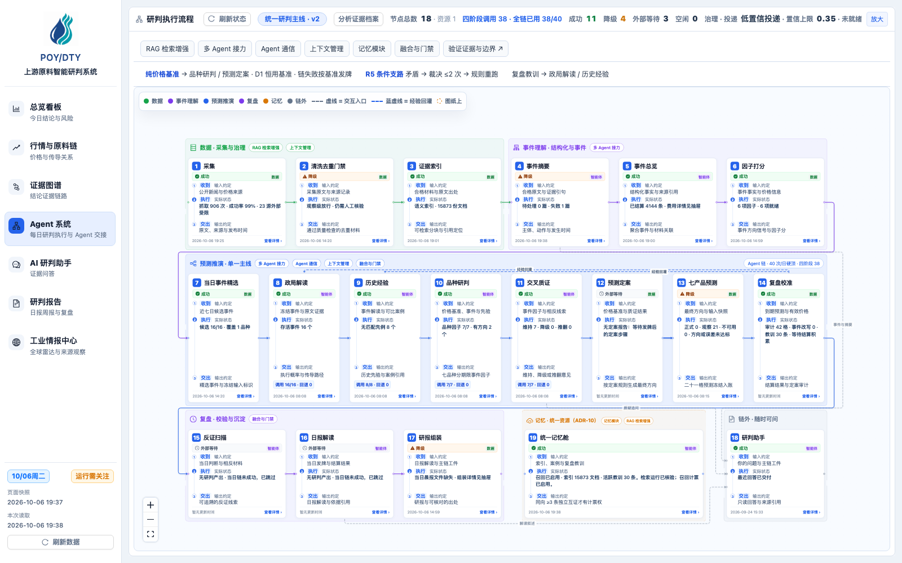
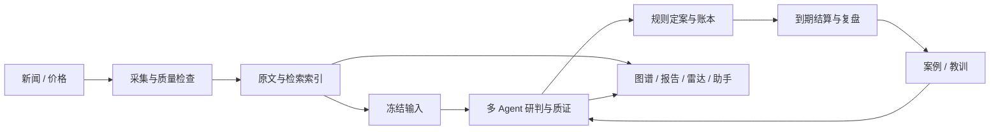

<p align="center"></p>

# POY/DTY · 产业链情报与多 Agent 研判

把公开新闻、价格与历史案例组织成可追溯的研判流程，覆盖 7 品种 × 1/7/30 天，共 21 格方向预测。

[在线演示](https://app.kaipingrc.com/) · [本地运行](docs/getting-started.md) · [English](README.en.md)

React / TypeScript · FastAPI · SQLite · FTS5 / FastEmbed · Apache-2.0

## 核心能力

- **信源治理**：采集新闻与价格，获取原文、解析官方 PDF，保留来源与时间。
- **RAG 与记忆**：结合词法和向量检索，按时间与品种筛选原文、案例及复盘教训。
- **多 Agent 协作**：事件解读、历史匹配、品种研判与交叉质证，使用结构化工件和引用校验传递结果。
- **预测与复盘**：规则定案、冻结账本、到期结算，保留判断依据与复盘记录。



截图来自在线演示，反映拍摄时刻的状态；首页插画为生成素材。

## 工作流



## 本地运行

需要 Node.js 20+、Python 3.11+ 和 uv：

```sh
git clone https://github.com/luxiaoyu0731/poy-dty-agent.git
cd poy-dty-agent
npm ci
uv sync --project server
```

按 [运行指南](docs/getting-started.md) 启动独立数据库与前后端。生产数据不随仓库分发；模型请求需自行配置密钥并承担供应商费用，没有数据时显示真实空态。

<details>
<summary>开发、文档与使用边界</summary>

[架构](docs/architecture.md) · [OpenAPI](docs/openapi.yaml) · [文档入口](docs/README.md)

前端入口 `src/`，后端入口 `server/app/`。检索、上下文与记忆的设计说明按需从文档入口阅读。

```sh
npm run check
npm run test:e2e
# 后端测试的隔离数据库设置见运行指南
```

模块接入不代表预测效果已经得到实验验证。当前工程问题和验收状态见 [代码审查](docs/code-quality-review.md) 与 [验证记录](docs/github-release-evidence.md)。

[贡献指南](CONTRIBUTING.md) · [安全反馈](SECURITY.md) · [公开范围](docs/public-distribution.md) · [素材说明](docs/media/README.md)

</details>

[Apache-2.0](LICENSE)。外部新闻、价格与第三方素材保留各自许可；预测用于研究辅助，不构成收益保证。
