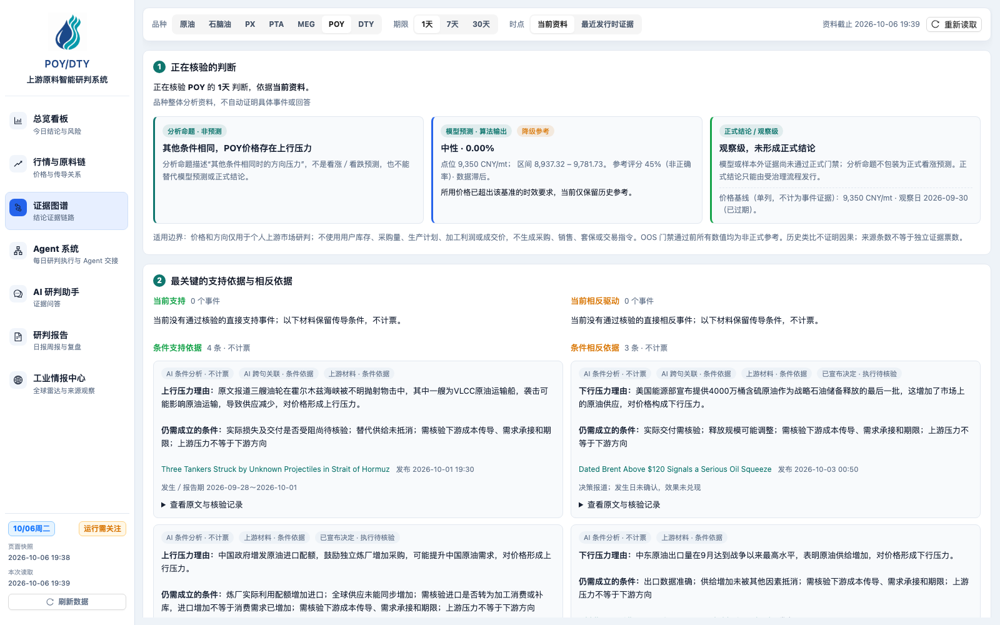
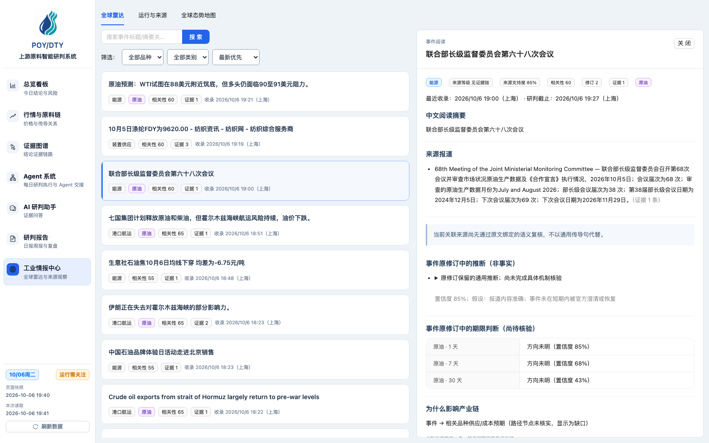
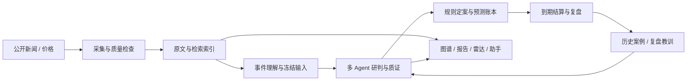

<p align="center">
  
</p>

<h1 align="center">POY/DTY · 产业链情报与多 Agent 研判</h1>
<p align="center">从公开资料到可追溯研判，把采集、检索、推理与到期复盘放在同一条工作流里。</p>
<p align="center">
  <a href="https://app.kaipingrc.com/">在线演示</a> ·
  <a href="#系统如何工作">架构</a> ·
  <a href="docs/getting-started.md">本地运行</a> ·
  <a href="docs/code-quality-review.md">代码审查</a> ·
  <a href="README.en.md">English</a>
</p>
<p align="center">
  
  
  
  <a href="LICENSE"></a>
</p>

## 为什么做这个系统

原料采购与报价研判需要同时阅读新闻、价格与历史案例，而一条“看起来相关”的新闻并不一定足以支持价格方向。这个个人工作台把材料的来源、时间、核验状态和传导条件保留到推理结果中，让使用者可以追问：**依据是什么、何时可得、有哪些反例、到期后是否成立？**

系统覆盖原油、石脑油、PX、PTA、MEG、POY、DTY，按 1 / 7 / 30 天三个期限组织每日 21 格方向预测。页面提供行情、证据图谱、Agent 工作流、研究问答、研判报告和工业情报雷达；历史数据与生产凭据不随代码分发。

## 可以看到什么

| 能力 | 实现方式 |
| --- | --- |
| 信源采集与治理 | 准入域名、正文获取、官方 PDF 解析、去重、来源分级与可追溯快照 |
| 混合检索 | SQLite FTS5 + FastEmbed 多语言向量，按资料可见时间、品种与证据条件筛选 |
| 多 Agent 接力 | 政局解读、历史经验、品种研判、交叉质证；结构化工件传递、引用校验与独立阶段配额 |
| 上下文与记忆 | 冻结当日输入、按时点检索案例、保留复盘教训来源，将临时上下文与长期记忆分开 |
| 预测与复盘 | 规则定案、21 格账本、到期结算、反证检查及教训回灌 |
| 业务阅读 | 图谱、报告、雷达详情和助手展示原文入口，区分直接依据与条件依据 |

### Agent 工作流


### 证据图谱与工业情报

<table>
<tr>
<td width="50%"><br />从判断回查资料、核验状态与引用。</td>
<td width="50%"><br />把产业事件放回来源与传导语境。</td>
</tr>
</table>

界面截图来自在线演示，不是生成的 UI。它们反映拍摄时刻的真实状态，具体数据会随业务日变化。

## 系统如何工作



前端采用 React、TypeScript、Ant Design、React Flow 和 MapLibre；后端采用 FastAPI、SQLite、FTS5 与本地向量索引。18 个后端节点保留固定身份，画布另有一个用于聚合记忆资源的前端卡片。生产采集、日度链和回放实验分别运行，回放不会写入生产预测账本。

### 上下文不是把资料全部塞进提示词


- **当前上下文**：冻结本轮事件输入、价格基准和时间边界，明确每个 Agent 接收与输出的工件。
- **可检索证据**：保留原文、发布时间、引用定位与核验条件；语义相近不自动等于方向支持。
- **长期记忆**：检索历史案例与带来源的复盘教训，防止未来资料泄漏到历史判断。

这是设计说明。模块接入、材料覆盖和方向预测效果是不同的验证问题，不能用 UI 的完整度替代实验结果。

## 开始运行

需要 Node.js 20+、npm、Python 3.11+ 和 uv。先阅读 [本地运行指南](docs/getting-started.md)，用独立数据库启动前后端。无需生产服务器或生产数据库；没有模型密钥时保留明确的降级状态。

```bash
npm ci
npm run check
uv sync --project server
```

真实 LLM 请求需要自行配置模型密钥并承担供应商费用。首次向量模型下载需要网络；测试使用隔离数据和词法检索替代，不会调用付费模型。

## 验证与工程质量

```bash
npm run check
npm run test:e2e
# 后端测试需先按本地指南设置隔离数据库与临时目录
uv run --project server python -m pytest server/tests -q
```

[代码审查报告](docs/code-quality-review.md)记录了大型模块、重复实现和构建体积等真实问题，以及本次修复的范围。该项目保留了较多演进文档，贡献者应从当前入口阅读，而不是把历史验收记录当作本次验证。

## 阅读与贡献

- [本地运行](docs/getting-started.md) · [贡献指南](CONTRIBUTING.md) · [安全反馈](SECURITY.md)
- [架构](docs/architecture.md) · [API 契约](docs/openapi.yaml) · [检索设计](docs/rag-event-direction.md)
- [上下文](docs/context-pack.md) · [记忆](docs/memory-system.md) · [多 Agent 设计](docs/multi-agent-prediction-plan.md)
- [公开版范围与素材来源](docs/public-distribution.md) · [图片说明](docs/media/README.md)

代码采用 [Apache-2.0](LICENSE)。第三方依赖保留各自许可证；来源网站的新闻、价格数据及品牌标识不因本仓库许可而获得再分发授权。系统面向研究与业务辅助，预测结果不构成收益保证。
