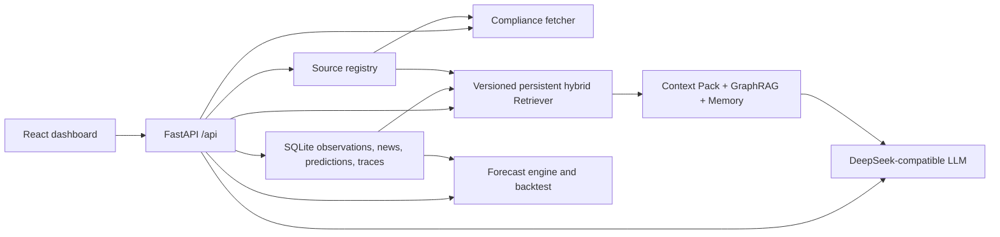
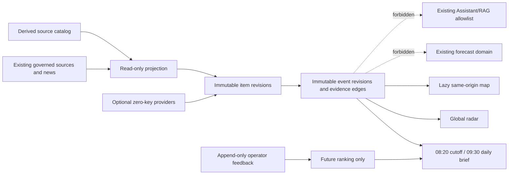

# Architecture

## System Shape

The project is a single-researcher upstream intelligence agent with a React frontend and a FastAPI backend.

- Frontend: Vite, React, TypeScript, Recharts, lucide-react.
- Backend: FastAPI, Pydantic, httpx.
- Current data mode: SQLite-backed observations, news events, prediction ledger, and source registry metadata.
- AI mode: validated DeepSeek-compatible structured output with a local safe fallback.
- Visual QA: golden screenshots, design tokens, and Playwright screenshot diffing.

## Runtime Boundaries

## RAG Boundary

The Assistant enters `assistant_pipeline`, creates a Context Pack, and queries
the versioned persistent Chunk index. The index materializes eligible evidence
documents from:

- knowledge graph nodes and edges,
- source registry entries,
- news articles and event clusters,
- market, industry, and event observations,
- reviewed domain knowledge and event-intelligence snapshots.

Retrieval combines SQLite FTS5 and a local FastEmbed multilingual dense vector,
then reranks by evidence tier, freshness, review state, risk, source diversity,
and product coverage. Results expose lexical/vector/rerank scores, model and
index versions, and stale/fallback state.

GraphRAG may discover additional industry entities, but its expansion is sent
through the same Retriever and final evidence whitelist. Memory is
relevance/time filtered and model-generated memories cannot become facts.
Formal requests persist the exact pack and graph path; GET preview is read-only.

Prompt-injection-like content inside retrieved news or manual notes is treated as untrusted evidence, not an instruction. C/D-tier material can support weak signals but cannot support high-confidence answers without A/B confirmation.

Human review state is stored separately from raw evidence. `reviewed` evidence receives retrieval boost; `rejected` evidence is excluded from normal RAG retrieval while the original record remains auditable.

Structured answers bind conclusion and evidence claims to supporting documents.
Presence, validity, local entailment and conflict are separate checks; an
unsupported conclusion cannot receive `success`.

## Persistence Boundary

SQLite remains the local persistence layer, but schema changes are now versioned through both `schema_migrations` and SQLite `PRAGMA user_version`. Startup still runs `CREATE TABLE IF NOT EXISTS` for compatibility, then applies idempotent migrations for existing databases. New migrations should add a numbered entry, keep the operation safe to repeat, and include a pytest that exercises an older schema shape.

The following paragraph describes the retained historical Phase A proof graph, not
the current seven-product forecast contract. Schema 27 adds the internal formal-eligibility and Phase A batch proof graph; schema
29 extends its empty-formal-history shape for the historical v7 19-series contract. One
content-addressed assessment binds a live sealed snapshot, exact 57-result evaluator
replay, complete safe approval projection, and three independent 19-series validity
slices. One immutable current prediction revision then binds that assessment to exactly 42
cells, six terminal POY/DTY subtargets, and three slice proofs in one immediate
transaction; historical v4 revisions retain their 45-cell audit semantics. Canonical JSON is authoritative; typed rows are bounded projections and
all formal tables are append-only. Captured trust is audit-only: every new assessment
and new batch rechecks the running module trust root, which remains empty in production.
Ordinary current-schema connection checks object identity without replaying historical
formal records; targeted consumers re-audit only the bounded revisions they use.
Schema identity compares normalized SQL for every new table, explicit index and trigger,
so a same-name no-op trigger or weakened index fails closed while the check remains O(1).
Migration 27 classifies pre-existing scalar ledger rows before permanently rejecting new
scalar inserts; legacy reads and review-status updates remain available.

Schema 35 adds the current seven-product live forecast ledger. One Shanghai
business date can have exactly one immutable `seven-product-forecast.v1` batch
and exactly 21 immutable cells. A retry returns the already frozen canonical
payload; it never overwrites or recomputes that business date. Later actuals are
appended once per cell only after the required number of subsequent label
observations is visible. Batch, cell and outcome payloads are canonical JSON
with SHA-256 bindings; typed projections, schema SQL, indexes and no-update/
no-delete triggers are re-audited on every read. Historical data is not
backfilled into this ledger, so live OOS time can only accumulate forward.

Schema 36 adds append-only outcome invalidations for legacy settlements whose
actual source/semantic-series identity does not match the label contract frozen at
issue. The original outcome remains immutable, but current history and model
monitoring exclude it from scored evidence. A v36 database requires restoring the
verified v35 backup before an old release can run; switching only the release
symlink is not a valid rollback.

Schema 37 adds the isolated append-only industrial intelligence domain: six
`intelligence_*` business tables plus one derived FTS5 index, all bound to
canonical JSON payloads with full SHA-256 chains, stable UUIDv5 identities
(`industrial-intelligence-identity.v1`), `prediction_eligible=0` /
`instruction_eligible=0` CHECK constraints, UPDATE/DELETE abort triggers, and
JSON-array reference triggers. The migration creates objects only — no
backfill, network, or brief generation. Legacy tables keep their exact schema
and content; the intelligence domain reads them only through a bounded,
idempotent projection.

Prediction data snapshots store the selected observation payload plus snapshot metadata. The metadata records per-collection limits, sort order, returned count, total available count, truncation state, and included time/id bounds. This keeps prediction replay honest when snapshots contain only the most recent rows.

Upstream market observations are stored separately from `prediction_ledger`:
observations are evidence inputs, while legacy scalar ledger rows are historical
POY/DTY upstream cost-pressure calls. The current contract reads observations through
the seven-product forecast service and produces an exact 7 products × 3 horizons
matrix with per-cell provenance, evaluation status and model-registry binding.
The ordinary current API and UI read the latest frozen ledger batch. An explicit
cutoff remains a read-only diagnostic preview and cannot create production history.
Existing `forecast_price_points` rows that contain real crude, PX, PTA or MEG
observations must be migrated into the upstream observation model; peer and own quotes
are not formal targets.

## Forecast Boundary

The current forecast boundary produces D1, D7 and D30 forecasts for exactly crude,
naphtha, PX, PTA, MEG, POY and DTY. It includes uncertainty, direction, confidence,
evidence, gaps, source identity and point-in-time hashes. Formal status is fail-closed:
only an explicitly approved model whose bound rolling OOS result passes every per-cell
gate may emit a formal cell. POY/DTY inventory, operator processing profit, quotes,
procurement, order-taking and trading instructions are outside the model boundary.
Formal runtime selection has precedence over the independent reference grid. A
feature failure or three consecutive valid losses to persistence produces a
non-formal runtime fallback; it never borrows the displaced champion's approval.
Promotion and rollback tools generate immutable registry proposals only, leaving
release activation to the normal commit/review/deploy boundary.

## Outbound Integration Boundary

All new HTTP integrations should use the shared outbound allowlist helpers on `Settings` before calling `httpx`. Price intraday providers and source fetchers now validate outbound URLs against `OUTBOUND_FETCH_HOSTS`; blocked hosts should be reported as provider/source errors rather than bypassed or retried indefinitely.

## Production Boundary Plan

1. UI should consume typed API contracts only; missing services render explicit unavailable/degraded states, never mock business conclusions.
2. API handlers should stay thin and delegate to service modules.
3. Data ingestion should persist a raw snapshot before normalization only when
   the applicable source policy permits it; otherwise it persists a bounded
   metadata receipt, content hash, source URL, and rights snapshot without the
   source body.
4. LLM calls require trace records, eval fixtures, cost metrics, and human-review rules for high-impact outputs.
5. Source connectors must preserve license notes, source URL, fetched timestamp, and parser version.
6. RAG answers must preserve retrieved `doc_id` citations, expose warnings, and include retrieval metadata for audit replay.

## Industrial Intelligence Boundary (schema v37 — Local Implementation Complete / Release Candidate; Not Yet Deployed)

ADR-0005 accepts an additive eighth workbench module, “情报中心.” Its target
architecture is specified in `docs/industrial-intelligence-center.md`. The
v37 domain is now implemented and tested locally: migration
`append_only_industrial_intelligence_domain_v37` creates the six append-only
`intelligence_*` tables plus a rebuildable FTS5 index (`user_version=37`),
`server/app/industrial_intelligence/` owns the domain, `/api/v1/intelligence/*`
ships the documented surface behind the existing internal auth, and the React
module adds `module=intelligence` after the legacy seven without touching
their refresh graph. The module is gated by `INDUSTRIAL_INTELLIGENCE_ENABLED`
(default off) and is not yet deployed to production; production rollout,
scheduled runs, and the first 09:30 non-`blocked` brief remain separate
authorized steps.

The target v37 migration, `append_only_industrial_intelligence_domain_v37`,
creates six append-only `intelligence_*` business tables and one rebuildable
FTS5 index. It does not backfill data, fetch external sources, generate a brief,
or alter existing news, event, prediction, evaluation, or Assistant tables.
Every item, event revision, and daily brief is constrained to
`prediction_eligible=0` and `instruction_eligible=0`.

The source catalog is a read-only union of the core source registry and
`NEWS_SOURCES`; it is not a third writable registry. Collector, aggregator, and
origin identities remain separate, point-in-time eligibility uses `visible_at`,
and applicable storage/display/commercial-use limits are frozen in a rights
snapshot. Each frozen daily brief embeds the safe canonical catalog snapshot,
entry count, and SHA-256 used for readiness so historical results remain
recomputable rather than pointing only to a mutable registry. The first
accepted source wave reuses the existing GDELT connector as
metadata-only discovery, adds USGS M4.5+ earthquake facts, and vendors a Natural
Earth geography baseline. It must not create a second GDELT source identity or
fetcher. A versioned `industrial_nodes.v1.geojson` derives ports from the fixed
Natural Earth Ports asset and admits canal/facility nodes only with verifiable
A/B source coordinates; unresolved locations stay gaps. DCE and CCF stay
soft-removed.

The React module and `/api/v1/intelligence/*` routes are isolated from the
existing seven modules and forecast refresh graph. MapLibre is loaded only when
the map subview opens and consumes same-origin static data/API responses. The
feature has no WebSocket, SSE, polling, email, messaging, webhook, or other
instant business-alert path. A later request to use intelligence as a forecast
feature or Assistant fact source requires a separate ADR and new point-in-time,
leakage, evaluation, and release evidence.

## Near-Term Refactors

- Split `src/App.tsx` into page modules and shared components.
- Split `src/styles.css` into shell, components, and page-level CSS.
- Add a storage adapter before adding real crawlers.
- Add a provider-native streaming path; current stream is explicitly simulated
  from the validated complete response.
