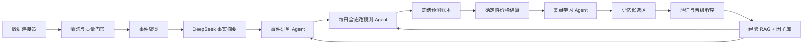

# POY/DTY 全链路预测与 Agent 系统治理规范

> 状态：已接受的业务政策基线（Phase A 机器契约、正式序列纯eligibility evaluator/manifest信任根及完整正式写路径已实现并完成隔离复验；生产正式来源资格与发布仍阻断）
> 版本：v1.1
> 冻结日期：2026-08-02（Asia/Shanghai）
> 状态同步：2026-08-06（Asia/Shanghai）；仅更正实现与验证状态，不改变已冻结业务政策。
> 适用范围：数据采集、新闻事件分析、全链路预测、后验复盘、经验与因子沉淀、RAG、Agent 运行以及使用 Codex 实施本规范
> 业务时区：Asia/Shanghai

## 1. 文档目的

本规范用于指导 POY/DTY 上游原料智能研判系统从当前的“多角色 Prompt 流程”重构为：

```text
确定性数据与工作流系统
+ 少量职责明确的推理 Agent
+ 可审计、可遗忘、可验证的分层记忆
+ 按时点回放的经验学习闭环
```

系统的最终目标不是生成更多新闻摘要，而是持续提高对全产业链价格和 POY/DTY 上游成本压力的判断质量，同时保留完整证据、预测、后验和复盘记录。

本规范也是后续使用 Codex 修改项目时的权威上下文。除非用户明确改变业务决策，后续任务应引用本文件，不应反复要求 Codex 重新理解整个项目。

### 1.1 Codex 阅读规则

除首次治理审查外，Codex 不应在每个任务中通读本文档。先用标题索引定位任务，再只读取相关章节：

| 任务 | 必读章节 |
|---|---|
| 数据源、抓取、单位和断点 | 第 2、3、7、10、15 节 |
| Agent 架构 | 第 4、5、6、11、16 节 |
| 新闻摘要和事件分析 | 第 7、8、9、15 节 |
| 预测期限和事件合成 | 第 5、9、10、12 节 |
| 记忆、RAG 和因子 | 第 11、12、13、15 节 |
| 历史回放 | 第 10、11、12、13、15 节 |
| 晨报与实时调度 | 第 10、14、16 节 |
| 使用 Codex 实施 | 第 17、18、19、20 节 |

读取顺序应为：

```text
任务目标
→ 相关治理章节
→ 目标代码入口
→ 相关测试
```

不得因为本文档存在就默认扫描全文和整个仓库。

### 1.2 Phase A 冻结决定

以下业务政策由用户于 2026-08-02 接受，优先于本文档和历史实现中的冲突表述。逐序列数据契约以及事件、摘要、预测和经验 Schema 已据此形成可执行机器契约；正式来源资格仍须逐序列验收：

1. 公网正式预测期限为 **D+1、D+7、D+30**。既有 D+14 仅作历史兼容，不再新增；D+3、D+5、D+10、D+20 不属于正式预测面。
2. 正式预测目标仅为 POY/DTY 上游成本压力，不输出采购、成交价、库存、报价或交易执行指令。
3. 正式节点清单为 Brent、WTI、SC、煤炭、石脑油、MX、PX、乙烯、EO、甲醇、PTA、MEG、聚酯熔体、聚酯切片和 POY/DTY 上游成本压力；各节点分别保留判断，缺少合格数据时必须降级或不可评分，不得用模拟值补齐。
4. 价格来源优先级为官方交易所/政府源、已授权商业现货源、公开辅助源。用户已决定：公开可访问数据视为可个人复用，无需为每个公开来源再次申请项目内授权；仍须保留来源归属和原始证据，且不得绕过登录、付费墙、验证码、访问控制或任何非公开边界。现货、期货、结算价和公开评估价必须分系列保存，不得混算或把公开评估价描述为真实成交价。
5. 标准单位按序列冻结：原油为 USD/桶（SC 可保留 CNY/桶并保存换算证据），化工品和聚酯链为 CNY/吨，汇率为 CNY/USD；原始单位、币种、换算版本和原值必须保留。
6. 晨报数据于工作日 08:20 冻结，09:30 发布。新闻采用自然时间；夜盘行情按交易所交易日归属；价格后验使用有效观测日。
7. 历史回放范围为 2025-01-01 至 2026-07-01，首尾日期均包含。
8. DeepSeek 正式模型采用当前受控配置 `deepseek-v4-pro`；必须使用结构化输出、证据绑定、预算、超时、重试和安全降级门禁。
9. 高影响、证据冲突、仅低等级证据支撑或拟输出高置信结论时必须人工确认；普通且证据充分的结论不强制人工确认。
10. Shadow 因子晋级至少需要 120 个可评分样本和 3 个滚动样本外窗口；相对透明基线须有稳定增益，且高置信错误率不得恶化。
11. 09:30 后允许发布新的不可变 revision；不得覆盖原晨报，必须记录变更数据、原因、生成时间和上一个版本。

来源映射遵循第 4、5 节：原油使用 ICE/CME/INE 及 EIA 等对应官方或授权序列；PX/PTA 使用 ZCE 与授权现货源；DCE 已于 2026-09-01 软移除，MEG 在新的正式来源完成验收前保持显式缺口；汇率使用 CFETS/PBOC；其他节点仅在相应官方或已授权商业序列可用时进入正式评分。辅助代理序列不得冒充目标序列。

## 2. 产品目标与边界

### 2.1 正式目标

系统需要回答：

1. 过去一个信息窗口内发生了哪些与产业链相关的事件。
2. 这些事件通过什么机制影响全产业链。
3. 对不同产业链节点的影响方向、强度、概率和期限是什么。
4. 多个事件叠加后，POY/DTY 上游成本压力如何变化。
5. 过去的判断在后续价格中如何表现。
6. 哪些经验可以复用，哪些只是偶然相关或错误推理。

### 2.2 全链路范围

正式产业链节点范围冻结为：

```text
原油 / 煤炭
→ 石脑油 / MX / PX / 乙烯 / EO / 甲醇
→ PTA / MEG
→ 聚酯熔体 / 聚酯切片
→ POY / DTY 上游成本压力
```

系统必须支持每个产业链节点的独立判断，不得只生成一个未经解释的总方向。

### 2.3 禁止越界

系统不得：

- 把 POY/DTY 公开评估价描述为企业真实成交价。
- 自动生成采购、报价、接单、库存或交易执行指令。
- 用模拟数据填充正式行情或提高预测置信度。
- 绕过登录、付费墙、CAPTCHA、浏览器校验或许可证。
- 把 DeepSeek 输出当作事实来源。
- 用未来可见的信息影响过去时点的历史预测。
- 因为价格随后变化，就直接宣称某一新闻造成了该变化。

## 3. 当前问题定义

预测效果不佳不能简单归因于预测框架。当前风险来自整条链路：

```text
连接超时
→ 原始内容不完整
→ 数据结构错误
→ 时间或单位错误
→ 事件聚类错误
→ 摘要事实错误
→ 分析和传导错误
→ 预测错误
→ 后验标签错误
→ 错误经验再次进入 RAG
```

治理顺序必须是：

```text
先治理数据
→ 再治理事实摘要
→ 再治理事件分析
→ 再治理预测
→ 最后治理经验和因子
```

新 Prompt 或新 Agent 架构不能替代数据治理。

## 4. Agent 的定义

一个模块只有同时具备以下属性，才应被称为 Agent：

1. 有明确且可验收的目标。
2. 可以根据当前状态选择工具或下一步动作。
3. 可以观察工具结果并修正判断。
4. 有清晰的工作记忆和权限边界。
5. 有停止、降级、失败或请求人工处理的条件。
6. 输出符合可验证的结构化契约。

如果某一步只是固定执行抓取、清洗、转换单位、计算收益或查询数据库，它应是服务、工具或工作流节点，而不是 Agent。

## 5. 目标 Agent 架构

### 5.1 总体结构



系统不设置自由规划的 LLM Supervisor。调度、状态转换、重试、预算和权限由确定性工作流引擎管理。

### 5.2 事件研判 Agent

目标：将一个已经清洗、聚类并通过事实门禁的事件转换为结构化的全链路影响判断。

允许读取：

- 合格的事实摘要和引用。
- 当前时点可见的市场状态。
- 已成熟的历史经验。
- 已验证或 Shadow 状态的结构化因子；Shadow 因子必须明确降权。
- GraphRAG 传导路径。

允许调用：

- 证据检索。
- 经验检索。
- 图谱路径查询。
- 当前市场状态查询。
- DeepSeek 多视角分析。

不得：

- 抓取外部数据。
- 修改原始事实。
- 自行换算价格和收益。
- 读取当前 `as_of` 之后成熟的经验。
- 直接写入长期记忆。

输出至少包含：

- 事实、推断和预测的严格分离。
- 多方利益、能力、动机和执行概率。
- 受益方、受损方与阻挠方。
- 影响链和被影响品种。
- 各期限方向、强度、概率与置信度。
- 是否已被市场计价。
- 支持证据、反证和冲突。
- 加强、确认、结束和反转条件。
- 数据缺口与降级原因。

### 5.3 每日全链路预测 Agent

目标：将所有有效事件、市场状态、因子和仍未结束的历史事件合成为每日全链路预测和晨报。

它负责：

- 识别重复事件和重复来源。
- 处理事件之间的强化、抵消和冲突。
- 更新长期事件的生效、增强、衰减或反转状态。
- 形成产业链节点 × 预测期限的完整预测面。
- 生成 POY/DTY 上游成本压力的综合结论。

它不得：

- 改写单事件的原始分析。
- 将来源不足的事件提升为高置信度结论。
- 用自然语言覆盖结构化预测结果。
- 绕过正式证据和数据完整度门禁。

### 5.4 复盘学习 Agent

目标：在后验窗口成熟后，评价冻结的预测，并提出经验和因子候选。

允许读取：

- 冻结的事件事实与分析快照。
- 冻结的预测期限曲线。
- 确定性程序计算的后验价格路径。
- 同期其他事件、基准行情和市场状态。

它负责识别：

- 方向错误。
- 影响幅度错误。
- 生效时间或持续期限错误。
- 传导路径错误。
- 事实或数据质量错误。
- 市场已提前计价。
- 事件有效但被其他冲击遮蔽。
- 可复用机制、反例和失效条件。

它不得：

- 修改原始预测。
- 自行计算收益。
- 将单个成功案例直接升级为正式因子。
- 直接写入 Active 长期记忆。

## 6. 原 12 角色的处置原则

| 原角色 | 新定位 |
|---|---|
| plan | 确定性调度器 |
| ingest | 数据连接器 |
| clean | Schema、时间、单位和质量校验服务 |
| market | 市场特征计算服务 |
| event | 合并到事件研判 Agent |
| verify | 确定性证据门禁；高风险时可触发 Critic |
| retrieve | RAG 检索工具 |
| graph | GraphRAG 查询工具 |
| reason | 合并到事件研判 Agent |
| counter | 事件研判 Agent 的必填输出 |
| qa | Schema、引用、时点和一致性校验器 |
| report | 合并到每日全链路预测 Agent |

默认不保留只是更换 Prompt 的角色 Agent。

高影响、证据冲突或低置信事件可以触发一次独立 Critic 调用，但 Critic 是条件性质量工具，不是常驻 Agent。

## 7. 数据治理

### 7.1 原始数据不可改写

每次抓取必须保留：

- 来源 ID 和 URL。
- 抓取时间。
- 首次可见时间。
- 来源发布时间。
- 原始内容哈希。
- HTTP 状态、超时和重试结果。
- 解析器版本。
- 授权和许可证状态。
- 原始单位、币种和数值。

更正数据应生成新版本，不覆盖历史时点使用的原始版本。

### 7.2 标准化数据契约

每个正式价格序列必须冻结：

- 业务品种。
- 具体合约、现货或评估价口径。
- 权威来源。
- 备用来源。
- 原始单位。
- 标准单位。
- 币种。
- 转换公式及版本。
- 时区。
- 价格时间含义。
- 新鲜度阈值。
- 正常观测日历。

单位、币种、收益和时间换算由确定性代码完成，不交给 DeepSeek。

### 7.3 数据质量状态

建议统一采用：

```text
received
→ normalized
→ schema_valid
→ unit_valid
→ time_valid
→ eligible
```

失败状态：

```text
timeout
structure_invalid
unit_unknown
timestamp_invalid
duplicate
license_blocked
stale
quarantined
```

不合格数据进入隔离区，不能静默进入摘要、预测或因子计算。

> 【2026-08-28 取代说明】本节中的 manifest 信任根/来源授权条款已按"个人工作台 + 公开数据"定位整体删除（见 `docs/full-chain-prediction-status.md` 权威结论）；数据质量门禁与时间正确性条款继续有效。以下为历史原文。

当前 v7 正式序列纯eligibility evaluator与manifest信任根已经形成可执行实现。INE/SC 仅保留在历史 v1–v4 合同，不再是当前资格矩阵的一项；煤炭的 CCTD 环渤海 5500K 日度参考及混二甲苯的 SunSirs 华东日度评估均已登记为候选，但仍须逐项证据和manifest审批。生产批准manifest仍为空，因此当前19条正式价格/换算证据序列均为blocked，`eligible=0/19`。该实现不能由调用方自行提供摘要或批准记录来绕过信任根。`POST /api/v1/predictions`现会在认证和模型校验后、summary、snapshot、旧gate和ledger之前固定返回409 `formal_series_eligibility_not_trusted`且零写；非正式model-signal路径和GET/review行为保持不变。完整assessment materialization、42格batch正式写、storage同事务proof enforcement及legacy写入口排除均已在当前源码实现，并已于2026-08-27在全新临时库完成147项v7定向复验和13文件独立静态/重建核验；正式manifest为空、完整发布证据及来源验收未完成时，禁止生产使用继续有效。

## 8. 新闻、摘要和事件分析

### 8.1 按事件簇处理

DeepSeek 不应对同一事件的每篇重复新闻分别生成完整分析。

正确流程：

```text
多篇文章
→ 去重
→ 事件聚类
→ 事实摘要
→ 事件分析
```

同一事件簇可以补充新证据，但每次更新必须产生新的分析版本。

### 8.2 DeepSeek 调用分层

#### 调用 A：事实抽取与摘要

目标：只回答“发生了什么”。

输入：

- 清洗后的事件簇。
- 原文片段及证据 ID。
- 来源等级和可见时间。

输出：

- 时间、主体、行为、地点。
- 数值与单位。
- 已确认事实。
- 来源之间的冲突。
- 未知项。
- 每个事实对应的证据引用。

摘要不得输出走势结论。

#### 调用 B：多视角分析与全链路预测

目标：解释事件机制并形成事件级期限曲线。

输入：

- 通过门禁的事实摘要。
- 当时可见的市场状态。
- 少量已成熟经验和反例。
- 已验证的结构化因子。
- 产业链图谱。

输出：

- 多方利益与能力分析。
- 影响机制和传导路径。
- 事件是否已计价。
- 各品种、各期限预测。
- 支持证据、反证和失效条件。

#### 调用 C：后验复盘与经验提炼

目标：评价冻结预测，产生经验候选。

输入：

- 冻结预测。
- 程序计算的后验价格结果。
- 同期市场背景和重叠事件。

输出：

- 成功和失败原因。
- 期限错配。
- 机制是否得到后验支持。
- 可复用经验。
- 因子候选及其适用条件。

复盘 Agent 不得重新描述一个更有利的“原预测”。

## 9. 全链路预测契约

### 9.1 预测面

每日正式输出应为：

```text
产业链节点
×
D+1 / D+7 / D+30
```

每个单元至少包含：

- 方向。
- 方向概率。
- 影响强度或幅度区间。
- 置信度。
- 仍然生效的概率。
- 主要驱动事件。
- 反向事件。
- 数据完整度。

### 9.2 动态影响期限

事件不贴单一的“影响 1 天”或“影响 30 天”标签。

每个“事件 × 品种”关系维护状态：

```text
潜伏
→ 生效
→ 增强
→ 衰减
→ 结束
↘ 反转
```

预测检查点不是事件的固定结束时间。系统应维护：

- 预计生效时间。
- 预计峰值时间。
- 衰减或半衰期。
- 各期限仍有效概率。
- 确认条件。
- 加强条件。
- 结束条件。
- 反转条件。

### 9.3 多事件合成

初期采用透明、可审计的规则合成，至少处理：

- 同一事件簇去重。
- 同一来源重复。
- 高度相关事件的贡献上限。
- 相反方向事件的抵消。
- 来源和证据等级。
- 市场已计价程度。
- 传导路径和时间延迟。

历史数据证明统计模型优于透明基线后，才允许替换合成权重。

## 10. 日历、周末、节假日和断点

系统同时保存两只时钟：

- 自然日：用于新闻老化、政策持续和事件状态。
- 有效观测日：用于价格后验和 D+N 结算。

规则：

1. 周末或节假日仍有可信报价时，计为该序列的有效观测日。
2. 官方正常休市且无报价时，跳至下一有效观测日。
3. 本应有数据但因超时、结构错误或采集失败而缺失时，标记 `data_outage`。
4. `data_outage` 不得被解释为价格未变化或正常休市。
5. 不允许用零收益填补缺失。
6. 恢复后的第一条价格必须记录实际跨越的自然日数。
7. 每个结算窗口同时保存 `calendar_days_elapsed` 和 `valid_sessions_elapsed`。

D+N 的正式含义为锚点后的第 N 个有效且可信价格观测，并同时披露实际经过的自然日。

## 11. 记忆治理

### 11.1 五层记忆

#### 证据记忆

保存原始新闻、公告、价格、来源和抓取快照，是事实来源。

#### 工作记忆

只服务一次 Agent 运行，包含：

- 当前目标和 `as_of`。
- 本次数据快照。
- 当前事件。
- 少量相关经验。
- 已使用工具和剩余预算。
- 当前冲突和待解决问题。

任务结束后，完整 Prompt、对话和中间推理不写入长期记忆。

#### 情景记忆

即经过复盘的 Experience Card，记录：

- 当时可见事实。
- 当时的分析和预测。
- 后验价格路径。
- 成功、失败和期限错配。
- 适用条件。
- 反例和失效条件。

情景记忆是经验 RAG 的主要对象。

#### 语义记忆

保存跨多个案例验证后的规律与因子：

- 因子定义。
- 输入和目标。
- 适用市场状态。
- 产业链节点。
- 期限响应曲线。
- 样本量和样本外表现。
- 支持案例、反例和失效条件。

#### 程序记忆

保存系统如何工作：

- Prompt 版本。
- Schema 版本。
- 工具权限。
- 来源优先级。
- 单位转换规则。
- 工作流和停止条件。

程序记忆应存在版本化代码或配置中，不进入普通向量 RAG。

### 11.2 记忆写入

Agent 不能直接写 Active 长期记忆，只能提交候选。

经验生命周期：

```text
draft
→ eligible
→ reviewed
→ active
→ contested
→ retired
```

因子生命周期：

```text
proposed
→ shadow
→ validated
→ active
→ degraded
→ retired
```

单个事件只能形成情景经验，不能证明普遍因子。

### 11.3 记忆最小元数据

长期记忆至少包含：

- 唯一 ID 和版本。
- `known_at`。
- `as_of`。
- `outcome_cutoff`。
- 事件类型。
- 目标品种和期限。
- 市场状态。
- 证据 ID。
- 支持和反向关系。
- 数据、模型、Prompt 和 Schema 版本。
- 成熟度和状态。
- 置信度。
- 失效条件。
- 下次复核时间。

### 11.4 记忆读取

检索顺序必须是：

1. `known_at <= 当前预测时点` 的硬过滤。
2. 按品种、期限、事件类型、传导路径和市场状态过滤。
3. BM25、向量和 GraphRAG 混合召回。
4. 按证据质量、结果完整度和相似性重排。
5. 构建小型 Context Pack。

正式上下文应优先包含：

- 2～3 条支持案例。
- 1～2 条反例。
- 1 条失败经验。
- 少量经过验证的结构化因子。

检索不到合格经验时应明确返回空结果，不能用低质量材料填满上下文。

### 11.5 记忆污染防线

禁止：

- 把 DeepSeek 文本当作事实。
- 把晨报全文重复摘要后写回 RAG。
- 保存完整 Agent 中间推理。
- 用未来成熟经验回灌历史预测。
- 用新模型解释覆盖旧模型原始预测。
- 只检索支持当前结论的案例。
- 永久激活从未被使用或已经失效的经验。

退役记忆应保留审计记录，但不进入正常检索。

## 12. 后验价格与经验结算

每个预测期限应程序化计算：

- 原始价格变化。
- 相对基准变化或异常变化。
- 最大有利变化。
- 最大不利变化。
- 到达峰值的有效观测日数。
- 首次反转时间。
- 数据完整度。
- 是否可评分。

价格变化只能作为机制验证信号，不能天然等同事件因果效果。

经验采用渐进结算：

```text
D+1：初步经验
D+7：继续更新和中期结算
D+30 或失效条件触发：成熟经验
```

初步经验可以在检索中降权使用；成熟经验权重更高。

当前实现已完成Experience Card v26 append-only持久化、到期纯计划器、revision/head内部只读API、同一candidate多action的原子落库adapter、持久化candidate loader及显式参数的内部settlement service。该loader和service要求显式prediction revision、evaluation snapshot和cutoff，并重新审计绑定的资格评估和既有card head；它们不选择生产输入或提升资格。正式HTTP settlement写API、受控输入选择、精确每日cutoff和scheduler仍未接入，不能据此宣称生产结算闭环。

## 13. 历史回放

历史范围：

```text
2025-01-01 至 2026-07-01
```

首尾日期均包含。正式品种和价格源遵循第 1.2 节冻结决定。

历史回放必须按日期向前推进：

```text
冻结当时可见数据
→ 数据质量门禁
→ 事件聚类
→ 事实摘要
→ 多视角分析
→ 全链路预测
→ 冻结预测
→ 到期后补充后验
→ 生成经验候选
→ 达到成熟时间后才允许被后续日期检索
```

禁止先处理完整历史、生成全部经验，再把这些经验用于早期日期。

每次预测必须使用 `available_at` 或 `first_seen_at`，不能只依赖新闻声称的事件时间。

无法证明当时可见的历史补录数据，应标记为 `reconstructed`，不能计入严格回测成绩。

当前顺序回放纯计划器已经通过可执行验收：范围严格为2025-01-01至2026-07-01（首尾包含），按D1、D7、D30推进，D14只读兼容。它尚未接入真实candidate loader或scheduler，因此不代表历史生产回放已经执行。

## 14. 每日实时运行

以 D 日为例：

```text
06:30–07:30
结算 D-2 及更早预测在 D-1 到期的价格窗口
生成或更新初步/成熟经验

07:30–08:20
补采和清洗 D-1 新闻与行情
执行来源、结构、时间、单位、新鲜度和重复检查

08:20
冻结晨报数据快照

08:20–08:50
DeepSeek 事实摘要

08:50–09:10
事件研判与全链路期限预测

09:10–09:20
事件合成、质量门禁和晨报生成

09:30
发布晨报
```

D 日同时运行：

- D-1 事件的晨报和预测。
- D-2 事件基于 D-1 价格的初步复盘。
- 更早事件的 D+7 和 D+30 结算。

晨报任务优先级高于历史回放和非紧急经验重算。

## 15. 质量门禁与评估

### 15.1 数据指标

- 抓取成功率。
- 超时率。
- 结构错误率。
- 单位未知或转换失败率。
- 时间戳异常率。
- 重复率。
- 各品种可评分覆盖率。
- 数据断点与正常休市区分准确率。

### 15.2 摘要指标

- 事实引用覆盖率。
- 事实支持率。
- 数值与单位准确率。
- 冲突表达完整度。
- 未知项识别率。
- 幻觉率。

### 15.3 预测指标

- 各品种、各期限方向准确率。
- Macro-F1。
- Brier Score 和概率校准误差。
- 幅度 MAE。
- 高置信错误率。
- 相对简单基线的增量提升。
- 不可评分率。

### 15.4 经验与因子指标

- RAG 检索精度。
- 支持、反例和失败案例覆盖。
- 加入经验后的样本外增量提升。
- 因子方向稳定性。
- 不同市场状态下的表现。
- Active 因子的退化率。
- 时间泄漏审计结果。

### 15.5 渐进实验路径

```text
阶段 0：数据治理和可评分覆盖率
阶段 1：无 RAG 的固定多期限基线
阶段 2：规则型动态期限
阶段 3：经验卡和结构化检索
阶段 4：Shadow 因子
阶段 5：滚动样本外验证和因子晋级
```

任何复杂方案必须通过消融实验说明它相对简单基线的增量价值。

## 16. 可观测性、失败与降级

每次 Agent 调用必须记录：

- 输入和输出 ID。
- `as_of` 和数据快照。
- 模型、Prompt 和 Schema 版本。
- 检索到的经验和因子 ID。
- 工具调用。
- 耗时、重试、Token 和错误。
- 质量门禁结果。
- 最终状态和降级原因。

失败规则：

- 数据源失败：允许生成降级晨报，但披露缺失范围。
- 单位或时间未确认：对应品种不得输出高置信预测。
- 摘要无引用：禁止进入事件分析。
- 事实来源冲突未表达：禁止进入正式预测。
- 后验价格不完整：经验保持 pending。
- 9:30 尚未完整：发布带覆盖率和缺口的版本，后续新增 revision，不静默覆盖。

当前Agent纯evaluation、aggregation和observability均已有可执行实现；内部单次运行评估GET已绑定真实pipeline来源证明，只接受受治理trace。`agent-production-readiness.v1`已冻结：连续进程内在北京时间每日08:10结算上一完整24小时窗口；非ready或窗口不可得时输出`low_confidence`、不新建人工复核队列。每日报告已append-only持久化并在重启后可读取；已用两个独立Python进程对同一临时SQLite库和同一窗口完成并发持久化验证，结果收敛为同一报告且库内仅有一行。真实部署中的进程拓扑、服务生命周期和跨进程调度仍须验证，单次评估不得单独推断生产就绪。

## 17. 分阶段实施顺序

### 阶段 A：冻结公共契约

状态：**业务政策、机器契约、完整正式写路径及正式序列纯资格判定器均已形成；生产正式来源资格仍为P0**。第 1.2 节为当前权威政策；当前 v7 为14个正式节点、42个节点/期限单元、19条逐序列契约和四类Schema，INE/SC 仅保留在历史合同。煤炭日度和 SunSirs 华东混二甲苯日度评估候选均已登记但仍受证据门禁。eligibility/manifest信任根也已实现；生产批准manifest为空，新契约判定当前19条正式价格/换算证据序列全部保持blocked，`eligible=0/19`。完整assessment物化、42格batch写入、storage同事务proof enforcement及legacy排除已经实现，并已完成当前 v7 的定向复验和13文件独立静态/重建核验；在来源逐项验收、受信manifest发布及完整发布证据完成前，仍不得批准生产使用。

- 正式产业链品种清单。
- 各品种权威价格源和备用源。
- 单位和币种。
- 事件、摘要、预测和经验 Schema。
- 晨报截止时间。
- 后验期限和日历规则。

### 阶段 B：数据治理

- 来源健康状态。
- 标准数据契约。
- 单位和时间校验。
- 数据隔离区。
- 每日数据快照。

### 阶段 C：事件分析

- 事件聚类。
- DeepSeek 事实摘要。
- 事件研判 Agent。
- 期限预测曲线。

### 阶段 D：后验和记忆

- 价格反应窗口。
- Experience Card。
- 记忆写入和检索门禁。
- 反例和失败记忆。

### 阶段 E：历史回放和因子

- 顺序回放。
- Shadow 因子。
- 滚动样本外验证。
- 因子晋级、退化和退役。

### 阶段 F：实时生产

- 9:30 晨报 SLA。
- 调度、重试和预算。
- 可观测性。
- 降级与人工复核。

## 18. 使用 Codex 实施本规范

本节面向项目负责人，说明每一步应如何与 Codex 交互。

### 18.1 总体原则

1. 默认使用单 Agent。
2. 只有存在真正独立、无重叠且能节省总成本的子任务时，才使用多 Agent。
3. 不再要求 Codex 每次重新了解整个项目。
4. 每次只给出一个阶段、一个明确目标和一组验收标准。
5. 架构决策与代码实现分开。
6. 先让 Codex做只读审计，再授权修改。
7. 修改后要求针对性验证，不默认运行所有昂贵测试。
8. 每轮结束都更新短小的实施状态和下一步。

### 18.2 建议的对话结构

保留一个主对话处理：

- 产品目标。
- 治理决策。
- 公共 Schema。
- 跨模块边界。
- 实施顺序。
- 最终验收。

在公共契约冻结前，不开多个实现对话并行修改。

只有满足以下条件时才新开专门对话：

- 工作流会持续多个任务。
- 修改目录基本独立。
- 公共接口已冻结。
- 可以通过文件中的 Context Pack 完成交接。

不建议为每个小任务新建对话。

### 18.3 项目负责人应采取的具体行动

#### 行动 1：确认治理文档

在主对话中发送：

```text
请只读审查 docs/full-chain-prediction-governance.md。
列出其中仍需我决定的业务口径、相互矛盾的规则和无法验收的表述。
不要改代码，不要扩展到未列出的产品功能。
```

逐项确认后，再让 Codex 修改本文档形成正式版本。

#### 行动 2：冻结正式品种和价格源

发送：

```text
任务：形成全链路正式品种、价格口径、权威来源、备用来源、单位和日历清单。

权威依据：
- docs/full-chain-prediction-governance.md
- server/source_registry.json
- 当前价格与观测相关代码

先只读审计，不改代码。
输出：
1. 当前实际来源
2. 缺失或冲突口径
3. 建议清单
4. 必须由我决定的问题
```

确认清单后，再单独授权实现。

#### 行动 3：治理数据链路

发送：

```text
任务：实现治理文档阶段 B 的第一个最小闭环。

范围：
- <明确列出允许修改的文件>

验收标准：
1. 超时、结构错误、单位错误和正常休市可以区分
2. 不合格数据进入隔离状态
3. 现有合法数据继续兼容
4. 增加对应后端测试

开始前：
- 检查目标文件的现有未提交修改
- 如存在不明重叠，停止并报告

禁止：
- 修改预测框架
- 修改前端业务页面
- 启动子 Agent，除非发现真正独立且无重叠的任务
```

每次只完成一个可验证闭环，例如先治理一个价格源或一个错误类型，不要一次重写所有连接器。

#### 行动 4：实现事件分析契约

发送：

```text
任务：实现事件簇 → 事实摘要 → 事件研判的结构化契约。

权威依据：
- docs/full-chain-prediction-governance.md 第 5、8、9 节

先输出：
1. 拟新增或修改的 Schema
2. 与现有表/API的映射
3. Prompt阶段划分
4. 迁移与兼容风险

等我确认后再改代码。
```

Schema 未确认前，不允许 Codex直接实现 Prompt 或数据库迁移。

#### 行动 5：实现记忆系统

发送：

```text
任务：按照治理文档第 11、12 节重构记忆系统。

先只读分析现有：
- memory
- RAG
- context pack
- prediction ledger
- event intelligence snapshot
- graph memory

输出：
1. 可以复用的实体
2. 需要新增的最小实体
3. 写入门禁
4. 读取过滤
5. 版本、冲突、退役和时间泄漏规则

不要创建第二套重复的预测账本或 RAG。
等我确认数据模型后再实施。
```

#### 行动 6：历史回放

发送：

```text
任务：设计并实现 2025-01-01 至 2026-07-01 的按日顺序回放。

必须满足：
- 每日 as_of 冻结
- 经验只能在 matured_at 后被未来日期使用
- 同一事件簇不能跨时间泄漏
- 每日运行可恢复、幂等、可暂停
- 历史回放不得影响 9:30 实时晨报

先给出状态机、检查点、幂等键和最小试跑计划。
不要直接启动完整历史任务。
```

先用少量日期做 dry-run，通过后再扩大日期范围。

#### 行动 7：实时晨报

发送：

```text
任务：实现 D 日 9:30 晨报与经验结算双循环。

权威依据：
- docs/full-chain-prediction-governance.md 第 14 节

验收标准：
- 晨报优先级最高
- 数据不完整时可降级发布
- 到期经验任务不会阻塞晨报
- 每个阶段有状态、耗时和失败原因
- 同一输入重复执行不会产生重复记录

先提供调度设计和失败矩阵，确认后再实现。
```

#### 行动 8：独立验收

主要实现完成后，再允许使用一个独立审查 Agent 或新对话。

只提供：

- 治理文档。
- 该阶段验收标准。
- `git diff`。
- 测试结果。

要求：

```text
只审查当前 diff 是否违反治理文档和验收标准。
不要重新设计整个系统。
按严重度列出可复现问题；没有问题则明确说明。
```

### 18.4 标准 Codex 实现 Prompt

```text
任务：<一句话目标>

权威依据：
- AGENTS.md
- docs/full-chain-prediction-governance.md 第 <章节>
- <必要的其他文件>

允许修改：
- <文件或目录>

禁止修改：
- <文件或目录>

验收标准：
1. <可验证结果>
2. <可验证结果>
3. <可验证结果>

验证命令：
- <针对性命令>

执行规则：
- 默认单 Agent
- 不扫描无关目录
- 先检查目标文件的未提交修改
- 不覆盖用户现有改动
- 公共 Schema/API发生变化时先停止并询问
- 完成后汇报修改文件、测试、假设和遗留问题
```

### 18.5 标准只读设计 Prompt

```text
请只读分析，不修改文件。

问题：<需要讨论的问题>

只读取：
- <3～8个相关文件>

输出：
1. 当前事实
2. 现有约束
3. 可选方案及权衡
4. 推荐方案
5. 需要我决定的问题

不要：
- 扫描整个仓库
- 运行会写入状态的任务
- 将建议描述成已实现事实
```

### 18.6 标准修复 Prompt

```text
现象：<错误>
复现：<命令或步骤>
期望：<结果>
实际：<结果>

允许修改：
- <目标文件>

请先定位根因并报告。
在根因明确且修改范围未扩大后，直接实现修复并运行针对性测试。
如果根因涉及公共契约或不明用户改动，停止并询问。
```

### 18.7 新对话交接 Prompt

新对话不要粘贴完整历史聊天，使用：

```text
项目：POY/DTY 全链路预测工作台

请先读取：
- AGENTS.md
- docs/full-chain-prediction-governance.md 中与当前任务有关的第 <章节> 节
- docs/full-chain-prediction-status.md（如果已经创建）

当前任务：
<一句话>

允许修改：
- <范围>

验收标准：
- <列表>

已确认决策：
- <仅列与本任务有关的决定>

先通过治理文档标题索引定位章节，不要通读无关章节。
不要重新审计整个项目；如果状态文档与代码矛盾，先报告。
```

### 18.8 最小 Context Pack

只有确实需要子 Agent 时，才构造以下 Context Pack：

```text
目标
非目标
输入文件
输出文件
公共接口
验收标准
测试命令
禁止事项
已知风险
交接格式
```

Context Pack 应尽量控制在 800～1,500 tokens。使用文件路径和行号，不复制大型文档。

子 Agent不得继承完整对话历史，不得再次阅读整个项目。

### 18.9 Codex Token 节省规则

项目负责人应：

- 在一个任务中只提出一个可验收目标。
- 引用治理文档章节，不重复粘贴背景。
- 给出精确文件范围。
- 先做小范围 dry-run。
- 在一条主对话中冻结公共决策。
- 只有长期独立工作流才新开对话。
- 不要求多个 Agent 对同一问题分别发表意见。

Codex 应：

- 默认单 Agent。
- 使用 `rg` 精确查找，不遍历无关目录。
- 先读入口、契约和目标实现，不读所有文件。
- 不重复输出已经确认的项目介绍。
- 只运行与修改成比例的测试。
- 使用 `git diff` 和针对性测试完成交接。
- 把事实、假设和建议分开。
- 在阻塞条件出现时停止，而不是扩大搜索范围。

### 18.10 Codex 停止条件

遇到以下情况必须停止并询问：

- 需求存在多个合理解释。
- 需要改变正式品种、价格源、单位或预测目标。
- 需要修改公共 API、Schema 或数据生命周期。
- 目标文件存在无法判断归属的重叠修改。
- 需要执行删除、正式发布或不可恢复的数据迁移。
- 测试失败明显来自任务范围之外。
- 为继续工作必须访问未授权来源。
- Context Pack 与当前代码事实冲突。

遇到以下情况可以降级继续：

- 非关键外部数据源暂时不可用。
- 无关测试或工具不可用，但目标逻辑可以用其他方式验证。
- 文档存在轻微漂移，但代码和权威契约足以确定行为。

### 18.11 每轮 Codex 交接格式

Codex 完成后只需汇报：

```text
结果
修改文件
关键决定
验证结果
未验证内容
风险与下一步
```

不要在交接中重新复述完整产品背景。

## 19. 建议维护的实施状态文件

建议另建：

```text
docs/full-chain-prediction-status.md
```

该文件只保存：

- 当前阶段。
- 已冻结决策。
- 已完成任务。
- 当前阻塞。
- 下一项任务。
- 最近一次验证命令及结果。

状态文件应短小，避免成为第二份治理文档或运行日志。

## 20. 已冻结政策与剩余实施门槛

原待确认的业务政策已由第 1.2 节统一冻结。后续如需改变正式节点、来源层级、单位币种、预测期限、日历、模型、人工确认、Shadow 晋级或晨报 revision 规则，必须形成新的用户决定并按第 21 节更新版本；不得以代码现状或历史数据静默改变契约。

Phase A机器契约、四类版本化Schema、正式序列纯eligibility evaluator/manifest信任根、正式POST containment、完整assessment materialization、42格batch正式写入、storage同事务proof enforcement、legacy写入口排除及D+14只读/禁止新增规则已经形成。当前 v7 资格矩阵、assessment物化、42格batch正式写入、proof/legacy fail-closed及时间门禁已于2026-08-27在全新临时库完成147项定向复验；此前61项为v4历史验证，仅保留历史意义。真实Assistant四阶段治理接线、Agent纯trace评估/聚合观测与单次运行内部评估GET、Experience Card v26持久化/到期纯计划/revision-head内部只读API/原子落库adapter与持久化candidate loader、顺序回放纯计划器及Shadow生命周期纯判定也已通过可执行验证。这些是受控源码验证，不是正式来源验收、完整发布证据或生产上线证明。剩余门槛是：

1. 按当前19条正式价格/换算证据序列逐项验收权威来源、授权、规格、单位换算、新鲜度、可见性和交易日历，并发布受信批准manifest；只有通过后才能从`blocked_*`升级eligibility，当前政策必须保持`0/19`。INE/SC如需恢复，必须以新的合同版本和独立来源验收重新进入范围。
2. 在已验收的Experience Card能力和持久化candidate loader之上接入正式settlement写API、精确每日cutoff和scheduler；受控输入选择已实现为显式cutoff下的只读选择器，缺少任一合格输入时返回blocked且零写。上游契约不可用时必须fail-closed。
3. 刷新与当前源码身份一致的DG-01 successor evidence；历史证据不得自动代表后续获批变更。
4. 验证已实现的Agent eval自动window aggregation与不可变每日报告在真实部署中的跨进程执行；将已验收的顺序回放纯计划器接入真实candidate loader，完成Shadow输入装配、数值policy冻结及生产调度门槛。

## 21. 文档治理

本文件中的规则发生变化时：

1. 更新版本号。
2. 记录变更原因。
3. 标记受影响的 Schema、Prompt、任务和历史回放。
4. 不使用新规则静默改写旧预测。
5. 必要时建立 ADR。

v1.1 的变更原因是同步已实现且经隔离复验的正式写路径、持久化candidate loader和每日报告持久化状态，并将当前正式证据序列总数同步为19；v4历史合同仍保留20条序列的只读兼容语义。它不变更业务政策、Schema、Prompt、历史回放范围或既有预测；受影响的仅是实施状态、后续任务排序与来源验收门槛描述。

后续实现文档、Prompt 和代码应引用本文件的具体版本。
