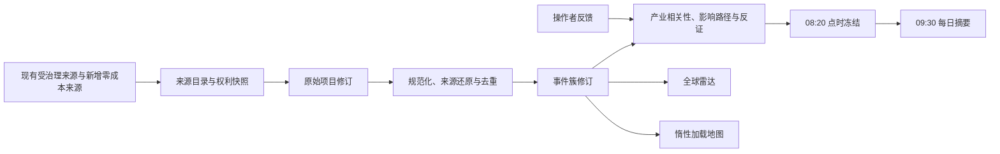

# POY/DTY 工业情报中心：产品与技术实施规格

> 状态：**Accepted Design / Production Deployed / First Scheduled Brief Pending / Value Validation Pending（设计已接受 / 已部署生产 / 等待首份自然调度日报 / 等待价值验证）**
> 决策日期：2026-09-05（Asia/Shanghai）
> 适用版本：schema v37；现行生产已迁移至 v37
> 决策依据：操作者已确认本规格第 2.5 节的决策台账；最终边界为“情报主轴、预测保留、只做加法、全球广泛采集但产业相关内容窄输出、零新增强制付费、无即时提醒”。

## 1. 文档效力与阅读方式

本文既是工业情报中心的**已接受目标设计**，也是 v37 的生产实施验收合同。D1–D6 已实现并取得本地机械证据；D7 的提交、推送、v36→v37 迁移、部署、功能启用及本地/鉴权公网 smoke 已于 2026-09-06 完成。由于部署发生在周日，第一份自然工作日 09:30 日报只能在 2026-09-07 发生；在该日报形成非 `blocked` 冻结终态之前，实施状态保持 `Production Deployed / First Scheduled Brief Pending`。D8 价值实验尚未开始。

当前生产状态：

- 当前 API 的事实来源是 `docs/api.md` 与 `docs/openapi.yaml`；v37 情报接口已在鉴权公网生产暴露。
- 现行架构、安全、可观测性、部署与运行合同仍分别以 `docs/architecture.md`、`docs/security.md`、`docs/observability.md`、`docs/deployment.md` 和 `docs/runbook.md` 为准。
- 本文中的“必须”仍是验收条件；只有附带机械证据的 D1–D6 项才可视为本地完成。
- 当前不可变 release 为 `20260905T162117Z-e2f2f681480b032b`（git `aa253f99f1838cdbeaae350c3bdc0b835aab0e43`）；D7 工作日调度已加载，首份自然调度证据与 D8 价值验证仍不得提前宣称完成。

## 2. 产品修正与价值主张

### 2.1 新的产品主轴

工作台的首要价值从“必须依靠数值预测证明价值”扩展为：

> 将分散、重复、时效和可信度不一的全球信息，压缩成可追溯、可复核、与 POY/DTY 上游采购和供应风险有关的每日决策上下文。

数值预测继续作为独立参考模块存在。工业情报中心不替换、不重算、不润色现有预测，也不以“增加情报”作为提高正式预测完成度或 OOS 分数的理由。

### 2.2 目标用户与核心任务

目标用户是单一操作者，即 POY/DTY 生产商及原料买卖相关决策者。核心工作任务是：

1. 减少每天跨来源查找、去重和核实信息所花时间。
2. 更早发现可能影响原油、石脑油、PX、PTA、MEG、POY、DTY、港口、物流和供应稳定性的事件。
3. 快速区分“发生了什么”“为什么与产业链有关”“哪些仍只是推断”“接下来应观察什么”。
4. 保留每条结论的来源、时间、版本、权利和反证，使后续复盘不依赖记忆。

### 2.3 每日核心交付

默认交付是一页中文每日摘要，回答：

- 今天发生了什么？
- 为什么可能与 POY/DTY 及上游原料有关？
- 可能影响哪些品种、地区、港口、路线或装置？
- 影响更可能出现在 D1、D7 还是 D30？
- 哪些是来源直接支持的事实，哪些是系统推断？
- 有哪些反证、缺口和后续观察项？

摘要不输出买入、卖出、锁价、加减库存、调整开工率等采购或交易指令。

### 2.4 成功标准

产品成功首先由两类结果衡量：

- 操作者每日研究时间显著下降。
- 对有用的采购、供应和上游风险信息发现得更早、遗漏更少。

预测准确率、正式预测格数和当前项目严格评分均不是本功能的替代指标；工业情报中心上线也不会自动改变它们。

### 2.5 已接受决策台账

下列行为是本轮对话确认后的可追溯决策，不依赖悬空的题号或选项字母：

| 主题 | 已接受行为 |
| --- | --- |
| 产品重心 | 情报收集、去重、溯源和压缩成为新增主价值；现有预测完整保留为独立参考 |
| 变更方式 | 只做加法；旧七模块、预测合同、结果、评分、账本、RAG 白名单和晋级语义不变 |
| 用户与场景 | 单一 POY/DTY 生产经营者，用于晨会、原料采购和供应风险研判；不读取操作者自身具体库存或加工利润来改变输出 |
| 默认交付 | 一页中文日报优先，08:20 截止、09:30 发布；Top 5 为首屏核心 |
| 信息范围 | 全球经济、能源、地缘安全、制裁、航运、港口、天气、灾害和重要新闻广泛进入雷达，产业链相关内容窄化进入日报 |
| 产业范围 | 原油、石脑油、PX、PTA、MEG、POY、DTY 与相关物流/装置同一套相关性规则；不额外偏重 MEG |
| 研判边界 | 事实、推断、反证、缺口、影响方向和 D1/D7/D30 分开；不生成采购、交易、库存或开工指令 |
| 来源与成本 | 基础能力不新增强制付费 API；可选付费源默认关闭，缺少它们不阻断基础 readiness |
| 来源治理 | 事件簇而非文章计数；collector/aggregator/origin 分离；来源分级、转载去重、权利快照和显式 coverage gap 为硬合同 |
| 外部参考 | 只参考 `bilawalsidhu/gods-eye-view`；选择性借鉴/移植，不整仓、iframe 或第二套服务接入 |
| 地图 | MapLibre + 同源固定 Natural Earth/节点资产，二级惰性加载；地图不是默认首页或事实来源 |
| 反馈 | 支持相关、无关、重复、观察和静音事件；只影响未来排序/显示，不改事实、不触发提醒 |
| 通知 | 不建设即时业务提醒，即使高风险也只在下一日报或主动打开页面时出现 |
| 交付与验证 | 发布后 smoke 加首份按时非 `blocked` 终态日报（`ready | ready_with_gaps | no_material_events`）即可完成技术交付；随后独立运行 20 个预注册业务日验证时间、相关性、召回、重复率和可用性 |
| 软移除 | DCE 与 CCF 继续软移除，不因情报中心重新启用 |

## 3. 冻结边界与非目标

### 3.1 不得改变的现有行为

实现必须冻结以下边界：

- 现有七品种 × D1/D7/D30 预测合同、模型注册表、评测门槛、正式资格、账本、结算和回滚语义。
- 现有预测数值、状态、分数、API 响应语义、导出和点时证据。
- 现有七个工作台模块的页面语义、加载依赖和降级行为。
- 现有 `news_articles`、`news_event_clusters`、`event_observations`、预测与评测表的写入路径。
- 现有 Assistant/RAG 的允许证据范围；本阶段不得自动把新情报表加入 Assistant 上下文。
- 现有 DCE 与 CCF 软移除状态。

工业情报域可以**只读投影**现有受治理数据，但只能写入自己的 v37 表。迁移和投影测试必须证明旧表没有新增、更新或删除。

### 3.2 明确非目标

本期不包含：

- 用新情报自动修改数值预测、置信度、正式资格或模型晋级结果。
- 自动采购、交易、库存、开工、报价或订单建议。
- WebSocket、SSE、浏览器轮询、短信、邮件、微信、ServerChan、PushPlus 或其他即时业务提醒。
- 强制付费 API、付费新闻正文、绕过登录、付费墙、验证码、WAF 或技术访问控制。
- DCE、CCF 重新启用。
- 军机、军舰、人员、卫星轨迹、CCTV、无线电、实时道路交通等监控图层。
- 把所有公开可见内容视为可任意复制、长期保存或再分发。
- 声称“全球全量”意味着穷尽世界上的所有事件。目标是广泛雷达能力，任何未覆盖领域必须作为缺口显示。

公开的战争、制裁、地缘安全和航运中断报道可以作为事件证据；被排除的是实时跟踪型军事/人员/监控能力。

## 4. 接受的产品信息架构

工作台在原七模块之后新增第八个一级模块：

| 一级模块 | 定位 | 默认子视图 |
| --- | --- | --- |
| 工业情报中心 | 全球广泛雷达与 POY/DTY 产业链窄摘要 | 每日摘要 |

工业情报中心包含四个子视图：

1. **每日摘要**：一页核心交付，按重要性展示有限事件、传导路径、证据和缺口。
2. **全球雷达**：浏览更广泛的全球经济、能源、制裁、地缘安全、航运、港口、天气和灾害信号。
3. **全球态势地图**：作为空间理解工具，展示具有足够地理证据的事件；不是默认首页。
4. **运行与来源**：展示来源目录、权利状态、投影运行、数据缺口和失败原因。

事件详情是摘要、雷达和地图共用的二级视图，包含事实/推断分离、证据链、转载关系、反证、修订历史和反馈入口。

## 5. 用户流程

### 5.1 每日主流程

1. 操作者在 09:30 后进入“工业情报中心”。
2. 页面首先显示业务日期、08:20 截止时间、生成状态、覆盖缺口和数据新鲜度。
3. 操作者阅读按供应中断、装置、港口航运、能源、极端天气、制裁和战争优先排序的核心事件。
4. 展开事件，分别检查事实、推断、影响路径、D1/D7/D30、置信度、反证和观察项。
5. 需要空间上下文时进入地图；需要原始依据时进入证据详情。
6. 操作者可以标记相关、无关、重复、继续/取消观察，或静音/取消静音来源与主题。反馈只影响未来排序和显示，不改写历史证据；观察状态不触发提醒。

### 5.2 主动浏览流程

- 操作者可在全球雷达按类别、品种、地区、来源等级、时间和重要性筛选。
- 列表使用稳定游标加载更多；新数据到达不会使正在浏览的分页重复或漏项。
- 操作者主动重新打开或刷新页面时可以看到已持久化的最新雷达内容，但系统不做前端轮询，也不发送即时提醒。

### 5.3 失败与空状态

- 当日没有高相关事件时显示“今日无达到摘要阈值的事件”，而不是制造摘要。
- 来源不可用、权利不允许正文保存、事件缺少地理位置、产业关联未验证、分析生成失败时分别显示明确缺口。
- 上一次成功结果可以作为带时间戳的只读回退展示，但不得标成当日最新或健康。

## 6. 信息漏斗与系统边界



漏斗必须遵守以下顺序：

1. **发现**：接收来源项目，但不因来源数量多就提高置信度。
2. **权利判断**：在保存正文或展示摘录前决定允许的存储、展示、缓存和保留范围。
3. **点时规范化**：保存发布、首次发现、抓取、可见和事件发生时间，不用后来信息改写过去可见状态。
4. **来源还原**：区分聚合器、转载媒体和最初发布者。
5. **去重和成簇**：同一原始报道的多个转载属于一个来源家族，不算独立交叉验证。
6. **事实提取**：每项事实必须绑定一个或多个证据修订。
7. **产业研判**：推断传导路径、品种、方向和期限，同时保留反证与不确定性。
8. **窄输出**：只有达到相关性、证据和重要性门槛的事件进入每日摘要；其他合规事件仍可在雷达中浏览。

### 6.1 事实、推断和建议的硬分隔

| 类型 | 含义 | 要求 |
| --- | --- | --- |
| `fact` | 来源明确陈述或结构化接口直接给出的事实 | 必须引用证据修订；保留原始时间和来源 |
| `inference` | 从事实到产业链影响的分析 | 必须说明传导路径、假设、置信度和反证 |
| `watch_item` | 后续需要观察的可验证信号 | 必须是可观察条件，不是行动指令 |
| `procurement_instruction` | 买卖、库存、开工等具体行动 | 禁止生成、保存和展示 |

所有可输出的 item/event/brief 内容记录必须固定 `prediction_eligible=false` 和 `instruction_eligible=false`；证据边、运行审计和反馈不重复承载这两个字段。任何把工业情报内容写入预测、模型晋级、正式评测输入，或把其输出变成采购/交易指令的尝试都必须失败关闭。

### 6.2 时间语义

每条来源项目至少保留以下时间：

- `occurred_at`：事件实际发生时间；未知时为空。
- `published_at`：原始来源发布时间；未知时为空而不是猜测。
- `first_seen_at`：本系统首次看见该身份的时间，创建后不可后移。
- `retrieved_at`：本修订实际取得时间。
- `visible_at`：该修订在点时边界下对本系统真实可见的最早时间；允许保存和展示的范围另由同一修订的权利快照约束。
- `as_of_time`：事件分析或日报的严格截止时间。

进入某日报的任何证据必须满足 `visible_at <= cutoff_at`，且在该截止时刻的权利快照允许相应用途。晚到、回补或事后修订只能出现在后续事件修订或后续日报中，不得重写已冻结日报。

### 6.3 分类、相关性与日报选择

首版分类枚举固定为：`energy`、`plant_supply`、`shipping_ports`、`weather_disaster`、`geopolitics_sanctions`、`macro_policy`、`trade_regulation`、`other`。新增分类需做 API 兼容评审，不能由模型临时创造标签。

跨数据库、API 和 UI 的产业字段冻结为：

- `product_id`: `crude | naphtha | px | pta | meg | poy | dty`；展示层可以写“原油/PX”，持久化和接口不得混用大小写或 `crude_oil` 别名。
- `horizon`: `D1 | D7 | D30`。
- `impact_direction`: `upward_pressure | downward_pressure | mixed | unclear`；它表示潜在成本/价格压力方向，不是现有数值预测的方向字段。

旧域投影通过版本化 `intelligence-product-aliases.v1` 规范化，不修改旧记录：至少把 `crude_oil -> crude`，并将 `PX/PTA/MEG/POY/DTY` 大小写别名规范为对应小写 ID。item revision 同时保留 `original_product_ids_json`、`normalized_product_ids_json` 和 alias-policy 版本；未知别名拒绝进入产业摘要并显示 gap，不能猜测映射。

每个事件修订分别计算 0–100 的 `relevance_score`、`severity_score`、`urgency_score` 和 0–1 的 `confidence`。日报排序分采用冻结公式：

```text
brief_score = 0.45 * relevance_score
            + 0.25 * severity_score
            + 0.15 * urgency_score
            + 0.15 * (confidence * 100)
```

核心摘要候选必须同时满足：

- `relevance_score >= 60`；
- 至少绑定一个目标品种，或有一条可解释的港口/路线/装置→目标品种传导路径；
- 至少一项事实具有有效 evidence link；
- 至少有一个 A/B 的 `fact | corroboration` 证据；或至少两个不同 `origin_group_id` 的独立 C 级直接 `fact | corroboration` 证据。

D 级证据和 `evidence_role=discovery` 永不计入核心摘要证据门槛。只有 C/D 发现证据的事件可进入“未核实观察项”，其 `confidence` 上限为 0.49；由两个独立 C 级直接来源交叉支持的核心事件仍只能标为“二手来源交叉支持”，`confidence` 上限为 0.69，不能伪装成官方确认。日报首屏/一页核心固定为 Top 5；第 6–12 个达标事件进入折叠的“更多重要事件”，20 只是服务端候选/审计硬上限，不能把 20 张卡全部塞进一页。选择按 `brief_score DESC, last_seen_at DESC, event_id DESC` 确定性排序。没有达到门槛的内容仍可在全球雷达浏览。

供应中断、装置、港口航运、能源、极端天气、制裁与战争是同分时的业务优先序；宏观信息其次，其他全球信息不删除但不得挤占更直接的产业链风险。

## 7. 来源等级、独立性与权利模型

### 7.1 来源等级

沿用现有 A/B/C/D 来源等级，但在情报域中解释为：

- **A**：政府、交易所、监管机构、官方组织或事件直接责任方；仅锚定其直接发布的事实。
- **B**：具备明确编辑、研究、方法论或一手企业责任的专业来源，包括经许可的专业数据和直接媒体报道。
- **C**：聚合器、搜索/RSS 发现源、普通二手媒体或尚未还原原始出处的线索源。
- **D**：操作者材料、社交媒体、论坛、传闻、仅供复核的输入或来源身份不足的线索。

等级描述来源性质，不等于对具体产业影响结论的认可。例如 USGS 对地震时间、震级和位置可作为 A 级事实锚点，但“影响某港口或 PTA 供应”仍必须由距离、设施和其他证据验证。GDELT 仅为 C 级发现入口，不能独立触发高置信结论。

### 7.2 聚合器与原始来源

每个项目修订必须同时保存：

- `collector_source_id`：本系统实际从哪个连接器或采集通道取得该条目。
- `aggregator_source_id`：若由 GDELT 等聚合器发现，则记录该聚合器；非聚合发现时为空。
- `origin_source_id`：可识别的最初发布者；未知时显式为空。
- `origin_group_id`：同一原始报道或通讯社稿件的来源家族。
- `canonical_url` 与 `origin_url`。

`collector_source_id`、`aggregator_source_id` 与 `origin_source_id` 不得因 URL 相同而静默混为一个身份。同一 `origin_group_id` 内的转载不增加独立证据计数。只有来源所有权、采集路径和事实生成过程相互独立时，`independent_corroboration=true` 才成立。

### 7.3 权利快照

每个项目修订必须冻结当时适用的权利策略，至少包括：

- `rights_policy_version`
- `storage_mode`: `metadata_only | link_excerpt | full_content | operator_supplied`
- `display_scope`: `link_only | metadata | excerpt | full`
- `cache_mode`: `none | ephemeral | bounded | long_term`
- `commercial_use_status`: `allowed | restricted | unknown`
- `redistribution_status`: `allowed | restricted | unknown`
- `attribution_required`、`attribution_text`、`attribution_url`
- `retention_class`、`retention_days`（有界保留时必须为正整数，其他模式按策略为空）
- `license_name`、`license_url`、`license_note`
- `rights_snapshot_sha256`

“网页公开可见”不能自动推导出 `full_content` 或可再分发。策略未知时默认 `metadata_only`；权利收紧时新增修订，不覆写旧修订，并使当前展示按新策略收敛。

## 8. 来源目录与实施波次

工业情报中心不得建立第三套永久来源注册表。运行时来源目录由现有核心 source registry 与 `NEWS_SOURCES` 派生合并：

- 当前基线为 22 个 active 核心条目与 40 个新闻定义。
- 去重后目标基线为 59 个来源身份。
- 核心 registry 对 tier、权限、license、operational status、data role 和 eligibility 等治理字段拥有优先权。
- 新闻定义只补充 connector、category、查询和频率等采集字段。
- 同一身份出现冲突时必须返回 `metadata_drift` 并降级；不得静默选择较宽松值。
- 59 是当前冻结夹具的预期值，不是永远固定的产品常量；来源变更必须经过清单差异评审并更新测试夹具。

### 8.1 Phase 0：现有来源单向投影

优先把现有受治理来源和新闻记录只读投影到情报域：

- 读取现有来源注册信息、新闻文章、事件来源和必要的结构化公开事实。
- 不向旧表回写任何情报字段。
- 保存 `projection_source_type`、`projection_source_id` 和旧记录内容哈希，支持幂等重放。
- v37 迁移本身不自动回填；投影作为独立、可恢复、可审计的运行执行。

### 8.2 Phase 1A：复用现有发现源并新增零成本动态来源

| 来源 | 用途 | 身份与限制 | 初始调度 |
| --- | --- | --- | --- |
| 现有 `gdelt_oil_geopolitics_rss` | 全球新闻发现与元数据 | 复用现有 C 级 connector，不创建第二个 source ID 或重复抓取器；情报投影收紧为 `metadata_only`，聚合记录不得作为独立佐证 | 沿用既有采集、限流和退避；日报截止前只读投影 |
| USGS M4.5+ past-week GeoJSON | 全球显著地震事实与坐标 | USGS 对地震事实为 A 级；产业影响默认未验证；只接受官方固定 HTTPS 端点 | 每日一次，纳入 08:20 截止 |

USGS 初始范围固定为 M4.5+ past-week feed，避免在 MVP 中吞入高频低震级噪声。任何端点、阈值或频率变化都属于来源合同变更。

### 8.3 Phase 1B：静态地理底座

- 固定并 vendoring 一个明确版本的 [Natural Earth](https://www.naturalearthdata.com/downloads/) 数据，只包含地图所需的国家边界、海岸线及经评审的基础地理层。
- 同时 vendoring [Natural Earth Ports](https://www.naturalearthdata.com/downloads/10m-cultural-vectors/ports/) 的固定版本，形成首批港口点；其[官方条款](https://www.naturalearthdata.com/about/terms-of-use/)声明数据为 public domain，但坐标质量仍按来源说明降级标注，不能当导航数据。
- 保存官方来源 URL、版本、文件 SHA-256、转换脚本版本和 public-domain 说明。
- 转换后的地图资产与应用同源发布，不在浏览器中请求第三方瓦片。
- OSM 只建立 disabled capability contract，默认不抓取、不地理编码、不加载公共瓦片。

另建立与来源注册表分离的只读静态资产 `industrial_nodes.v1.geojson` 及 manifest。它是空间参照目录，不是第三份数据源配置，最小字段为：`node_id`、`node_type`（`port | canal | refinery | px_plant | pta_plant | meg_plant`）、规范名称与别名、WGS84 geometry、国家/行政区、`source_id`、原始 URL、来源版本、核验日期、rights snapshot、内容 SHA-256 和 `location_precision`。首版港口从固定 Natural Earth Ports 派生；运河及炼化/化工装置只有在官方港口机构、企业公告或其他 A/B 一手来源给出可核验位置时才加入，缺失部分显示 coverage gap，不由模型补点。

事件到节点只允许两种确定性匹配：来源自带可信坐标后的距离计算，或规范名称/唯一别名精确匹配。模糊地名、重名港口、只有国家名或模型猜测的位置必须保持 unresolved。距离只作为 `proximity_candidate` 展示并保存算法/节点目录版本；“供应受影响”仍需独立事实或推断证据，不能仅凭接近关系确认。

### 8.4 后续门控来源

| 波次 | 来源/能力 | 启用前置条件 |
| --- | --- | --- |
| Phase 2 | NASA FIRMS 火灾 | 明确注册/API 条件、使用权、限流、坐标质量、日度而非即时语义及验收样本 |
| Phase 2 | OSM 或 OSM 派生服务 | 获批的瓦片/地理编码提供方式、自托管或合规供应商、署名、缓存和限流合同 |
| Phase 3 | AIS/港口船期 | 合法授权或用户提供的数据、稳定成本、保留期、船舶身份质量；不得从航迹臆测货种或装载量 |
| Phase 3 | 其他天气、港口和基础设施源 | 逐源完成权利、点时、故障隔离和价值证明 |

FIRMS、OSM 网络能力和 AIS 均不是首版完成条件。任何付费能力只能作为可关闭增强项，不能成为基础日报可用的强制依赖。

## 9. God’s Eye View 的复用边界

参考上游：[`bilawalsidhu/gods-eye-view`](https://github.com/bilawalsidhu/gods-eye-view)。代码采用 MIT License，但其调用的第三方数据和资产各自保留独立条款，参见上游 [`LICENSE`](https://github.com/bilawalsidhu/gods-eye-view/blob/main/LICENSE)、[`DATA_SOURCES.md`](https://github.com/bilawalsidhu/gods-eye-view/blob/main/DATA_SOURCES.md) 与 [`SECURITY.md`](https://github.com/bilawalsidhu/gods-eye-view/blob/main/SECURITY.md)。

接受的方案是**选择性复用，不整仓接入**：

- 借鉴空间图层、图层开关、事件定位和来源归属的交互思路。
- 需要复制 MIT 代码时，只复制最小片段，固定上游 commit，保留版权/许可证，进入 SBOM 和依赖评审。
- 不 iframe、不作为第二套生产服务运行、不 git subtree、不把其 Vanilla JS/Cesium/Vite 应用整体合并进现有 React/FastAPI 系统。
- 不因上游项目使用某数据源，就默认取得该数据源的复制、缓存、商业或再分发权。
- 不引入 Google Maps、Cesium token、OpenAI Voice 或其他必须付费/计量的基础依赖。
- 不引入其飞机、军事、卫星、CCTV、无线电、实时交通等非本项目范围图层。

地图技术单独采用更贴合现有 React 架构的 MapLibre GL JS 与 `react-map-gl` MapLibre 入口；选择它不等于采用 God’s Eye View 的运行架构。

## 10. 目标模块边界

建议后端新增隔离包，名称可在实现时保持以下职责边界：

```text
server/app/industrial_intelligence/
  models.py          # 领域与 API 模型
  schema.py          # v37 对象、schema manifest 与审计
  storage.py         # 仅访问 intelligence_* 对象
  source_catalog.py  # 合并现有两套来源定义，不持久化第三份 registry
  projection.py      # 现有数据单向投影
  providers.py       # GDELT/USGS/Natural Earth 能力合同
  clustering.py      # 来源还原、去重、事件修订
  analysis.py        # 事实/推断/反证/期限
  brief.py           # 点时日报冻结
  service.py         # 用例编排
  routes.py          # 薄 FastAPI 路由
  metrics.py         # 有界指标
```

建议前端新增独立 feature，而不是继续扩大现有工作台单文件：

```text
src/features/industrial-intelligence/
  api.ts
  types.ts
  hooks/
  pages/IntelligenceCenterPage.tsx
  components/
  map/IntelligenceMap.tsx
```

`server/app/main.py` 只挂载 router；`AgentWorkbenchPage.tsx` 只追加 `module=intelligence` 的导航和独立入口。新模块不得加入旧七模块的 `moduleLiveDependencies` 或改变旧快照锁定集合。

## 11. v37 数据模型

### 11.1 总体原则

v37 只创建六张业务表和一个 FTS5 派生索引：

1. `intelligence_item_revisions`
2. `intelligence_event_revisions`
3. `intelligence_event_evidence`
4. `intelligence_daily_briefs`
5. `intelligence_runs`
6. `intelligence_feedback`
7. `intelligence_search_fts`（派生、可重建，不计作事实表）

六张业务表必须使用可执行的引用完整性、必要的 `CHECK`、唯一索引和 `BEFORE UPDATE/DELETE` 触发器保持追加式。单值跨表/自引用用 `FOREIGN KEY`；指向本 v37 数据域的 JSON 数组引用由 `json_valid`、`json_each` 和 `BEFORE INSERT` 触发器逐项验证存在性，任一缺失即 abort。对旧表、派生来源目录或版本化 topic 的引用无法使用跨边界 FK，必须保存当时的稳定 ID、规范身份快照和 hash，在同一服务事务中验证，并用负例测试锁定失败关闭，不宣称数据库 FK 可以穿透 JSON/代码配置。规范 JSON 采用 UTF-8、排序键、紧凑分隔、禁止 NaN/Infinity 的同一编码函数，所有事实负载使用完整 64 个十六进制字符（256 bit）SHA-256。

v37 不给旧新闻、事件、预测或评测表新增列，不建立级联删除到旧表的外键。旧记录身份仅以字符串投影引用和哈希保留。

六张业务表不保存有限保留期的来源正文或二进制内容。权利策略明确允许原文保存或临时缓存时，内容进入服务端受权限保护的内容寻址对象区；item revision 只保存不可由客户解析成文件路径的 opaque object ID、内容 SHA-256、状态和到期时间，API 不返回服务端路径。读取对象前必须同时检查当前权利策略、对象状态和保留期限。到期或权利收紧时先禁止读取并从对象区清除内容，再追加 `expired | rights_withdrawn` item revision/tombstone；既有业务 revision、hash 和 rights snapshot 不 UPDATE/DELETE。只有明确允许长期保存的内容才能没有到期时间。

### 11.1.1 存储顺序、稳定身份与哈希

六张业务表每行都有数据库生成的 `append_seq INTEGER PRIMARY KEY AUTOINCREMENT`；对外稳定 ID 使用 `UNIQUE NOT NULL`，不以 SQLite `rowid`、创建时间或客户传入时间充当快照顺序。`append_seq` 只用于库内快照高水位，不作为跨库业务身份。

身份规则冻结为 `industrial-intelligence-identity.v1`：

- `item_id = UUIDv5(namespace, projection_source_type + projection_source_id + stable_external_key)`；`stable_external_key` 优先使用来源原生 ID，否则使用经规范化且已去跟踪参数的 canonical URL。两者都没有时拒绝投影，不用标题或发布时间猜身份。
- 事件初次建簇以当时输入中按 `visible_at,item_id` 确定排序的第一个合格 item 作为永久 `anchor_item_id`，`event_id = UUIDv5(namespace, clustering_policy_version + anchor_item_id)`。后续增员不改 anchor；merge 保留排序最小的现有 `event_id` 并引用全部父事件，split 子事件用 `UUIDv5(parent_event_id + partition_payload_sha256)`。
- item/event revision ID 使用 `UUIDv5(entity_id + revision_no + payload_sha256)`。`revision_no` 在单个短写事务内按当前最大值加一分配；唯一冲突时重读 head，相同 payload 返回既有 revision，不同 payload 有界重试后失败关闭。
- `evidence_link_id = UUIDv5(event_revision_id + item_revision_id + claim_id + evidence_role)`；`brief_id = UUIDv5(business_calendar_id + business_date)`；`feedback_id = UUIDv5(client_request_id)`。`run_id` 在 attempt 开始前生成 UUIDv4 并同步写入锁/checkpoint，运行内不得换 ID。这些规则均使用同一固定项目 UUID namespace，由 identity v1 夹具冻结。

`canonical_payload_json` 只包含该记录的业务语义字段、稳定身份、谱系、策略/模式版本和引用；明确排除 `append_seq`、数据库列的 `canonical_payload_json`、`payload_sha256`、存储路径、重试次数以及不影响业务语义的写入时间。`payload_sha256 = SHA256(UTF8(canonical_payload_json))`；字段集合由 `industrial-intelligence-payload-manifest.v1` 夹具和 schema test 冻结，任何增删必须提升 manifest/schema 版本。`content_sha256` 只哈希允许保存的规范化来源内容，不代替 payload hash。

### 11.2 `intelligence_item_revisions`

保存外部来源项目的不可变修订。

| 字段组 | 必需字段 |
| --- | --- |
| 身份 | `append_seq` PK、`item_revision_id` UNIQUE、`item_id`、`revision_no`、`revision_kind`、`supersedes_revision_id` FK、`invalidates_revision_id` FK、`invalidation_reason_code`、`schema_version` |
| 投影谱系 | `projection_source_type`、`projection_source_id`、`external_id`、`collector_source_id`、`aggregator_source_id`、`origin_source_id`、`origin_group_id` |
| 内容 | `canonical_url`、`origin_url`、`title`、`excerpt`、`language`、`category`、`keywords_json`、`original_product_ids_json`、`normalized_product_ids_json`、`product_alias_policy_version`、`region_codes_json`、`geometry_json`、`location_precision` |
| 点时 | `occurred_at`、`published_at`、`first_seen_at`、`retrieved_at`、`visible_at`、`created_at` |
| 治理 | `source_tier`、`rights_json`、`rights_snapshot_sha256`、`parser_version`、`raw_object_ref`、`raw_content_sha256`、`content_status`、`content_expires_at`、`prediction_eligible`、`instruction_eligible` |
| 完整性 | `content_sha256`、`canonical_payload_json`、`payload_sha256` |

约束：

- `UNIQUE(item_id, revision_no)`。
- `UNIQUE(item_id, payload_sha256)`，保证同一完整修订负载重放幂等；`content_sha256` 只用于内容去重，不能阻止 rights 或来源谱系变化产生新修订。
- `prediction_eligible = 0` 且 `instruction_eligible = 0`，数据库层不得接受其他值。
- 权利为 `metadata_only` 时 `excerpt` 必须为空，不得保存正文。
- `content_status` 仅允许 `absent | available | expired | rights_withdrawn`；`available` 必须有 object ref/hash，其他状态的 object ref 必须为空。
- `raw_content_sha256` 哈希允许保存的原始字节，`content_sha256` 哈希规范化后可用于去重的内容；两者均不代替包含权利和谱系的 `payload_sha256`。
- `cache_mode=bounded` 时 `content_expires_at` 必须存在；到期对象不得由任何 API、FTS 或分析路径读取。
- `revision_kind` 仅允许 `upsert | invalidate | tombstone`。同一完整 payload 没有变化时返回 existing revision；内容、权利或来源归属变化时追加 `upsert`；错误、撤回、到期或权利收紧通过指向前一修订的 `invalidate/tombstone` 追加记录表达。
- `upsert` 要求内容、点时、谱系和权利字段完整；`invalidate/tombstone` 只必需身份、指针、原因、生效时间、权利/策略和完整性字段，内容字段必须为空。当前读模型可追溯先前 revision 做审计，但不得因此继续展示已失效内容。

### 11.3 `intelligence_event_revisions`

保存聚合事件及每次分析的不可变修订。

| 字段组 | 必需字段 |
| --- | --- |
| 身份 | `append_seq` PK、`event_revision_id` UNIQUE、`event_id`、`anchor_item_id`、`anchor_item_revision_id` FK、`revision_no`、`revision_kind`、`supersedes_revision_id` FK、`invalidates_revision_id` FK、`invalidation_reason_code`、`merge_parent_event_ids_json`、`split_from_event_id`、`schema_version` |
| 生命周期 | `status`、`first_seen_at`、`last_seen_at`、`as_of_time`、`created_at` |
| 摘要 | `title`、`category`、`region_codes_json`、`geometry_json`、`location_precision`、`location_confidence` |
| 研判 | `facts_json`、`inferences_json`、`counterevidence_json`、`supply_chain_paths_json`、`affected_products_json`、`direction_by_product_json`、`horizon_impact_json`、`watch_items_json` |
| 排序 | `relevance_score`、`severity_score`、`urgency_score`、`confidence`、`ranking_reasons_json` |
| 治理 | `analysis_method`、`analysis_version`、`prediction_eligible`、`instruction_eligible`、`gaps_json` |
| 完整性 | `canonical_payload_json`、`payload_sha256` |

约束：

- `UNIQUE(event_id, revision_no)`。
- `UNIQUE(event_id, payload_sha256)`；相同分析重放返回既有 revision，不重复追加。
- `anchor_item_revision_id` 必须外键指向初建时选中的 item revision，插入触发器同时验证该 revision 的 `item_id = anchor_item_id`；后续 revision 不得改变这两个锚点字段。
- `revision_kind` 仅允许 `upsert | merge | split | invalidate`；合并、拆分、撤回和纠错都通过新 revision 指针表达，不修改旧 revision。
- `status` 仅允许 `open | monitoring | resolved | retracted`。
- 分数均为有界有限值；缺少依据时为空或零，不得用默认高分填充。
- `horizon_impact_json` 只能包含 D1、D7、D30，并对每个品种分别记录 `direction`、`confidence`、`basis` 与 `gaps`。
- `facts_json` 中每个 claim 必须能通过 `intelligence_event_evidence` 找到证据。
- `prediction_eligible = 0` 且 `instruction_eligible = 0`。
- `upsert/merge/split` 要求摘要、研判、排序和完整性字段；`invalidate` 只必需身份、指针、原因、生效时间、治理和完整性字段，不复制旧事实或研判文本。

### 11.4 `intelligence_event_evidence`

保存事件修订与项目修订之间的不可变证据边。

必需字段：`append_seq` PK、`evidence_link_id` UNIQUE、`event_revision_id` FK、`item_revision_id` FK、`claim_id`、`evidence_role`、`origin_group_id`、`independent_corroboration`、`citation_label`、`created_at`、`canonical_payload_json`、`payload_sha256`。

`evidence_role` 仅允许 `fact | corroboration | counterevidence | discovery | location`。同一 `origin_group_id` 的多个链接不得都被标成独立佐证。`UNIQUE(event_revision_id, item_revision_id, claim_id, evidence_role)` 保证重放幂等。证据边只属于一个不可变 event revision；若链接或 claim 错误，必须追加新的 event revision 和正确证据边，旧边仅保留历史。若 item 被 invalidate，任何仍把它作为有效事实依据的事件都必须在同一纠错事务中追加替代/失效 revision，当前读路径不得继续展示悬空事实。

### 11.5 `intelligence_daily_briefs`

保存按版本化上海业务日历冻结的一份不可变日报。

必需字段：

- `append_seq` PK、`brief_id` UNIQUE、`business_date` UNIQUE、`business_calendar_id`、`schema_version`
- `cutoff_at`、`generated_at`、`scheduled_publish_at`、`released_at`、`created_at`
- `status`: `ready | ready_with_gaps | no_material_events | blocked`
- `source_run_ids_json`、`selected_event_revision_ids_json`（均由触发器逐项验证所引稳定 ID 存在）
- `cutoff_input_manifest_json`、`cutoff_input_manifest_sha256`（冻结 provider/projection run、item revision 和各表高水位）
- `source_catalog_snapshot_json`、`source_catalog_snapshot_sha256`、`source_catalog_entry_count`、`generator_version`、`selection_policy_version`、`rights_policy_version`
- `sections_json`、`coverage_json`、`gaps_json`
- `prediction_eligible`、`instruction_eligible`（均固定为 `0`）
- `canonical_payload_json`、`payload_sha256`

`scheduled_publish_at` 是该业务日计划发布时间，`released_at` 是终态首次对操作者可见的实际时间；所有可发布终态都必须保存二者，SLO 以 `released_at <= scheduled_publish_at` 判定。`source_catalog_snapshot_json` 是用来计算 readiness 和选择的完整安全规范目录，不只保存 hash；快照只允许来源身份、分级、capability/cadence、布尔或枚举凭据状态、运行/权利状态及 safe 缺口，严禁密钥值、token、cookie、服务端路径或未脱敏错误详情。必须通过 entry count/hash 重算，并使历史日报可独立复算。同一业务日期、同一输入、目录快照和生成/选择/权利策略版本重放返回原记录；如果同一业务日期已冻结但新请求产生不同正文，返回冲突并停止，不覆盖旧日报。事后更正通过后续事件修订和下一日报呈现。

09:30 前的失败或重试只追加 `intelligence_runs`，不提前写入当日唯一 brief。系统在门禁通过后持有候选，并在计划发布时间一次性写入/释放；若到 09:30 仍不满足门禁，则一次性写入诚实 `blocked` 终态。这样不会因一次可恢复的早期失败占用 `business_date UNIQUE`，也不允许 09:30 后用另一正文覆盖当日终态。

日报状态按能力覆盖而不是某个供应商 ID 判定。三个首版关键覆盖域为：`energy_feedstock`（能源与上游市场）、`polyester_supply`（芳烃/聚酯链及装置企业）、`logistics_geopolitics`（港航、制裁与地缘中断）。每个域至少有一个在自身 cadence 内、权利可用且通过质量门禁的 A/B 事实能力才算 covered；C/D 发现源不计关键覆盖。

| 状态 | 冻结判定 |
| --- | --- |
| `ready` | schema/hash/point-in-time/rights/selection 全部通过，三个关键域均 covered，无阻断或重要覆盖缺口，并有达标事件 |
| `ready_with_gaps` | 所有完整性门禁通过且至少两个关键域 covered；恰有一个关键域或任一非关键能力缺失，缺口逐项列出；可有或没有达标事件 |
| `no_material_events` | 三个关键域均 covered，完整性门禁通过，但截至 cutoff 没有事件达到摘要门槛 |
| `blocked` | schema/hash/point-in-time/rights/确定性门禁失败，或少于两个关键域 covered；不得用空摘要伪装成功 |

关键域映射、source capability 和 cadence 均来自冻结的来源目录快照。修改三个域、覆盖门槛或状态矩阵必须提升 `selection_policy_version`。

### 11.6 `intelligence_runs`

保存投影、来源、聚类和日报运行的终态审计记录。必需字段包括：

- `append_seq` PK、`run_id` UNIQUE、`run_type`、`provider_id`、`business_date`
- `started_at`、`finished_at`、`status`、`duration_ms`
- `cursor_before_json`、`cursor_after_json`
- `parent_run_ids_json`、`cutoff_input_manifest_sha256`（适用于下游阶段）
- `input_count`、`inserted_count`、`existing_count`、`revised_count`、`rejected_count`
- `degraded_reasons_json`、`error_code`、`error_detail_safe`
- `input_sha256`、`output_sha256`、`created_at`
- `canonical_payload_json`、`payload_sha256`

运行器在终态时追加一行，不更新历史运行。非正常进程终止由调度状态文档和下一次运行的 `prior_run_missing_terminal` 缺口反映，不能伪造成功记录。

### 11.7 `intelligence_feedback`

保存操作者反馈事件。必需字段包括：

- `append_seq` PK、`feedback_id` UNIQUE、`client_request_id` UNIQUE
- `target_type`: `item | event | source | topic`
- `target_id`
- `target_identity_snapshot_json`、`target_identity_snapshot_sha256`（item/event 可为最小 ID/revision 快照；source/topic 必须包含当时 catalog/policy 版本）
- `action`: `relevant | irrelevant | duplicate | watch | unwatch | mute | unmute`
- `reason`、`actor_type`、`created_at`
- `canonical_payload_json`、`payload_sha256`

反馈采用事件流语义，最新有效反馈通过查询投影得到。item/event 目标由数据库触发器验证稳定 ID 存在；source/topic 由服务对当时目录/策略版本验证，并将最小规范身份快照连同 hash 写入，以便目录变化后仍能解释。反馈可以改变未来排序、观察标记或隐藏偏好，但不能删除来源项目、改写事实、重标历史日报、提高证据等级或触发即时提醒。

### 11.8 `intelligence_search_fts`

FTS5 只索引可展示的标题、摘要、品种、地区和规范关键词：

- 索引是派生缓存，不是事实来源。
- 权利不允许展示的正文不得进入 FTS。
- 正常新修订追加索引记录；查询通过业务表和签名快照高水位选择当时的有效修订。
- 权利收紧、到期或 invalidation 是唯一允许主动删除/重建 FTS 行的情形；必须先把搜索标记为 `rebuilding_or_rights_blocked`，再从派生索引清除不再允许的文本。清理未完成前搜索降级或不可用，不得返回旧命中。这不修改任何业务 revision。
- 必须提供确定性重建与一致性检查；删除/重建 FTS 不得改变六张业务表。
- 中文分词/tokenizer 必须在实现前通过运行时能力探针和固定夹具验证，不能默认为搜索有效。

### 11.9 索引与查询预算

至少建立以下业务索引：

- item：`(visible_at DESC, item_revision_id DESC)`、`(item_id, revision_no DESC)`、`(origin_group_id)`。
- event：`(relevance_score DESC, last_seen_at DESC, event_revision_id DESC)`、`(event_id, revision_no DESC)`、`(as_of_time DESC)`。
- evidence：`(event_revision_id, claim_id)`、`(item_revision_id)`。
- brief：`(business_date DESC)`。
- run：`(started_at DESC, run_id DESC)`、`(provider_id, started_at DESC)`。
- feedback：`(target_type, target_id, created_at DESC)`。

禁止把全部记录读入 Python 后排序或分页。

### 11.10 快照隔离与回补

API 中的 `snapshot_at` 是操作者可读的显示时间，不单独承担并发隔离。首页请求在同一读事务内为相关业务表取 `MAX(append_seq)`，生成 `snapshot_manifest={table:high_watermark}`，并将其、`snapshot_at`、过滤器 hash、排序键和合同版本放入 HMAC 签名游标。后续页对每张表强制 `append_seq <= high_watermark`，并在该快照内选择每个稳定 ID 的最新有效 revision。

因此，分页期间新追加的回补数据即使 `visible_at` 早于 `snapshot_at`，也不会渗入旧快照；主动刷新则获得新的 high-water manifest。任何请求都不得由客户提供或回填 `append_seq/created_at`。游标过期、manifest 缺表、高水位超过当前库或签名不匹配均返回 `intelligence_cursor_invalid`。

## 12. 目标 API 合同（尚未实现）

### 12.1 通用规则

- 基础路径：`/api/v1/intelligence`。
- 所有 GET 与 POST 均要求现有内部鉴权；浏览器使用 loopback HttpOnly local-session cookie，自动化使用 `X-Internal-Token`。不得把 token 编译进前端。
- 所有响应带 `X-Request-ID`；错误使用现有 `ErrorEnvelope`。
- 所有列表使用同一 snapshot keyset cursor 工具。首屏在一个读事务内冻结 `snapshot_at` 和第 11.10 节的各表 `append_seq` 高水位；返回 opaque `snapshot_id`，游标内签名绑定快照 manifest、合同版本、过滤条件哈希、排序键和稳定 ID。
- 客户端后续页必须沿用首屏 `snapshot_id`/游标；期间新写入或带早期 `visible_at` 的回补都不会造成重复、漏项或页间漂移。
- `items/events/search/map` 的 `snapshot_at` 是首屏请求时的显示时间，可晚于当日 08:20；实际隔离由签名高水位承担。只有日报的 `cutoff_at` 固定信息冻结边界。主动刷新雷达会建立新快照，不会改写日报。
- 默认 `limit=20`、一般列表最大 `limit=100`；来源目录和证据子资源按接口表可到 200，地图最多返回 1,000 个简化 feature。
- 时间均为带时区 ISO 8601；日期为 `YYYY-MM-DD`。
- 成功模型统一携带 `schema_version="industrial-intelligence.v1"`。

### 12.2 只读接口

| 方法与路径 | 用途 | 主要参数与边界 |
| --- | --- | --- |
| `GET /sources` | 派生来源目录及漂移/权利/运行状态 | `cursor,limit,status,tier,category`; 最多 200/页；单源 drift 以 200 + per-source/overall `ready_with_gaps` 返回 |
| `GET /items` | 来源项目修订列表 | `cursor,limit,category,region,source_id,from,to` |
| `GET /items/{item_id}` | 当前有效修订及允许展示的内容 | 返回修订计数和 revisions 链接；不返回权利禁止内容 |
| `GET /items/{item_id}/revisions` | 项目修订历史 | `cursor,limit<=100`; 返回 `has_more,next_cursor` |
| `GET /events` | 全球雷达事件簇 | `cursor,limit,product,category,region,status,min_relevance,from,to` |
| `GET /events/{event_id}` | 当前有效事件详情、事实/推断和反证 | 返回 revision/evidence 计数及分页子资源链接 |
| `GET /events/{event_id}/revisions` | 事件修订历史 | `cursor,limit<=100`; 返回 `has_more,next_cursor` |
| `GET /events/{event_id}/evidence` | 当前或指定 revision 的证据边 | `event_revision_id,cursor,limit<=200`; 返回 `has_more,next_cursor` |
| `GET /brief` | 某业务日期或最新已冻结日报 | `business_date` 可选；当前/最新不存在时返回 200 `availability_status=data_not_ready`，不现场生成；显式历史日期不存在时返回 404 |
| `GET /search` | 标题、摘要、品种、地区检索 | `q` 2–160 字符；`cursor,limit,types`; 最多 50/页 |
| `GET /runs` | 投影和日报运行审计 | `cursor,limit,provider_id,status,from,to` |
| `GET /map` | 同源 GeoJSON 事件投影 | 必须给有效 `bbox`; `from,to,product,category,min_relevance,zoom`; 最多 1,000 feature |

`GET /map` 在低缩放级别必须服务端聚合；没有可信几何的事件不生成伪坐标。每个 feature 只返回展示所需字段、`location_precision`、位置置信度、事件 revision/as-of 和详情链接，不携带完整证据正文。

### 12.3 写接口

| 方法与路径 | 用途 | 幂等与权限 |
| --- | --- | --- |
| `POST /feedback` | 追加操作者反馈 | 要求 `Idempotency-Key`/`client_request_id`；相同请求返回原记录 |
| `POST /projection/news` | 从现有受治理新闻/来源记录单向投影 | 内部写权限；接受有界 cutoff/cursor/limit；旧表必须保持只读 |
| `POST /brief/materialize` | 按业务日期与 08:20 截止冻结日报 | 内部写权限；同日同输入返回原日报，不同输入冲突 |

`POST /projection/news` 不是任意 URL 抓取器。新增网络来源由受限 provider 调度服务调用，不能让调用者提交任意主机或 URL。

### 12.4 关键请求/响应语义

`POST /feedback` 请求示例：

```json
{
  "client_request_id": "01J...",
  "target_type": "event",
  "target_id": "intel-event-...",
  "action": "relevant",
  "reason": "与华东 PTA 到港和供应节奏直接相关"
}
```

列表响应骨架：

```json
{
  "schema_version": "industrial-intelligence.v1",
  "snapshot_at": "2026-09-05T10:15:00+08:00",
  "snapshot_id": "opaque-signed-snapshot",
  "items": [],
  "next_cursor": null,
  "has_more": false,
  "applied_filters": {}
}
```

日报响应必须区分 API 可用性字段 `availability_status` 与持久化日报字段 `brief.status`，并在已发布时分别返回：`facts`、`inferences`、`counterevidence`、`affected_products`、`horizon_impact`、`watch_items`、`coverage` 与 `gaps`。当当前/最新日报尚未形成时，返回 `availability_status="data_not_ready"`、`brief=null` 和明确缺口；该值不是 `intelligence_daily_briefs.status` 的持久化枚举。不得回退到旧日报、预测结果或客户端拼装内容，也不得复用现有 morning brief 模型后悄悄改变旧合同。

### 12.4.1 冻结 API 模型集

Pydantic 模型与 OpenAPI 必须以下列字段集为最低一致合同；时间均为 timezone-aware `date-time`，ID/hash/URL 均有长度和格式约束，所有枚举使用本规格已冻结值，未知字段拒绝。

| 模型 | 必需字段（除非标注 nullable） |
| --- | --- |
| `SnapshotPage[T]` | `schema_version:string`、`snapshot_at:datetime`、`snapshot_id:string`、`items:T[]`、`has_more:boolean`、`next_cursor:string|null`、`applied_filters:object` |
| `SourceCatalogEntry` | `source_id`、`display_name`、`source_type`、`tier:A|B|C|D`、`categories:string[]`、`capabilities:string[]`、`cadence`、`cost_status:free|optional_paid|paid|unknown`、`credential_status:not_required|configured|missing|invalid|unknown`、`operational_status`、`rights_summary`、`last_attempt_at:null|datetime`、`last_success_at:null|datetime`、`quality_status`、`metadata_drift:boolean`、`drift_fields:string[]` |
| `ItemRevision` | `item_id`、`item_revision_id`、`revision_no`、`revision_kind`、`canonical_url`、`origin_url:null|string`、`title:null|string`、`excerpt:null|string`、`category`、`product_ids:string[]`、`region_codes:string[]`、`geometry:null|GeoJSON`、`location_precision:null|enum`、`occurred_at:null|datetime`、`published_at:null|datetime`、`first_seen_at`、`retrieved_at`、`visible_at`、`collector_source_id`、`aggregator_source_id:null|string`、`origin_source_id:null|string`、`origin_group_id`、`source_tier`、`rights`、`content_status`、`prediction_eligible:false`、`instruction_eligible:false`、`payload_sha256`、`presentation_status:full|redacted`、`redactions:Redaction[]` |
| `EventSummary` | `event_id`、`event_revision_id`、`revision_no`、`status`、`title`、`category`、`region_codes:string[]`、`product_ids:string[]`、`last_seen_at`、`as_of_time`、`relevance_score`、`severity_score`、`urgency_score`、`confidence`、`location_precision:null|enum`、`evidence_count`、`gap_count`、`payload_sha256` |
| `EventDetail` | `EventSummary` 全部字段，加 `facts:Claim[]`、`inferences:Inference[]`、`counterevidence:Claim[]`、`supply_chain_paths:SupplyChainPath[]`、`horizon_impact:HorizonImpact[]`、`watch_items:WatchItem[]`、`gaps:Gap[]`、`revision_count`、`evidence_count`、`revisions_url`、`evidence_url`、`presentation_status:full|redacted`、`redactions:Redaction[]` |
| `EvidenceLink` | `evidence_link_id`、`event_revision_id`、`item_revision_id`、`claim_id`、`evidence_role`、`origin_group_id`、`independent_corroboration`、`citation_label`、`source_tier`、`canonical_url`、`payload_sha256` |
| `BriefEnvelope` | `schema_version`、`availability_status:available|data_not_ready`、`business_date`、`brief:null|DailyBrief`、`gaps:Gap[]`、`presentation_status:full|redacted`、`redactions:Redaction[]` |
| `DailyBrief` | `brief_id`、`business_date`、`business_calendar_id`、`cutoff_at`、`scheduled_publish_at`、`released_at`、`status`、`facts:Claim[]`、`inferences:Inference[]`、`counterevidence:Claim[]`、`affected_products:string[]`、`horizon_impact:HorizonImpact[]`、`watch_items:WatchItem[]`、`coverage:Coverage`、`gaps:Gap[]`、`selected_event_revision_ids:string[]`、`selected_events:EventSummary[]`、`source_catalog_entry_count`、`source_catalog_snapshot_sha256`、`cutoff_input_manifest_sha256`、`payload_sha256` |
| `RunSummary` | `run_id`、`run_type`、`provider_id:null|string`、`business_date:null|date`、`started_at`、`finished_at`、`status`、`duration_ms`、`counts`、`degraded_reasons:string[]`、`error_code:null|string`、`error_detail_safe:null|string`、`input_sha256`、`output_sha256` |
| `FeedbackCreate` | `client_request_id`、`target_type`、`target_id`、`action`、`reason:null|string` |
| `FeedbackReceipt` | `feedback_id`、`client_request_id`、`target_type`、`target_id`、`action`、`created_at`、`target_identity_snapshot_sha256`、`payload_sha256`、`replayed:boolean` |
| `IntelligenceMapFeature` | GeoJSON `Feature`；`id=event_revision_id`，`geometry`必须通过第14.3节，`properties` 只含 `event_id,title,category,product_ids,relevance_score,status,location_precision,location_confidence,as_of_time,detail_url,cluster_count` |

`Claim` 必含 `claim_id,text,evidence_link_ids[]`，并允许 nullable 的 `source_tier,origin_group_id,canonical_url,published_at` 来源谱系；`Inference` 只含 `inference_id,text,basis_claim_ids[],assumptions[],confidence,counterevidence_claim_ids[]`，不得重复嵌入供应链路径；`SupplyChainPath` 为唯一的路径投影 `path_id,node_ids[],basis_claim_ids[],explanation`；`HorizonImpact` 为 `product_id,horizon,direction,confidence,basis_claim_ids[],gaps[]`；`WatchItem` 为 `watch_id,observable_condition,product_ids[],horizon`；`Gap` 为 `code,scope,message_safe`；`Redaction` 为 `scope,target_id,reason_code`；`RunCounts` 为五个非负整数 `input,inserted,existing,revised,rejected`；`Coverage` 为三个固定核心域的 `covered:boolean,source_ids[],gap_codes[]` 投影。所有引用 ID 必须在响应内或其分页子资源中可解析。

日报和事件的持久化内容不得包含第三方原文或长摘录，只保存结构化事实、系统生成研判、短引用标签和证据 ID/URL。每次读取都对持久化 rights snapshot 与当前来源策略取更严格值；若当前策略收紧，API 保留原 `payload_sha256` 作审计身份，但返回 `presentation_status=redacted`、字段级 `redactions`和安全缺口，不返回受限文本或对象。这是当前展示投影，不改写不可变日报。

### 12.5 错误语义

除现有 `401/403/422/429/5xx` 外，至少冻结以下错误码：

- `intelligence_schema_not_ready`（503）
- `intelligence_cursor_invalid`（422）
- `intelligence_cursor_filter_mismatch`（422）
- `intelligence_item_not_found`（404）
- `intelligence_event_not_found`（404）
- `intelligence_brief_not_found`（404，仅用于显式请求不存在的历史业务日期）
- `intelligence_daily_brief_conflict`（409）
- `intelligence_source_metadata_drift`（409，仅阻断会据此写入的 projection/materialize 请求；只读目录以 200 降级状态暴露 drift）
- `intelligence_rights_blocked`（403）
- `intelligence_projection_failed`（503）

实现时必须同步更新 `docs/api.md` 和 `docs/openapi.yaml`，并由 API 合同测试证明生成 OpenAPI 与冻结文件一致；在此之前不得把本节复制到现行 API 清单并标成可用。

## 13. 前端实施规格

### 13.1 一级导航与状态隔离

- `ModuleId` 追加 `intelligence`，URL 为 `?module=intelligence`。
- 原七个导航项的顺序、ID、标签、路由和依赖不变；工业情报中心追加在其后。
- 新模块使用独立 API client、类型、hook、缓存和错误边界。
- 不把新请求加入旧 `WorkbenchLiveData`、旧快照锁定键或旧模块原子刷新组。
- 导航切换必须取消或忽略已离开模块的过期请求，不能让旧请求覆盖当前页面。

### 13.2 每日摘要

页面首屏按以下顺序展示：

1. 业务日期、08:20 cutoff、09:30 publish、生成状态和数据缺口。
2. “今日最值得看”固定 Top 5；第 6–12 个达标事件折叠为“更多重要事件”，没有达标事件时显示诚实空状态。
3. 品种 × D1/D7/D30 影响矩阵；这里是情报研判，不是数值预测。
4. 供应中断/物流/装置/能源/天气/制裁地缘等分组摘要。
5. 反证与“接下来观察什么”。

事件卡必须显式标识来源等级、独立来源数、事实/推断、置信度、位置置信度和最后更新。方向只允许 `upward_pressure | downward_pressure | mixed | unclear` 等影响语义，避免伪装成价格点预测。

### 13.3 全球雷达与详情

- 雷达提供产品、类别、地区、来源等级、状态、时间和相关性筛选。
- 使用服务端游标和加载更多，不做全量前端排序。
- 每个事件详情分为“已证实事实”“产业链推断”“证据与转载关系”“反证与缺口”“修订历史”。
- 来源链接必须显示原始发布者和发现入口，不能把 GDELT 等聚合器展示成原作者。
- 反馈操作可撤销，但撤销通过追加 `unwatch`、`unmute` 或相反反馈实现，不删除历史。

### 13.4 地图

- 地图是二级子视图；只有用户首次打开地图时才动态加载 MapLibre 代码和 GeoJSON。
- 地图不能成为理解事件的唯一方式；同一事件必须可在文本列表中访问。
- 颜色、图形和聚类标记必须有文本标签、图例和非颜色编码。
- 键盘用户可以从事件列表定位地图对象，也可以绕过地图进入详情。
- 地图失败不能阻断每日摘要和全球雷达。

### 13.5 降级和可访问性

- 加载、空、部分成功、权限不足、来源陈旧、地图不可用和后台失败状态分别呈现。
- 保留最后成功内容时必须显示生成时间和“非最新”标记。
- 页面标题、地标、焦点顺序、对比度、键盘操作和屏幕阅读器名称满足现有可访问性门禁。
- 不使用 `dangerouslySetInnerHTML` 渲染来源文本；URL、标题、摘要和地图 popup 均作为不可信数据处理。

## 14. MapLibre、Natural Earth 与 CSP

### 14.1 技术选择

- 前端依赖：`maplibre-gl` 与 `react-map-gl` 的 MapLibre 入口，版本精确锁定并接受 npm audit、许可证和构建检查。
- MapLibre 只是渲染器，不提供免费的生产地图 SLA。
- 基础地图使用同源、固定版本、内容哈希校验的 Natural Earth 派生资产。
- 浏览器不访问 Google、Cesium、Mapbox、OSM 公共瓦片或第三方 glyph/sprite/CDN。
- 字体使用本地/系统字体；样式、worker、数据、图标均与应用同源。

### 14.2 CSP 最小合同

发布代理的目标 CSP 至少满足：

```text
default-src 'self';
script-src 'self';
style-src 'self' 'unsafe-inline';
worker-src 'self' blob:;
connect-src 'self';
img-src 'self' data: blob:;
font-src 'self';
object-src 'none';
base-uri 'self';
frame-ancestors 'none';
```

实现应优先把 MapLibre worker 构建为同源静态资产；保留 `blob:` 仅用于经浏览器测试确认的 MapLibre worker/图像路径。不得为修地图而放宽 `connect-src` 到任意 HTTPS 或 `script-src` 到 `unsafe-eval`。

### 14.3 地理真实性

- GeoJSON 坐标参考系固定为 WGS84 / EPSG:4326，并按 GeoJSON 规范使用 `[longitude, latitude]`；输入坐标超界或 CRS 未知时拒绝进入地图。
- `location_precision` 固定为 `source_point | verified_facility_point | route_geometry | admin_area | country_area | approximate_area`。未知位置不生成 geometry 或 map feature。
- 国家使用 ISO 3166-1 alpha-2，行政区优先使用 ISO 3166-2；公海、运河、航线和港口使用带版本的内部 geography ID，不伪造国家/行政区代码。
- 来源精确坐标、经核验设施点、路线、行政区范围和仅有国家级范围必须使用不同精度；行政区/国家应优先渲染范围，不得把其中心点冒充事件坐标。
- 不得把未知位置放到国家首都、海域中心或 `(0,0)`。
- USGS 震中可展示为来源坐标；产业设施影响仍需另行证据。
- 地图上的距离计算、范围圈和聚类属于展示辅助，必须保存算法版本，不能替代事实证据。

## 15. 调度与发布节奏

### 15.1 日度合同

时区固定为 `Asia/Shanghai`。首版复用现有版本化 `china-weekday-business-days.v1` 日历：周一至周五为业务日，不猜测大陆法定节假日或调休；每份日报保存 `business_calendar_id`。若改用交易所日历、法定节假日日历或操作者自定义日历，必须发布新的日历版本并显式迁移未来调度，不能事后重解释历史业务日期。

日度顺序：

1. 现有来源采集按原节奏运行；情报投影可以在既有成功运行后追加，但不得拖慢或改变旧任务结果。
2. 每个业务日 **08:20** 冻结日报可见性截止，只允许 `visible_at <= cutoff_at` 且当时权利允许相应用途的修订参与。
3. 08:20 后执行确定性的来源目录核对、最新修订选择、去重、成簇、产业相关性、摘要选择和质量门禁。
4. 最迟 **09:30** 发布当日不可变摘要。
5. 08:20 后到达的项目进入雷达最新状态或下一份日报，但不重写当日日报。

日报 materialization 必须幂等：相同日期重跑返回相同 `brief_id` 和 SHA-256；同日不同结果失败关闭。

### 15.2 无即时提醒

- 不新增任何业务事件告警、推送、通知队列或高危旁路。
- 高相关事件在下一份日报或操作者主动打开/刷新页面时出现。
- 前端不使用定时轮询、WebSocket 或 SSE。
- 既有平台运维健康监控保持原状，但本功能不新增外部通知通道，也不把业务事件内容送入运维告警。

### 15.3 故障隔离

- 单一来源失败只使该来源和覆盖项降级，不阻断其他来源投影。
- GDELT 限流、USGS 超时、分析失败、地图资产失败和 FTS 不可用必须分别隔离。
- 搜索索引失败不得破坏业务表；地图失败不得阻断摘要；LLM/规则分析失败不得删除已保存事实项目。
- 日报无法在 09:30 前通过门禁时状态为 `blocked` 或 `ready_with_gaps`，不得回退到伪造成功。

### 15.4 并发、锁与阶段所有权

执行 DAG 固定为 `provider terminal -> projection terminal -> cutoff input manifest -> clustering/analysis terminal -> brief materialize`。在 08:20 建立不可变输入 manifest：只纳入已落下 terminal 审计记录、输出哈希可复核，且对应 item `visible_at <= cutoff_at` 的 provider/projection 输出。成簇、分析和日报 run 按设计可以在 08:20 后完成，但必须绑定该 manifest 和其 hash，不得重查“当前最新”数据。任一阶段都不得读取仍在运行、超时未终止或游标所有权不明的上游；09:30 时未能从同一 manifest 完成门禁则写入诚实终态。

- 同一 `run_type + provider_id + business_date/cursor range` 采用跨进程 single-flight 文件锁；锁放在受权限保护的运行目录，进程崩溃由 OS 自动释放。不同阶段仍按 DAG 顺序，不依赖“看起来没有写入”的乐观并发。
- 网络请求、文件解析和 LLM/规则计算在事务外完成。数据库写入使用短 `BEGIN IMMEDIATE` 事务，并在提交前重新核对输入 revision/head/hash；变化时回滚并按有界次数重算，不能长期占有 SQLite writer lock。
- checkpoint 使用原子替换的运行状态文件，绑定 `run_id`、provider、游标范围、输入 hash 和 generation。只有确认旧进程锁已释放后才能接管；未知 owner 或 generation 冲突时失败关闭。
- timeout/cancel 必须等待底层线程、子进程和网络 I/O 真正终止后才释放阶段锁或宣称 terminal；禁止遗留后台 writer 与下一轮重叠。
- terminal `intelligence_runs` 行只追加一次；进程崩溃没有 terminal 行时，下一轮记录 `prior_run_missing_terminal`，不能补造 success。

## 16. 权限与安全

### 16.1 信任边界

- 所有新 API 均为已认证的单操作者工作台能力，不提供匿名直连后端接口。
- 浏览器只连接同源 API；公共代理继续承担公网单用户登录、Session 和 CSRF 边界。
- provider 凭据只在服务器秘密存储中使用，不写数据库、日志、响应、前端 bundle 或地图 URL。
- 首版 GDELT、USGS、Natural Earth 不要求新增付费密钥。

### 16.2 出站与采集安全

- 所有网络 provider 必须使用现有 `OUTBOUND_FETCH_HOSTS` 校验和共享 HTTP 客户端约束。
- 端点固定为 HTTPS；禁止调用者覆盖 scheme/host/port。
- 重定向默认关闭；确需跟随时每一跳重新校验主机、协议和私网地址。
- 设置连接/读取/总时限、最大响应字节、内容类型、压缩比和 JSON 深度限制。
- 禁止访问 loopback、RFC1918、link-local、metadata service、Unix socket 或本地文件。

### 16.3 内容安全

- 新闻、来源描述、GeoJSON 属性和用户文件均是不可信内容，不得成为 Agent 指令。
- 事实抽取/LLM 输入使用数据边界和固定系统提示；来源中的“忽略规则”“调用工具”等文字只作为引用内容。
- 输出必须通过 Pydantic 严格模型、长度、枚举、有限数值、引用存在性和事实/推断一致性校验。
- 前端文本转义；外链使用安全 `rel` 属性；地图 popup 禁止任意 HTML。

### 16.4 数据最小化与权利执行

- 按权利快照决定保存和展示范围，默认元数据最小化。
- API 永不返回 provider secret、原始授权头、内部堆栈、完整禁存正文或用户本地路径。
- 反馈只保存完成排序所需的单操作者事件，不建立人员画像。
- 来源权利和保留策略的改变必须产生可审计新修订；清理动作需要单独、精确授权。

### 16.5 滥用与资源边界

- 查询字符串、时间窗、列表 limit、证据数、bbox 面积、地图 feature 数和导出大小均有上限。
- 过滤和排序走索引；禁止任意 SQL、任意字段排序和正则表达式查询。
- 写接口使用既有速率限制并要求幂等键。
- 指标 label 不得包含 URL、标题、item/event ID 或其他高基数值。

## 17. 可观测性与运行状态

### 17.1 结构化日志

每次运行和请求至少记录：`request_id`、`run_id`、`provider_id`、`run_type`、`status`、开始/结束时间、计数、游标摘要、输入/输出哈希和安全错误码。不得记录正文、密钥、Cookie、Authorization、完整查询 URL 或反馈自由文本。

### 17.2 有界指标

目标新增指标：

- `poy_dty_intelligence_runs_total{run_type,provider,status}`
- `poy_dty_intelligence_run_duration_seconds{run_type,provider,status}`
- `poy_dty_intelligence_items_total{provider,result}`
- `poy_dty_intelligence_events_total{result}`
- `poy_dty_intelligence_projection_lag_seconds{provider}`
- `poy_dty_intelligence_brief_last_success_unixtime`
- `poy_dty_intelligence_brief_status{status}`
- `poy_dty_intelligence_brief_event_count`
- `poy_dty_intelligence_rights_blocked_total{provider,reason}`
- `poy_dty_intelligence_source_drift{provider}`
- `poy_dty_intelligence_feedback_total{action}`
- `poy_dty_intelligence_map_features_returned_bucket`

`provider` 必须来自受控来源 ID 集；`reason` 必须是有界枚举。

### 17.3 健康与 SLO 草案

- `/health/deep` 增加 intelligence schema、最后成功日报、来源漂移、FTS 和地图资产摘要。
- schema 缺失或损坏在功能开启时使 intelligence readiness 失败；某个非关键来源失败显示 `ready_with_gaps`，不应让整个既有 API 失去 liveness。
- 日报发布 SLI：有工作日运行时，在 09:30 前得到 `ready`、`ready_with_gaps` 或诚实的 `no_material_events`；`blocked` 不算成功。
- API 目标：普通列表/详情 p95 < 500 ms；有界地图 p95 < 800 ms；搜索 p95 < 800 ms。性能门禁使用固定规模夹具验证，不能凭本地空库推断。
- 固定门禁命令为 `server/scripts/benchmark_industrial_intelligence.py`；默认在隔离库生成 2,000 个 item/event，并对六个端点各预热后采样 30 次。证据 JSON 必须是 0600，目录必须是 0700。
- 日报目标：20 个实验工作日至少 19 日（95%）按时产生非 blocked 终态。

本功能不新增外部即时告警。状态由运行页、metrics 和现有健康面板供操作者主动查看。

## 18. 测试与验收矩阵

以下门禁在相应阶段为阻断项；不能用覆盖率数字替代行为证据。

| 风险/要求 | 最低测试层 | 必须证明的结果 |
| --- | --- | --- |
| v36→v37 | migration/integration | 只创建 6 表+FTS、`user_version=37`、可重复打开、旧对象和行数/哈希不变、迁移不回填 |
| schema 身份 | unit/integration | 表、索引、触发器、CHECK、FTS manifest 漂移失败关闭 |
| 稳定身份/哈希 | unit/property | identity v1 对精确重放稳定；无原生 ID/URL 的项目拒绝；payload manifest 字段漂移失败 |
| 引用完整性 | migration/integration | FK、JSON 数组触发器、feedback 目标快照的缺失/伪造反例全部拒绝 |
| 追加式事实 | integration | 六表 UPDATE/DELETE 被拒绝；篡改 payload/hash 被读路径发现 |
| 预测与指令隔离 | integration/regression | item/event/brief 内容表 `prediction_eligible=0` 且 `instruction_eligible=0`；投影前后预测、事件、新闻旧表指纹一致；现有七产品响应逐字节/语义不变；API/UI 不产生采购或交易指令 |
| 投影幂等 | unit/integration | 同一旧记录重放 0 新修订；内容/权利变化只追加 1 个新修订 |
| 来源目录 | unit/contract | 当前 22+40 去重为 59；核心治理优先；冲突显式 `metadata_drift` |
| 来源独立性 | unit | 同一通讯社/原始稿的聚合转载只计一个 origin group |
| 权利执行 | unit/integration/security | `metadata_only` 不保存/索引/返回正文；权利收紧追加修订，已冻结 brief 当前投影脱敏，FTS 清理前失败关闭 |
| 点时正确 | unit/integration | `visible_at` 晚于 08:20 的项目不进入当日报；回补不改写历史 brief |
| 分页快照 | integration/API | 首页后追加新数据和早 `visible_at` 回补，旧游标仍无重复/漏项/渗入；新刷新可见 |
| 事件合同 | unit | 每项事实有 evidence link；推断含路径/置信度/反证；D1/D7/D30 结构完整 |
| 日报幂等 | integration | 同日同输入返回同一 ID/hash；不同输入返回 409，不覆盖 |
| 日报复算 | integration | 持久化目录快照、entry count/hash、cutoff input manifest 可在当前 registry 变化后独立复算 |
| 现有 GDELT connector | projection/provider contract | 单一 source ID、无重复抓取；仅保存允许元数据；429/超时退避；不把聚合器当独立事实源 |
| USGS | provider contract | 固定官方 HTTPS、M4.5+、past-week schema、有限坐标；畸形/超大/重定向失败隔离 |
| 游标 | API contract | 插入并发数据后翻页无重无漏；篡改、过期、过滤条件不一致返回稳定错误 |
| API 鉴权 | security/contract | 每个新 GET/POST 的匿名、坏 token、loopback cookie、internal token 边界均覆盖 |
| API 边界 | contract | limit、时间窗、q、bbox、feature cap 和 ErrorEnvelope 与 OpenAPI 一致 |
| 搜索 | unit/integration | 中文固定夹具可找到目标；禁存正文不入 FTS；索引可重建且不改业务表 |
| 前端隔离 | component/E2E | 第八模块可进入；原七模块路由、快照、刷新和错误状态不变 |
| 事实/推断 UI | component/E2E | 分区、引用、来源家族、反证、缺口、反馈都可见且不混淆 |
| 无即时提醒 | static/E2E | 无 WebSocket/SSE/轮询 timer/推送请求；新事件只在主动加载或日报出现 |
| 地图惰性加载 | build/E2E | 进入摘要不加载 map chunk/GeoJSON；打开地图才加载；地图失败不影响摘要 |
| 同源地图/CSP | security/browser | worker、数据、图像、连接均满足 CSP；无远程 tile/glyph/sprite 请求 |
| 地理真实性 | unit/E2E | 未知位置不生成坐标；精度标签正确；文本视图与地图对象一致 |
| 空间节点资产 | asset/contract | Natural Earth/Ports 与 `industrial_nodes.v1.geojson` 版本、来源、rights、SHA-256 和转换器可复核；重名/未知节点不模糊匹配 |
| XSS/注入 | security/E2E | 恶意标题、GeoJSON 属性、来源指令和 URL 只作为数据，不执行脚本/Agent 指令 |
| 查询性能 | integration/load | 代表性大库使用索引；列表/搜索/地图满足 p95 预算；无 Python 全量排序 |
| 可访问性 | component/E2E/manual | 键盘、焦点、屏幕阅读器、非颜色编码、地图替代列表通过 |
| 故障隔离 | integration/fault | 单 provider、FTS、分析或地图失败不污染旧域，也不伪报全局成功 |
| 价值实验独立性 | unit/audit | 召回分母来自盲化独立审计全集；不能只用系统已发现事件；审计取得失败不缩分母 |

### 18.1 必跑回归

实现阶段至少运行：

- intelligence storage/service/API/provider 定向 pytest。
- 现有预测、事件、RAG、API 和工作台关键回归。
- 完整后端 `python3 -m pytest server/tests`（或经项目批准的等价 DG01 环境）。
- `npm run check`、`npm run assets:check`、相关 Playwright、视觉差异和生产构建。
- Ruff、OpenAPI 漂移、`git diff --check`。
- 项目现有 Semgrep、Gitleaks、Trivy、npm/pip 漏洞检查与许可证检查。

### 18.2 发布阻断条件

以下任一存在即 NO-GO：

- 写入或改变旧新闻、事件、预测、评测域。
- 未认证的新接口，或浏览器包含内部 token。
- 权利不允许的正文被保存、索引或返回。
- 游标漂移导致重项/漏项，或查询可无界运行。
- 同日 brief 可被覆盖。
- 地图依赖第三方远程瓦片或要求付费密钥才能打开核心页面。
- CSP 需要不受控放宽。
- 事实无证据、聚合转载伪装成独立佐证、推断伪装成事实。
- 新业务即时提醒、推送、轮询或预测写入旁路。
- 无法完成 v37 到 v36 的已验证成对回滚演练。

## 19. 分阶段实施计划

### Phase D0：设计冻结（本文）

交付：本规格、冻结边界、目标数据/API/UI/安全/测试/回滚合同。
门禁：操作者确认；设计状态保持 `Accepted Design`。
状态：设计已接受；该历史门禁已经通过。

### Phase D1：v37 领域骨架与隔离证明

范围：领域模型、六表+FTS 迁移、schema manifest、append-only 触发器、存储层、功能开关。
门禁：迁移/回滚副本测试、旧域指纹不变、hash/immutability 测试、预测回归通过。
非范围：网络抓取、UI、生产迁移。
状态：本地候选已完成；生产迁移仍属 D7。

### Phase D2：来源目录与现有数据投影

范围：22+40 派生目录、59 身份夹具、权利快照、现有新闻单向投影、来源还原、幂等 checkpoint。
门禁：目录漂移、权利、幂等、旧表零写、origin-group 测试通过。
状态：本地候选已完成。

### Phase D3：事件簇、产业研判与日报

范围：事件修订、证据边、相关性排序、事实/推断/反证、D1/D7/D30、08:20 cutoff 和日报冻结。
门禁：点时、引用完备、无采购指令、同日不可覆盖、无事件空状态测试通过。
状态：本地候选已完成；真实准时生产日报仍属 D7。

### Phase D4：API 与文本型前端垂直切片

范围：全鉴权 API、统一游标、来源/雷达/详情/日报/运行/反馈，工作台第八模块及摘要/雷达/运行页。
门禁：OpenAPI、鉴权、分页、E2E、可访问性、原七模块零回归通过。
状态：本地候选已完成。

### Phase D5：首批新来源与地图

范围：复用并收紧现有 GDELT connector 的 metadata-only 情报投影、新增 USGS M4.5+、固定 Natural Earth/Ports、`industrial_nodes.v1.geojson`、MapLibre/react-map-gl 惰性地图、同源 CSP。
门禁：provider contract、限流/故障、依赖/许可证、map chunk、CSP、无远程请求和地图降级测试通过。
状态：本地候选已完成；地图包体积警告作为非阻断性能观察项保留。

### Phase D6：运行加固与只读评审

范围：指标、deep health、性能预算、故障矩阵、架构/API/测试/安全/可观测性/发布门禁评审。
门禁：无 P0/P1；所有阻断测试有新鲜机械证据；候选形成不可变 commit 前不得部署。
状态：本地候选门禁已完成，无 P0/P1；仍未形成不可变提交，D7 未授权、未执行。

本轮新鲜证据（2026-09-05）如下：

- 全新 DG01 受控根后端全量 **1900/1900** 通过（1077.76 秒），覆盖率 **82.88%**；Ruff、Python 编译和 `git diff --check` 通过。
- 前端 TypeScript、11 项资产和生产构建通过；完整 Playwright **79/79** 通过（4.6 分钟）；视觉回归 desktop **0.16% perceptual / 1.64% raw**、mobile **0.39% / 2.51%**，均通过现行阈值。
- Semgrep、Gitleaks、Trivy 均为 0 finding；`npm audit --omit=dev` 为 0 vulnerability，`pip-audit` 为 0 已知漏洞。
- AI 离线评测 **21/21**、RAG 评测 **9/9** 通过；该证据只证明回归合同，不声称在线模型质量或情报价值。
- 固定规模隔离性能基准使用 2,000 items、2,000 events、30 次预热后采样。p95：events 152.554 ms、items 128.587 ms、event detail 51.402 ms、search 229.690 ms、低 zoom map 141.355 ms、高 zoom map 267.419 ms，均低于列表/详情 500 ms、搜索/地图 800 ms 的预算。报告位于 `/private/tmp/intelligence-benchmark-final.MGwzvV/report.json`，SHA-256 为 `ac4c9f38643ce2122edf561b774952f86a41f506fae1891b0c7fc7333fa4ce33`；这是临时本地证据，不是 release artifact。
- 地图保持惰性加载；其独立 chunk 789.49 KB（gzip 211.62 KB）的构建警告作为 P2 优化观察项保留，不阻断 D6。

### Phase D7：受控生产发布

范围：停止 writer、v36 备份、v37 迁移、部署、功能开关、现有和新增 smoke、必要回滚。
门禁：必须另获针对精确候选和生产操作的明确授权；本文的设计确认不等于生产授权。

### Phase D8：20 工作日价值实验

范围：按第 21 节预注册方法执行并形成结果报告。
门禁：时间、召回、精度、审计和稳定性均以真实记录计算；样本不足时延长，不填造结论。

## 20. 迁移、部署与回滚

### 20.1 v36→v37 迁移

- 迁移名冻结为 `append_only_industrial_intelligence_domain_v37`；只创建新对象并设置 `PRAGMA user_version=37`，不回填、不抓网、不生成日报。
- 在隔离的 v36 副本执行迁移，验证 `integrity_check`、schema manifest、索引/触发器和旧表内容指纹。
- 迁移必须可重复检查，但不可通过 `IF NOT EXISTS` 掩盖同名弱化对象。
- 初始数据投影在迁移成功后作为单独运行执行，带 checkpoint、计数、输入/输出哈希和幂等证明。

### 20.2 生产发布顺序

在获得独立授权后，按以下顺序执行：

1. 冻结精确 commit、构建 artifact、SBOM 和发布证据。
2. 停止所有可能写 SQLite 的生产 writer，并确认静止。
3. 使用 SQLite 一致性备份创建 v36 备份；覆盖 main/WAL 状态，校验完整性、SHA-256、0600 文件和 0700 目录。
4. 在生产副本演练 v36→v37 和回滚。
5. 对生产库执行迁移，验证旧域指纹、`user_version=37` 和 v37 schema manifest。
6. 部署后端与前端，先保持 `INDUSTRIAL_INTELLIGENCE_ENABLED=0` 完成旧功能 smoke。
7. 开启新模块，完成鉴权 API、投影小批次、日报预览、地图同源/CSP 和公网 smoke。
8. 恢复调度并核对 writer、数据库和运行指标。

### 20.3 两级回退

**功能回退**优先：关闭 `INDUSTRIAL_INTELLIGENCE_ENABLED` 和新 provider 调度，保留 v37 数据只读；旧七模块继续运行。该方式适用于新模块自身故障且数据库完整时。

**版本回滚**用于 schema/发布不兼容：

1. 停止全部 writer。
2. 保存 v37 intelligence 数据的只读故障证据；不将其合并回旧库。
3. 恢复已校验的 v36 备份。
4. 切回匹配的 v36 release。
5. 验证 `user_version=36`、数据库完整性、现有预测/新闻/工作台本地与公网 smoke。
6. 只有验证通过后才恢复 writer。

旧 v36 程序不得直接运行在 v37 数据库上。切换代码 symlink 而不恢复 v36 备份不是有效回滚。

## 21. 20 工作日价值实验

### 21.1 目的与原则

实验回答两个问题：

1. 情报中心是否实际减少操作者完成每日信息研判的时间？
2. 在无即时提醒的日度节奏下，是否能更早或更完整地发现有用的采购/供应风险？

实验不评价预测模型，不改正式 OOS 门槛，不以点击量替代业务价值。实验开始前冻结日期、评分规则和事件标签，避免看结果后改阈值。

### 21.2 设计

- 实验开始前按 `business_calendar_id` 预注册连续 20 个应运行业务日。系统全日不可用、日报 `blocked` 或晚于计划发布均计入运营稳定性分母并算失败，不能通过顺延消失；仅操作者事先记录的缺席日可从人工研究时间、帮助度和直接使用率分母中排除并顺延，但仍保留系统稳定性记录。
- 第 1–5 日为基线期：后台可 shadow 生成但操作者先按原流程研究，完成记录后才能查看 shadow 结果。
- 第 6–20 日为辅助期：操作者先看每日摘要，再按需要补查来源。
- 每日记录开始/结束时间、打开的外部来源数、被认为有用的事件、首次看到时间、最终是否相关、重复/错误/缺证据和 1–5 分主观帮助度。
- 每周用冻结的相关性 rubric 复核**独立审计全集**，而不是只复核系统已找到的候选。全集在匹配系统输出前由冻结脚本对三部分取并集并去重：操作者原日常研究记录、预注册 A/B 直接来源在独立取得回执中的合格项目，以及系统雷达候选。复核页隐藏是否被系统发现、排名、分数和阶段，只展示去标识后的来源证据；先冻结高重要/相关标签和全集 hash，再与雷达/日报稳定 ID 匹配计算召回。独立取得失败必须记为审计缺口，不得收缩分母后宣称通过。

实验记录不塞进六张产品业务表。内部 CLI 将其追加到受权限保护的 `intelligence-value-experiment.v1.jsonl`，并维护独立 manifest；目录权限 0700、文件 0600。实验开始时 manifest 冻结 `experiment_id`、20 个运营日期、基线/辅助分段、`business_calendar_id`、rubric/policy 版本、预注册独立 A/B 审计来源清单及空文件 SHA-256。每行至少包含业务日期、阶段、研究开始/结束、外部来源数、候选/有用/高重要/重复事件稳定 ID、首次看到时间、日报 `brief_id/hash`、帮助度、直接使用判定、操作者缺席原因和前一行 hash；写入采用文件锁、fsync、哈希链和重复日期冲突拒绝。独立审计全集、盲审标签、取得回执、匹配映射和各自 hash 作为同一证据包的必需工件。最终报告保存原 JSONL/manifest SHA-256、分母、排除项和计算器版本。该工件只记录实验事实，不回写事件、日报、反馈或预测。

### 21.3 指标

| 指标 | 定义 | 通过阈值 |
| --- | --- | --- |
| 研究时间 | 从开始日常信息工作到形成可用摘要的分钟数 | 辅助期中位数 ≤10 分钟，且较基线下降 ≥50% |
| Top 5 相关率 | 每日前五事件中复核为与采购/供应/上游风险有用的比例 | ≥80% |
| 系统发现召回 | 复核全集中的高重要事件进入全球雷达的比例 | ≥90% |
| 核心摘要召回 | 截止前满足证据门禁的高重要事件进入 Top 5 或“更多重要事件”高优先区的比例 | ≥90% |
| 重复率 | 摘要中属于同一 origin group 的重复事件比例 | ≤5% |
| 可追溯性 | 事实 claim 具有有效 evidence link 的比例 | 100% |
| 事实/推断误标 | 推断被展示为事实的数量 | 0 |
| 日报稳定性 | 20 日中 09:30 前生成非 blocked 终态的日期 | ≥19/20（95%） |
| 可直接使用率 | 日报可直接用于晨会或只需小改的有效日比例 | ≥80% |
| 提前发现 | 系统日度可见时间早于操作者原流程发现，且被复核为高重要的事件 | 至少 3 个；不足事件样本时标为样本不足，不宣称通过 |

“提前”只相对于操作者正常研究节奏计算，不宣称亚小时告警能力。来源在 08:20 后出现而次日进入摘要属于设计行为。

### 21.4 判定

- **GO**：研究时间、Top 5 相关率、系统发现召回、核心摘要召回、重复率、可追溯性、误标、稳定性和可直接使用率全部通过；提前发现样本充足并通过。
- **GO WITH ADJUSTMENTS**：安全/审计通过且时间有改善，但排序、召回或样本量未达标；只调整权重、来源或 UI，不扩大付费/监控范围。
- **NO-GO**：没有节省时间、事实/推断混淆、权利违规、旧域回归或系统噪声增加；关闭功能开关并保留审计证据。

如果 20 日内没有足够高重要事件，只能得出“稳定性与时间价值”结论，提前发现能力延长观察，不得填造成功。

## 22. 技术交付、价值验证与完成定义

工业情报中心使用两条独立状态，不让真实时间窗口阻塞技术交付，也不把技术交付冒充价值证明：

- **实施状态**：第 22.1–22.3 节全部满足后，从 `Implementation Pending` 改为 `Production Implemented`。最低运行证据包括发布后本地/鉴权公网 smoke 和首份在 09:30 前释放的非 `blocked` 冻结日报（`ready | ready_with_gaps | no_material_events`）。
- **价值状态**：第 22.4 节完成且通过后，从 `Value Validation Pending` 改为 `Value Validated`；未通过或样本不足则诚实标记 `Value Not Validated` 或 `Value Validation Extended`。

### 22.1 设计与合同

- 本规格保持 Accepted，重大偏离有新的明确决策记录。
- v37 schema、API/OpenAPI、架构、安全、可观测性、运行与发布文档同步完成。
- 来源目录、权利模型、点时语义、无即时提醒和预测隔离均成为可执行合同。

### 22.2 功能

- 现有来源可幂等投影，既有 GDELT connector 不被重复创建且其 metadata-only 投影与新增 USGS M4.5+ 能独立降级运行。
- 事件簇提供事实、推断、反证、产品、D1/D7/D30、置信度和观察项。
- 一份 08:20 截止、09:30 发布的不可变日报可以形成并诚实呈现缺口。
- 来源、项目、事件、日报、搜索、运行、地图和反馈 API 可用且全鉴权。
- 第八模块、摘要、雷达、详情、运行页和惰性地图完成；原七模块不变。

### 22.3 数据、安全与运行

- 六张业务表追加式、哈希可审计，FTS 可重建，旧域零写入。
- 每个项目修订保留来源谱系、点时时间和权利快照，`prediction_eligible=false` 且 `instruction_eligible=false`。
- 同源 Natural Earth/Ports、版本化工业节点资产、MapLibre worker 和 CSP 在真实浏览器验证，无远程瓦片和强制付费依赖；未知/重名位置保持 unresolved。
- 所有阻断安全、性能、故障隔离、可访问性和回滚测试通过。
- 精确 release 完成生产迁移、部署、本地及鉴权公网 smoke；失败回滚演练可重复。

### 22.4 独立价值验证

- 20 个真实工作日实验完成，原始记录和计算可复核。
- 时间、精度、召回、可追溯、误标、稳定性与提前发现按第 21 节诚实判定。
- 若样本不足或价值门槛未过，功能可以保持 `Production Implemented`，但不能宣称 `Value Validated`。

### 22.5 与全项目完成度的关系

工业情报中心的完成与现有预测终局门槛是两条独立轨道：

- 情报中心完成不能把尚未成熟的预测格标成 formal，也不能提高其 OOS 证据分。
- 预测仍按既有真实自然时间、每格样本量、朴素基线改善和方向准确率合同成熟。
- 全项目若要宣称 100 分，必须分别证明情报中心价值实验完成，以及预测轨道自身的冻结终局条件完成；二者不能相互代替。

## 23. 已知风险与默认裁决

| 风险 | 默认裁决 |
| --- | --- |
| 全球信息量变成新闻瀑布 | 广泛入雷达、严格窄化日报；Top 数量有界 |
| 聚合器制造虚假交叉验证 | origin group 去重；GDELT 只做发现 |
| 公开内容被误认为可任意保存 | 权利未知即 metadata-only；逐修订冻结 rights |
| God’s Eye View 上游快速变化 | 只固定最小 MIT 片段/理念，不成为运行依赖 |
| 地图喧宾夺主 | 摘要默认、地图二级 lazy、文本能力完整 |
| MapLibre 被误认为提供地图服务 | 同源 Natural Earth；renderer/provider 分离 |
| AIS 被误判货物与产业影响 | 后置且不推断货种；必须有独立货物证据 |
| 新情报污染预测或生成行动指令 | 独立表、`prediction_eligible=0`、`instruction_eligible=0`、旧表指纹和回归门禁 |
| 日报被晚到信息事后改写 | 08:20 cutoff + 单日不可变 brief |
| 个人反馈变成事实修改 | append-only feedback 只影响未来排序 |
| 20 日没有重大事件 | 标为样本不足并延长观察，不制造价值结论 |

## 24. 当前结论

产品方向和实施边界已经获得操作者确认。D1–D6 已通过本地门禁；D7 的不可变提交、v36→v37 可恢复迁移、功能启用、本地健康检查及鉴权公网 **29/29** smoke 已完成，当前生产 release 为 `20260905T162117Z-e2f2f681480b032b`。因此可以声明“D7 已正式部署上线”，但仍不能按第 22 节把状态提升为 `Production Implemented`：部署发生在周日，首份可归因于新调度器的工作日 09:30 前非 `blocked` 冻结日报最早于 2026-09-07 形成。D8 的 20 个预注册业务日也尚未发生，故不得声明“价值已验证”。预测轨仍独立保持严格 **79.8/100**、正式 OOS **0/21**。
