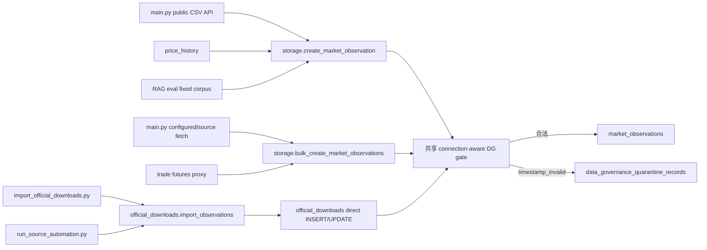

# DG-01：`timestamp_invalid` 第一个最小隔离闭环设计

- 状态：`DESIGN_REVISION`（方向 B：保留恢复能力并强化 Schema、事务和一致性校验）；本轮仅设计，未授权修复。
- 范围：只治理 `market_observations.observed_at` 的语法错误；通过语法解析不等于 `time_valid` 或 `eligible`。
- 明确排除：时区换算、未来时间、交易日历、`stale`、`data_outage`、单位治理、RAG、Agent、预测和因子实现。
- 公共行为：采用已冻结方案 A；既有成功 HTTP 200 和响应 Schema 不变。

现有 `MarketObservationCreate.observed_at` 只要求非空、长度不超过 40，没有日期语法验证；正式表直接保存该字符串
（[server/app/models.py:556](/path/to/project/server/app/models.py:556)，
[server/app/storage.py:168](/path/to/project/server/app/storage.py:168)）。
本设计在正式写入之前增加一个治理域薄门禁，不创建第二套观测、来源、快照或预测系统。

## 1. 完整 DDL 草案

### 1.1 正式表名与 DDL

正式名称：`data_governance_quarantine_records`。它属于现有 `data_governance` 域；现有治理表均由
`ensure_governance_schema()` 创建，并已经通过迁移 22 接入 storage 迁移链
（[server/app/data_governance.py:54](/path/to/project/server/app/data_governance.py:54)，
[server/app/storage.py:1393](/path/to/project/server/app/storage.py:1393)）。

```sql
CREATE TABLE IF NOT EXISTS data_governance_quarantine_records (
  quarantine_id TEXT PRIMARY KEY
    CHECK (length(trim(quarantine_id)) > 0),

  created_at TEXT NOT NULL
    CHECK (length(trim(created_at)) > 0),
  received_at TEXT NOT NULL
    CHECK (length(trim(received_at)) > 0),
  updated_at TEXT NOT NULL
    CHECK (length(trim(updated_at)) > 0),

  source_id TEXT NOT NULL
    CHECK (length(trim(source_id)) > 0),
  payload_hash TEXT NOT NULL
    CHECK (
      length(payload_hash) = 64
      AND payload_hash NOT GLOB '*[^0-9a-f]*'
    ),
  hash_algorithm_version TEXT NOT NULL
    DEFAULT 'sha256:dg-cjson-v1'
    CHECK (hash_algorithm_version = 'sha256:dg-cjson-v1'),

  failure_code TEXT NOT NULL
    DEFAULT 'timestamp_invalid'
    CHECK (failure_code = 'timestamp_invalid'),
  failure_detail TEXT NOT NULL
    DEFAULT ''
    CHECK (length(failure_detail) <= 512),
  raw_payload TEXT NOT NULL
    CHECK (length(raw_payload) > 0 AND json_valid(raw_payload)),

  status TEXT NOT NULL
    DEFAULT 'quarantined'
    CHECK (status IN ('quarantined', 'recovered')),

  recovered_at TEXT DEFAULT NULL,
  recovery_payload_hash TEXT DEFAULT NULL,
  recovery_hash_algorithm_version TEXT DEFAULT NULL,
  recovered_observation_id TEXT DEFAULT NULL
    REFERENCES market_observations(observation_id)
      ON UPDATE RESTRICT ON DELETE RESTRICT,
  recovery_detail TEXT NOT NULL
    DEFAULT ''
    CHECK (length(recovery_detail) <= 512),

  UNIQUE (source_id, payload_hash, failure_code),

  CHECK (
    recovery_payload_hash IS NULL
    OR (
      length(recovery_payload_hash) = 64
      AND recovery_payload_hash NOT GLOB '*[^0-9a-f]*'
    )
  ),
  CHECK (
    (
      status = 'quarantined'
      AND recovered_at IS NULL
      AND recovery_payload_hash IS NULL
      AND recovery_hash_algorithm_version IS NULL
      AND recovered_observation_id IS NULL
    )
    OR
    (
      status = 'recovered'
      AND recovered_at IS NOT NULL
      AND recovery_payload_hash IS NOT NULL
      AND recovery_hash_algorithm_version = 'sha256:dg-cjson-v1'
      AND recovered_observation_id IS NOT NULL
      AND recovery_payload_hash <> payload_hash
    )
  )
);

CREATE TABLE IF NOT EXISTS data_governance_quarantine_correction_links (
  link_id TEXT PRIMARY KEY
    CHECK (length(trim(link_id)) > 0),
  created_at TEXT NOT NULL
    CHECK (length(trim(created_at)) > 0),
  original_quarantine_id TEXT NOT NULL
    REFERENCES data_governance_quarantine_records(quarantine_id)
      ON UPDATE RESTRICT ON DELETE RESTRICT,
  correction_quarantine_id TEXT NOT NULL
    REFERENCES data_governance_quarantine_records(quarantine_id)
      ON UPDATE RESTRICT ON DELETE RESTRICT,
  CHECK (original_quarantine_id <> correction_quarantine_id),
  UNIQUE (original_quarantine_id, correction_quarantine_id)
);

CREATE INDEX IF NOT EXISTS idx_dg_quarantine_status_failure_received
  ON data_governance_quarantine_records(
    status, failure_code, received_at DESC
  );

CREATE INDEX IF NOT EXISTS idx_dg_quarantine_source_received
  ON data_governance_quarantine_records(
    source_id, received_at DESC
  );

CREATE INDEX IF NOT EXISTS idx_dg_quarantine_recovered_observation
  ON data_governance_quarantine_records(recovered_observation_id)
  WHERE recovered_observation_id IS NOT NULL;

CREATE INDEX IF NOT EXISTS idx_dg_quarantine_correction_reverse
  ON data_governance_quarantine_correction_links(correction_quarantine_id);

CREATE TRIGGER IF NOT EXISTS trg_dg_quarantine_immutable_fact
BEFORE UPDATE OF
  quarantine_id,
  created_at,
  received_at,
  source_id,
  payload_hash,
  hash_algorithm_version,
  failure_code,
  failure_detail,
  raw_payload
ON data_governance_quarantine_records
BEGIN
  SELECT RAISE(ABORT, 'quarantine_fact_immutable');
END;

CREATE TRIGGER IF NOT EXISTS trg_dg_quarantine_no_delete
BEFORE DELETE ON data_governance_quarantine_records
BEGIN
  SELECT RAISE(ABORT, 'quarantine_fact_immutable');
END;

CREATE TRIGGER IF NOT EXISTS trg_dg_quarantine_recovery_observation_exists
BEFORE UPDATE OF status, recovered_observation_id
ON data_governance_quarantine_records
WHEN NEW.status = 'recovered'
 AND NOT EXISTS (
   SELECT 1
   FROM market_observations
   WHERE observation_id = NEW.recovered_observation_id
 )
BEGIN
  SELECT RAISE(ABORT, 'recovery_observation_not_found');
END;

CREATE TRIGGER IF NOT EXISTS trg_dg_quarantine_recovery_only
BEFORE UPDATE ON data_governance_quarantine_records
WHEN NOT (
  OLD.status = 'quarantined'
  AND NEW.status = 'recovered'
  AND NEW.updated_at = NEW.recovered_at
)
BEGIN
  SELECT RAISE(ABORT, 'invalid_quarantine_state_transition');
END;

CREATE TRIGGER IF NOT EXISTS trg_dg_recovered_observation_no_update
BEFORE UPDATE ON market_observations
WHEN EXISTS (
  SELECT 1
  FROM data_governance_quarantine_records
  WHERE status = 'recovered'
    AND recovered_observation_id = OLD.observation_id
)
BEGIN
  SELECT RAISE(ABORT, 'recovered_observation_immutable');
END;

CREATE TRIGGER IF NOT EXISTS trg_dg_recovered_observation_no_delete
BEFORE DELETE ON market_observations
WHEN EXISTS (
  SELECT 1
  FROM data_governance_quarantine_records
  WHERE status = 'recovered'
    AND recovered_observation_id = OLD.observation_id
)
BEGIN
  SELECT RAISE(ABORT, 'recovered_observation_referenced');
END;

CREATE TRIGGER IF NOT EXISTS trg_dg_quarantine_correction_link_exists
BEFORE INSERT ON data_governance_quarantine_correction_links
WHEN NOT EXISTS (
       SELECT 1
       FROM data_governance_quarantine_records
       WHERE quarantine_id = NEW.original_quarantine_id
     )
  OR NOT EXISTS (
       SELECT 1
       FROM data_governance_quarantine_records
       WHERE quarantine_id = NEW.correction_quarantine_id
     )
BEGIN
  SELECT RAISE(ABORT, 'correction_quarantine_not_found');
END;

CREATE TRIGGER IF NOT EXISTS trg_dg_quarantine_correction_link_no_update
BEFORE UPDATE ON data_governance_quarantine_correction_links
BEGIN
  SELECT RAISE(ABORT, 'correction_link_immutable');
END;

CREATE TRIGGER IF NOT EXISTS trg_dg_quarantine_correction_link_no_delete
BEFORE DELETE ON data_governance_quarantine_correction_links
BEGIN
  SELECT RAISE(ABORT, 'correction_link_immutable');
END;
```

`connect()` 当前只设置 busy timeout、WAL 和 synchronous，没有启用 `PRAGMA foreign_keys=ON`
（[server/app/storage.py:1328](/path/to/project/server/app/storage.py:1328)）。
方向 B 改为在每个 storage 连接创建后、任何事务和 DDL 前执行并核验 `PRAGMA foreign_keys=ON`；
上述显式 `ON UPDATE/DELETE RESTRICT` 因而是运行时约束。恢复后正式行的任何 UPDATE 再由
`trg_dg_recovered_observation_no_update` 禁止；正式行 DELETE/主键 UPDATE 由外键拒绝，二者共同保证审计链。

### 1.2 字段契约

| 字段 | SQLite 类型 / NULL / 默认值 | 语义 |
|---|---|---|
| `quarantine_id` | `TEXT PRIMARY KEY`，非空，无默认 | 内部 UUID；永不进入公共 API。 |
| `created_at` | `TEXT NOT NULL`，无默认 | 隔离事实第一次成功持久化的 UTC RFC3339 时间；重试不改变。 |
| `received_at` | `TEXT NOT NULL`，无默认 | 该逻辑行第一次到达治理门禁的 UTC RFC3339 时间；不是来源观测时间。 |
| `updated_at` | `TEXT NOT NULL`，无默认 | 创建时等于 `created_at`；以后只在成功恢复时更新。重复非法提交不更新。 |
| `source_id` | `TEXT NOT NULL`，无默认 | 门禁 payload 中的来源 ID；沿用正式观测的必填来源字段（[server/app/storage.py:171](/path/to/project/server/app/storage.py:171)）。 |
| `payload_hash` | `TEXT NOT NULL`，无默认 | 门禁边界完整逻辑 payload 的 64 位小写 SHA-256。 |
| `hash_algorithm_version` | `TEXT NOT NULL`，默认 `sha256:dg-cjson-v1` | Hash 与 canonical JSON 联合版本。 |
| `failure_code` | `TEXT NOT NULL`，默认并仅允许 `timestamp_invalid` | 首闭环唯一失败类型。 |
| `failure_detail` | `TEXT NOT NULL`，默认空串，最多 512 字符 | 仅内部诊断；允许值限定为稳定、去敏的短原因，例如 `date_parse_failed`、`timezone_required`、`rfc3339_parse_failed`。禁止堆栈、SQL、凭证、HTTP 原文及整份 payload。公共 `errors` 只返回 `timestamp_invalid`。 |
| `raw_payload` | `TEXT NOT NULL`，无默认，必须 `json_valid` | 第 2 节 canonical JSON 的 UTF-8 解码文本；是进入共享门禁的完整逻辑对象，不是 HTTP 原始字节或 CSV 原始空白。CSV 原始行已由现有 `raw=row` 保存在 payload 内（[server/app/main.py:2350](/path/to/project/server/app/main.py:2350)）。 |
| `status` | `TEXT NOT NULL`，默认 `quarantined` | 仅 `quarantined/recovered`；语法通过也不写 `time_valid/eligible`。 |
| `recovered_at` | `TEXT NULL`，默认 `NULL` | 更正 payload 已成功正式入库的同一事务 UTC 时间。 |
| `recovery_payload_hash` | `TEXT NULL`，默认 `NULL` | 更正后、正式入库 payload 的 hash；必须不同于原 hash。 |
| `recovery_hash_algorithm_version` | `TEXT NULL`，默认 `NULL` | 恢复 hash 算法版本；本版本只允许 `sha256:dg-cjson-v1`。 |
| `recovered_observation_id` | `TEXT NULL`，默认 `NULL` | 指向更正后正式 `market_observations.observation_id`。 |
| `recovery_detail` | `TEXT NOT NULL`，默认空串，最多 512 字符 | 内部稳定恢复说明；禁止敏感内容。 |

更正关联表字段：

| 字段 | SQLite 类型 / NULL / 默认值 | 语义 |
|---|---|---|
| `link_id` | `TEXT PRIMARY KEY`，非空，无默认 | 内部 UUID。 |
| `created_at` | `TEXT NOT NULL`，无默认 | 关联被确认并持久化的 UTC RFC3339 时间。 |
| `original_quarantine_id` | `TEXT NOT NULL`，无默认 | 被更正的原隔离事实。 |
| `correction_quarantine_id` | `TEXT NOT NULL`，无默认 | 更正尝试仍非法时，对应的幂等隔离事实。 |

普通 API 不携带也不返回 `quarantine_id`，所以不能凭“更正后的 source_id”猜测原隔离事实；只有掌握内部隔离 ID
或经过人工确认的治理恢复流程才能设置恢复关系。非法更正使用独立关联表，而不把父 ID 放入隔离事实唯一身份；
因此同一幂等非法 payload 可以被多个原隔离事实引用而不丢失关系。不得使用去掉 `observed_at` 后的模糊业务键自动关联，因为当前正式
身份键本身包含 `observed_at`
（[server/app/storage.py:2826](/path/to/project/server/app/storage.py:2826)）。

### 1.3 索引、并发和保留策略

| 索引/约束 | 对应查询 |
|---|---|
| `UNIQUE(source_id,payload_hash,failure_code)` | 非法重试和并发冲突后的精确幂等查找。 |
| `idx_dg_quarantine_status_failure_received` | 按状态、错误类型和接收时间列隔离复核队列。 |
| `idx_dg_quarantine_source_received` | 单来源时间线、来源审计和故障聚合。 |
| `idx_dg_quarantine_recovered_observation` | 从正式观测反查其恢复来源。 |
| correction link 唯一约束 | 从一个原隔离事实幂等关联一个仍非法的更正事实。 |
| `idx_dg_quarantine_correction_reverse` | 反查同一非法更正事实关联的一个或多个原隔离事实。 |

并发插入采用：

1. `INSERT ... ON CONFLICT(source_id,payload_hash,failure_code) DO NOTHING`。
2. 插入成功者返回新内部记录；冲突者在 SQLite 写锁释放后，按同一唯一键 `SELECT` 赢家记录。
3. 两个调用在内部得到同一个 `quarantine_id`；公共 API 均按该输入行返回 `rejected` 和
   `timestamp_invalid`，不暴露 ID。
4. 不用 `REPLACE`，避免删除并重建原隔离事实。
5. 若该 payload 是某个原隔离事实的非法更正，取得幂等 `quarantine_id` 后再对 correction link 执行
   `INSERT ... ON CONFLICT(original_quarantine_id,correction_quarantine_id) DO NOTHING`。
   同一更正事实可拥有多个父 link，不改变隔离事实唯一身份。

现有连接已有 30 秒 busy timeout 和 WAL，可复用其锁等待行为
（[server/app/storage.py:1313](/path/to/project/server/app/storage.py:1313)）。

保留策略：v1 append-only，无自动 `DELETE`、TTL、清理调度或硬删除接口。恢复只允许更新恢复字段和 `status`，
原 `raw_payload/hash/source/failure/received_at/created_at` 及更正关联由 trigger 冻结；恢复后任何再次 UPDATE
或状态回退也由单向 transition trigger 拒绝。正式保留期限和硬删除审批
尚未冻结，本闭环不新增 `retired` 状态；退役策略必须另立治理决定后再迁移。

## 2. Hash 与 Canonical JSON 契约

### 2.1 Hash 的准确输入

Hash 输入是“调用共享门禁时收到的完整 `dict` payload”，包括 `source_id`、原始 `observed_at`、数值、单位、
证据字段和嵌套 `raw`。它不是 HTTP body、CSV 字节、Pydantic 模型 JSON，也不包含数据库生成的
`observation_id/created_at/received_at/quarantine_id`。

主 API 当前先构造 `MarketObservationCreate`，再把 `model_dump()` 交给 storage，并把原 CSV 行放进 `raw`
（[server/app/main.py:2353](/path/to/project/server/app/main.py:2353)，
[server/app/main.py:2364](/path/to/project/server/app/main.py:2364)）。
因此该路径的准确 hash 输入是 `payload.model_dump()`；其他入口则是其传给 storage 的原始 dict。共享门禁在 hash
完成前不得 trim、补默认值、改写时间或删除字段。

### 2.2 `dg-cjson-v1` 步骤

1. 根必须是 JSON object；对象 key 必须是字符串。
2. 递归保留全部字段；不删除空串、`null`、零值或未知字段。
3. 对象 key 使用 Python 字符串的 Unicode code point 顺序递归排序。
4. 数组保持输入顺序，不排序、不去重。
5. Unicode 字符串保持原 code point 序列，不做 NFC/NFKC；`ensure_ascii=False`。
6. 数字保留 Python JSON 输入类型：`1` 与 `1.0` 分别序列化为 `1` 与 `1.0`；拒绝
   `NaN`、`Infinity`、`-Infinity`、Decimal 及其他非 JSON 类型。
7. `null` 原样保留为 `null`。
8. 所有时间字符串原样保留，不转时区、不大小写转换、不 trim；解析只使用临时副本。
9. 使用
   `json.dumps(payload, ensure_ascii=False, sort_keys=True, separators=(",", ":"), allow_nan=False)`。
10. 将结果编码为 UTF-8；该字节序列既是 hash 输入，也是 `raw_payload` 存储文本的来源。

现有 storage 已有相同的 `sort_keys=True`、紧凑 separators 和 UTF-8 JSON hash 先例
（[server/app/storage.py:2041](/path/to/project/server/app/storage.py:2041)），但当前不是治理 payload hash，
故本闭环必须使用独立版本号，不能冒充既有 hash。

### 2.3 算法与更正隔离

- 算法：SHA-256。
- 输出：64 位小写十六进制。
- 版本：`sha256:dg-cjson-v1`。
- 计算：`sha256(canonical_json_utf8).hexdigest()`。

更正后的 payload 仍以完整对象重新 canonicalize；由于 `observed_at` 是 hash 输入且时间字符串不被标准化，
任何时间修正都会产生不同 hash。恢复 CHECK 进一步要求 `recovery_payload_hash <> payload_hash`。
不得用 `(source_id, indicator, product)` 或删除 `observed_at` 后的对象作为 hash 输入，否则会把更正版本误识别成原隔离事实。

## 3. 迁移设计

当前未验收实现已经是 `SCHEMA_VERSION = 24`
（[server/app/storage.py:920](/path/to/project/server/app/storage.py:920)），且 migration 22 与 24
错误地共同调用会随当前版本扩张的 `ensure_governance_schema()`
（[server/app/storage.py:1411](/path/to/project/server/app/storage.py:1411)，
[server/app/storage.py:1417](/path/to/project/server/app/storage.py:1417)）。
方向 B 修复不得新增 migration 25；它是 migration 24 验收前的契约修正。必须把 Schema 创建入口拆成：

```python
def ensure_governance_schema(connection: sqlite3.Connection) -> None:
    # 仅供“确保当前全部治理对象”运行时调用；历史 migration 不调用它。
    _ensure_governance_v22_schema(connection)
    ensure_timestamp_quarantine_v24_schema(connection)

def _ensure_governance_v22_schema(connection: sqlite3.Connection) -> None:
    # 冻结为 migration 22 当时的五张治理/对账表和既有索引；永不加入 quarantine 对象。
    ...

def ensure_timestamp_quarantine_v24_schema(connection: sqlite3.Connection) -> None:
    # 专属于 migration 24：两张 quarantine 表、4 个显式索引及方向 B triggers。
    ...

def _migration_data_source_governance_and_reconciliation(connection):
    _ensure_governance_v22_schema(connection)

def _migration_data_governance_timestamp_invalid_quarantine(connection):
    ensure_timestamp_quarantine_v24_schema(connection)
```

“migration 22 不可变”是指其执行结果永久固定为 v22 对象集；允许把当前错误调用改回冻结入口，
但不得更名、重编号、增删其历史对象或让它间接调用 v24。两张 quarantine 表仍保留在当前
`GOVERNANCE_TABLES`，使审计排除逻辑继续生效
（[server/app/data_governance.py:13](/path/to/project/server/app/data_governance.py:13)）。

连接及迁移调用顺序：

```text
connect
→ PRAGMA foreign_keys = ON（必须在任何 BEGIN/DDL 前）
→ _schema_is_current
→ 若非 current：connection.executescript(SCHEMA)
→ _ensure_migrations
→ 读取 schema_migrations
→ 仅执行未记录版本
→ INSERT OR IGNORE schema_migrations
→ PRAGMA user_version = SCHEMA_VERSION
```

| 场景 | 必须执行的实际顺序与断言 |
|---|---|
| 空库逻辑 1→24 | `SCHEMA` 后执行全部未记录 migration；不得为 DG-01 重排既有 1–23 registry，故保留其历史注册顺序，但 DG 关键调用严格为 `22→_ensure_governance_v22_schema`、`23→既有函数`、`24→ensure_timestamp_quarantine_v24_schema`。最终 v22 与 v24 对象各一份、migration 1–24 各一条、`user_version=24`。 |
| 直接执行 migration 22 | 在只有基础 `SCHEMA` 的临时库执行 migration 22；断言 v22 治理对象存在，同时 `sqlite_master` 中表名、索引名和 trigger 名均无任何 quarantine 对象。 |
| 真实 v23→24 | fixture 必须在 WAL 临时库执行基础 `SCHEMA`，再逐个实际执行 registry 中 `version<=23` 的 migration 函数并写真实记录、设置 `user_version=23`；升级前断言无 quarantine 对象。之后只允许 `connect()` 执行 24。禁止先执行当前 v24 DDL再伪造 1–23 rows。 |
| 重复执行 | 对已经正确完成 24 的同一库清理进程内 path cache 后再次连接；migration 24 仍一条，Schema 对象集合和 SQL 定义均不变。 |
| 双进程并发 | 从上述真实 v23 WAL fixture 出发，用 `spawn` 的两个独立受控进程经 barrier 同时调用 `connect()`；两者都必须成功观察 `user_version=24` 和唯一 migration 24，最终 Schema 定义完整；线程不能替代。 |

`_migrations()` 中 1–23 的名称、版本和函数不得重排、重编号或重写；本修订只把 22 的调用目标固定回
v22 专属入口，并把 24 固定到 v24 专属入口。当前连接尚未启用 foreign keys
（[server/app/storage.py:1328](/path/to/project/server/app/storage.py:1328)），下一轮必须按第 10.4 节修复。

## 4. 全部 `market_observations` 写入入口图

生产代码中只有两组正式表 SQL 写点：

- storage `_upsert_market_observation_with_connection()` 的 UPDATE/INSERT
  （[server/app/storage.py:2819](/path/to/project/server/app/storage.py:2819)）。
- `official_downloads._apply_observation_changes()` 的直接批量 INSERT/UPDATE
  （[server/app/official_downloads.py:339](/path/to/project/server/app/official_downloads.py:339)）。



| 入口 | 当前调用链和事务 | 门禁、防绕过、返回影响 | 首闭环 |
|---|---|---|---|
| storage 单行 | `create_market_observation → _upsert... → identity SELECT → UPDATE/INSERT`；一调用一 connection transaction（[server/app/storage.py:2794](/path/to/project/server/app/storage.py:2794)）。 | 在 identity SELECT 前调用 connection-aware gate。合法返回 dict 不变；非法先提交隔离，再在事务块外抛内部 `TimestampInvalidError`，避免异常回滚隔离。 | 必须 |
| storage bulk | `bulk_create_market_observations → _upsert...`；当前整批共用一个事务和 list comprehension（[server/app/storage.py:2805](/path/to/project/server/app/storage.py:2805)）。 | 改为逐行分类；非法写隔离并继续，合法调用同一正式写原语。公共返回仍只保留正式 stored record list，故既有 `len(stored)` 自然排除隔离行。 | 必须 |
| main CSV/API | `POST /imports/public-observations → _import_public_rows → MarketObservationCreate → create_market_observation`（[server/app/main.py:2037](/path/to/project/server/app/main.py:2037)，[server/app/main.py:2347](/path/to/project/server/app/main.py:2347)）。每行独立事务，异常按输入顺序收集。 | storage 是不可绕过底线；main 只把内部异常稳定映射为 `row N: timestamp_invalid`。成功写正式表后才 `accepted += 1`。 | 必须；方案 A 核心 |
| configured/source fetch | 两个 fetch API 经 `_fetch_and_store_source → bulk_create_market_observations`（[server/app/main.py:952](/path/to/project/server/app/main.py:952)，[server/app/main.py:992](/path/to/project/server/app/main.py:992)）。每个来源一次 bulk 事务，snapshot 另事务。 | bulk 内门禁；`stored_observations=len(stored)` 只数正式行。`FetchResultModel` 没有 rejected/errors，不新增字段（[server/app/models.py:534](/path/to/project/server/app/models.py:534)）。 | 通过 bulk 必须覆盖；main 无需为此改 Schema |
| official downloads 直写 | `import_observations → validate/deduplicate → classify → _apply_observation_changes → executemany INSERT/UPDATE`；apply 为一个批事务（[server/app/official_downloads.py:267](/path/to/project/server/app/official_downloads.py:267)，[server/app/official_downloads.py:339](/path/to/project/server/app/official_downloads.py:339)）。 | 必须把共享时间门禁前移到现有 `validate_observations()` 改写 `observed_at` 之前：先对每个原 payload hash/分类，非法者送隔离，合法者再进入既有来源专用校验；apply 阶段仍必须调用同一 connection-aware 正式写原语，避免未来直写绕过。合法 summary 保持；内部可增加 rejected/errors，但不是公共 HTTP Schema。 | 必须 |
| `import_official_downloads.py` | CLI load/backup 后调用 `import_observations`（[server/scripts/import_official_downloads.py:50](/path/to/project/server/scripts/import_official_downloads.py:50)）。 | 不重复门禁；下层覆盖。合法 stdout/exit code 不变。 | 下层覆盖；脚本无需改 |
| `run_source_automation.py` 公共源 | Fetcher 后调用 `official_downloads.import_observations`，再独立写 source fetch audit（[server/scripts/run_source_automation.py:294](/path/to/project/server/scripts/run_source_automation.py:294)，[server/scripts/run_source_automation.py:369](/path/to/project/server/scripts/run_source_automation.py:369)）。 | 复用 official/common gate；变化统计仅使用正式表结果。 | 下层覆盖；脚本无需改 |
| trade futures proxy | 解析结果调用 storage bulk；`stored_rows=len(stored)`（[server/scripts/import_trade_futures_proxy.py:209](/path/to/project/server/scripts/import_trade_futures_proxy.py:209)，[server/scripts/import_trade_futures_proxy.py:235](/path/to/project/server/scripts/import_trade_futures_proxy.py:235)）。 | bulk 门禁；generated `accepted_rows` 仍表示解析生成数，`stored_rows` 只数正式行。 | 下层覆盖；脚本无需改 |
| price history | API 调用 `fetch_and_store_price_history`，其逐行调用 storage single（[server/app/price_history.py:41](/path/to/project/server/app/price_history.py:41)）。 | single 门禁。必须局部捕获 `TimestampInvalidError` 并继续后续行；现有返回 `{fetched,stored,start,end}` 不加字段，`fetched` 保持来源返回数，`stored` 只数正式行。 | 必须；否则一条非法记录会终止后续行 |
| RAG eval 固定语料 | `bootstrap_fixed_rag_eval_corpus → create_market_observation`；固定时间带显式 offset（[server/app/rag_quality_eval.py:48](/path/to/project/server/app/rag_quality_eval.py:48)）。 | single 门禁自动覆盖；应作为合法历史回归，不修改 RAG 代码。 | 回归覆盖；无需改 |

`official_downloads._validated_date` 现有来源专用校验只接受日期且拒绝未来日期
（[server/app/official_downloads.py:418](/path/to/project/server/app/official_downloads.py:418)）。
共享 DG-01 门禁不得新增未来校验，也不得删除或放宽该既有来源专用规则；后者属于另一个行为变更。
由于现有 `validate_observations()` 会先调用 `_validated_date` 并原地改写 `payload["observed_at"]`
（[server/app/official_downloads.py:233](/path/to/project/server/app/official_downloads.py:233)），实施时必须先保存门禁边界原 payload
并执行共享分类；否则非法时间会在进入隔离原语前被整批 `ValueError` 拒绝，且 hash 也不再对应原输入。
`import_observations(..., apply=False)` 必须保持真正 dry-run：执行相同分类并在 summary 报告 rejected/errors，
但不得写正式表、隔离表或更正关联表；只有 `apply=True` 才持久化隔离事实。

## 5. 批量事务语义

### 5.1 时间语法

共享门禁只做：

- `YYYY-MM-DD`：先匹配固定宽度，再由 `date.fromisoformat` 验证真实日期。
- datetime：精确 profile 为
  `YYYY-MM-DD[Tt]HH:MM:SS(?:\.[0-9]{1,6})?(?:[Zz]|[+-]HH:MM)`。
  先由完整锚定 regex 验证形状，再把临时副本中的 `Z/z` 替换为 `+00:00`，交给 Python 3.11
  `datetime.fromisoformat` 验证日期、`00–23` 小时、`00–59` 分秒和 offset。
  `±HH:MM` 接受 parser 允许的 `00:00–23:59`，包括 RFC3339 的 `-00:00`；不接受带秒 offset。
  闰秒 `:60` 和超过 6 位小数秒在 v1 明确返回 `timestamp_invalid`。
- 无时区 datetime、非法日期、乱码：`timestamp_invalid`。
- 不 trim 后接受、不换算时区、不检查未来、不检查日历。
- 解析使用临时字符串；raw/hash 中保留原字符串。

### 5.2 API 方案 A 的混合批

现有 public import 路由没有显式成功 status code，返回模型固定为
`accepted/rejected/errors/data_snapshot_id`
（[server/app/main.py:2037](/path/to/project/server/app/main.py:2037)，
[server/app/models.py:847](/path/to/project/server/app/models.py:847)）。
现有测试已断言正常响应 HTTP 200
（[server/tests/test_api.py:1576](/path/to/project/server/tests/test_api.py:1576)）。

规则：

1. 按 CSV 原始行序处理；现有循环使用 `enumerate(..., start=2)`，继续沿用
   （[server/app/main.py:2350](/path/to/project/server/app/main.py:2350)）。
2. 合法行正式 INSERT/UPDATE 成功后才计 `accepted += 1`。
3. 非法时间成功隔离后计 `rejected += 1`，`errors` 追加精确字符串
   `row {csv_line}: timestamp_invalid`；不得返回对象或隔离 ID。
4. `stored_observations` 只用于既有 fetch 契约，等于 bulk 返回的正式记录数
   （[server/app/main.py:1005](/path/to/project/server/app/main.py:1005)）。
5. 普通业务非法行不影响其他合法行；public CSV 继续沿用逐行独立事务。
6. bulk/official 单批在同一 connection 中逐行分类；official 在任何来源专用时间改写前分类；
   `timestamp_invalid` 是业务分支，不抛异常中止整批。
7. 相同非法行重复或并发提交：唯一约束只保留一条隔离事实，但每个请求的该输入行仍各自计一次 rejected；
   计数描述请求行，不描述新建隔离行数。
8. `rejected` 必须按被拒输入行单独计数，不能继续由 `len(errors)` 推导；基础设施失败可能为同一行追加第二条
   诊断字符串。响应字段及类型不变。

### 5.3 存储故障

| 故障 | 事务和返回 |
|---|---|
| 隔离 INSERT 失败 | 该行不得计 accepted；不得写正式表。public CSV 保持 HTTP 200 和 Schema，该行只计一次 rejected，但 `errors` 必须同时保留 `row N: timestamp_invalid` 和追加 `row N: quarantine_persist_failed`，从而既保持稳定业务错误码又明确表明隔离未落账。bulk/official 若无法保证其余行状态，回滚该批并向上抛基础设施错误。 |
| 正式观测 INSERT/UPDATE 失败 | 该行不得计 accepted/stored。public CSV 逐行事务回滚该行，追加 `row N: storage_write_failed`，继续其他行。bulk/official 的正式写失败回滚整个批事务，不能保留“隔离成功/正式成功”的半批结果。 |
| 隔离成功后需要通知 main | storage single 必须先正常退出 transaction context 使隔离提交，再在事务块外抛 `TimestampInvalidError`。若在 transaction 内抛出，现有 connection context 会回滚（事务边界见 [server/app/storage.py:2796](/path/to/project/server/app/storage.py:2796)）。 |
| snapshot/RAG 重建失败 | 行写已经是此前事务；沿用现有边界。本闭环不改变 snapshot/RAG 错误处理。snapshot 当前确实在 accepted 后另行创建（[server/app/main.py:2046](/path/to/project/server/app/main.py:2046)）。 |

因此不会出现“隔离写失败但 API 把该行计为 accepted/stored”。基础设施错误码仍放在既有 `list[str] errors` 中，
不新增响应字段。

## 6. 公共契约影响

### 6.1 可以保持不变的部分

| 契约 | 兼容证明 |
|---|---|
| public import HTTP | 路由当前正常返回 HTTP 200；不新增 `status_code` 或异常 HTTP 分支（[server/app/main.py:2037](/path/to/project/server/app/main.py:2037)）。 |
| `ImportResult` Schema | 保持 `accepted:int/rejected:int/errors:list[str]/data_snapshot_id`；稳定错误码编码为原有字符串元素，不改为对象（[server/app/models.py:847](/path/to/project/server/app/models.py:847)）。 |
| fetch Schema | `FetchResultModel` 仍只有现有字段；仅令 `stored_observations` 等于正式入库数（[server/app/models.py:534](/path/to/project/server/app/models.py:534)）。 |
| 隔离隐私 | API 不返回 `quarantine_id/raw_payload/failure_detail`。 |
| 正常合法输入 | storage 成功返回 record dict、ImportResult 字段和 official 合法统计保持既有形状。 |

### 6.2 内部行为变化

- storage 在正式 SQL 前执行时间语法分类。
- 非法行写治理隔离表而不写 `market_observations`。
- bulk 返回 list 只包含正式写入记录。
- main 将内部异常稳定映射为 `row N: timestamp_invalid`，并把 rejected 行计数与 `len(errors)` 解耦。
- official direct SQL 复用共享门禁，不能绕过。
- `accepted/stored_observations/inserted/updated/unchanged` 均只描述正式表结果。

兼容边界：单源 fetch 的既有 `FetchResultModel` 没有 `rejected/errors`
（[server/app/models.py:534](/path/to/project/server/app/models.py:534)）。
本设计将冻结决定解释为“每个既有响应 Schema 只使用其已有字段”：ImportResult 暴露 rejected/errors，
fetch 只校正 stored_observations 并在内部治理表留痕。若要求 fetch API 也公开
`rejected/errors=timestamp_invalid`，则无法维持方案 A，必须重新交用户决定；本设计不得自行添加字段或切换方案。

## 7. 工作区重叠保护

> 本节保留首次实施前的历史基线，仅用于追溯。当前已实施但未验收工作区的下一轮修复基线、唯一候选文件白名单和精确允许 hunk 以 §10.7 为准；两者不得混用。

### 7.1 当前状态和基线 hash

| 文件 | 当前 Git 状态及 staged/unstaged 重叠 | 当前工作树 SHA-256 | 当前 index blob |
|---|---|---|---|
| `server/app/data_governance.py` | `A `，整文件 staged 新增；无 unstaged hunk | `3b1c95b9017a246361cf769ef81f11207076a6e03cb5ad5cd204ddf0603ce39d` | `b9326959733d2b9a8c430ef4a79db0f6b31351b5` |
| `server/app/storage.py` | `MM`；整份 staged 修改，另有 unstaged hunk 约 979、1192–1297 | `921b111f0237b88b60caccfc49d1a1c35139be930b925ee8d7bf80319483d381` | `fae2ce445cce0bdd0831c9a94adb05b1e0b224d9` |
| `server/app/main.py` | `M `，staged 修改；无 unstaged hunk | `01100f4771daef0c4aa1fcf1ce7f7ec4751f03e580458ae5e59d7bdd15fcca36` | `3e0122c02db871bd702bd5bd4244391c7b7d6e27` |
| `server/app/models.py` | `MM`；staged 与 unstaged 均有修改；公共契约核对相关但不属于实施候选 | `d4cb9f0b393be1da3a586c917bca145c63e6d763be26b393f39b9d139c9aaa07` | `ed5d18e552e3c0c8a6b4ab0a43c3447729f01bfb` |
| `server/app/official_downloads.py` | `A `，整文件 staged 新增；无 unstaged hunk | `3ce1002dfb81c88e99d8f4719bc40427f602984847456b2b6c284eb405aa2e01` | `965cd300d6efdc9aaf37ea419e7e3122c32ac0a0` |
| `server/app/price_history.py` | `M `，staged 修改；无 unstaged hunk | `bfae05dd098020974e38fff9b4b91feee8bd75467fcdf89c21b55cec58d04d30` | `e8e4f4b1fe80f37a07c41fef7b62c63649b3209b` |
| `server/tests/test_api.py` | `MM`；staged 与 unstaged 均有修改 | `f8a64abc7e9362fe6f3460f8f02783cd0be17d652ea1ab38fa531dcc9ff9595b` | `2b806fe16e1274935e29378179fa9f94825c9368` |
| `server/tests/test_data_governance_audit.py` | `A `，整文件 staged 新增；无 unstaged hunk | `e54712f27d974e3d3fb41139e4db77df9f76c8f0b9657ce9d69b6d3053d0a490` | `81b6e3f7d37aabb3f6997868010fa4ca6dcc26a2` |
| `server/tests/test_official_downloads.py` | `A `，整文件 staged 新增；无 unstaged hunk | `a53784086da4972301339c7428e3bddefc7ff98df66d312e9ec347d3dfb33dd6` | `06bc973b58721ed4a5c1f342ab5320febb5e7889` |
| `server/tests/test_backend_foundation.py` | `A `，整文件 staged 新增；无 unstaged hunk | `73bd718630a6e5e92d6b88504998cfcf3063721aeeaa7061cbfa5cf966dffb37` | `1bc37c3f9f33e53c57b6b7dd8045e0304238c35b` |
| `server/tests/test_agent_foundation.py` | `A `，整文件 staged 新增（cached hunk `@@ -0,0 +1,303 @@`）；无 unstaged hunk | `f5b32fa6e79d905270e9e4b42e9f8ed183212bf51259165d9aa59b9c762a2877` | `b255799785edfd8c6a6f8b73d934b94a1b4ece53` |
| `server/tests/test_semantic_index.py` | `A `，整文件 staged 新增（cached hunk `@@ -0,0 +1,274 @@`）；无 unstaged hunk | `a6222f79a514ff62ab3db545aec94400ab1b21dc77b5a0b89ef459425a2fea13` | `faafdfba010aa435e75fbb8155b7637242c1bd2a` |
| `server/tests/test_timestamp_invalid_governance.py` | 不存在；无 staged/unstaged hunk | 不适用 | 不存在 |
| `server/tests/test_price_factor_contracts.py` | `A `，整文件 staged 新增；无 unstaged hunk；仅为隔离回归落点核对，不属于实施候选 | `9fdbc0b01e7184656bd586d61da6d608bc779bc50a6632df82d2663c113dcfda` | `c25bd9378b8c6418362136001a33270bcc86d0b9` |

`storage.py` 的现有 unstaged hunk 与拟改迁移/市场写入行当前不直接相交，但文件整体重叠。
`test_api.py` 当前同时有 staged/unstaged 修改。所有 `A ` 文件都应视为“整文件来源不明的既有修改”，不能因为
没有 unstaged diff 就视为安全。

### 7.2 未来精确 hunk

只有得到 `APPROVED_TO_IMPLEMENT` 后才允许局部修改：

| 文件 | 允许目标 hunk（以本设计时行号为锚） |
|---|---|
| `data_governance.py` | imports 1–8；`GOVERNANCE_TABLES` 10–17 仅加入两张隔离治理表；`ensure_governance_schema` 54–126；紧随 126 后新增 canonical/hash/time/quarantine helper。 |
| `storage.py` | `SCHEMA_VERSION` 903；`connect/_ensure_migrations/_migrations` 1311–1390；治理 migration 1393–1396 附近只追加 v24；market single/bulk/helper 2794–2881。 |
| `main.py` | import 区 74–209（仅异常类型）；public import 2037–2056；row loop 2347–2370。 |
| `official_downloads.py` | `validate_observations/deduplicate_observations` 233–264；`import_observations` 267–291；direct apply 339–397。 |
| `price_history.py` | `fetch_and_store_price_history` 41–48，只增加逐行拒绝捕获和正式 stored 计数。 |
| `test_api.py` | public import 现有测试附近 1576–1597 或文件末尾只追加。 |
| `test_data_governance_audit.py` | 现有 fixture 44–70；仅在文件末尾（现 173 后）追加治理表排除审计测试。 |
| `test_official_downloads.py` | 现有 import/idempotency 测试 139–179 后只追加。 |
| `test_backend_foundation.py` | 迁移期望区 78–105 仅追加 v24；现有 `user_version == 23` 断言 147 只改字面量为 24；文件末尾只追加两个受控独立进程的 23→24 测试。 |
| `test_agent_foundation.py` | 仅 [server/tests/test_agent_foundation.py:51](/path/to/project/server/tests/test_agent_foundation.py:51) 的 `storage.SCHEMA_VERSION == 23` 字面量改为 24；不得触碰整文件 staged 新增的其他行。 |
| `test_semantic_index.py` | 仅 [server/tests/test_semantic_index.py:103](/path/to/project/server/tests/test_semantic_index.py:103) 和 [server/tests/test_semantic_index.py:137](/path/to/project/server/tests/test_semantic_index.py:137) 的版本字面量 23 改为 24；不得触碰其他迁移断言或整文件 staged 新增的其他行。 |
| 新文件 | `server/tests/test_timestamp_invalid_governance.py`，仅在获批后新建。 |

实施前必须：

1. 保存每个目标的 `git diff --cached -- <file>` 和 `git diff -- <file>` 到监督指定的外部审计位置；
   不得写入仓库。
2. 同时记录工作树 SHA-256 和 index blob/hash。
3. 与本节 hash 和目标 hunk 上下文逐项比较。
4. 禁止整文件替换、格式化、stash、reset、stage、commit。

任一以下变化必须停止，不能猜测合并：

- `data_governance.py` 的 imports、治理表集合、`ensure_governance_schema` 或其结尾位置变化。
- `storage.py` 的 `SCHEMA_VERSION` 不再为 23、末迁移不再为 23、迁移函数签名/顺序变化。
- `storage.py` single/bulk/helper 的签名、事务 context、identity SELECT 或 INSERT/UPDATE 区变化。
- `main.py` 的 `ImportResult` route、返回字段、逐行循环或错误类型处理变化。
- `official_downloads.py` 的批事务、validate/classify/direct SQL 区变化。
- `price_history.py` 的抓取结果循环、single 写入调用或返回字段变化。
- `ImportResult` 或 `FetchResultModel` 字段变化。
- 任一工作树 SHA-256、index blob、迁移版本、上述函数签名或精确目标 hunk 上下文发生变化。

这里列出的候选文件与 hunk 只是未来实施上限，不构成实施授权；实施前必须重新取得状态、cached/unstaged
diff、工作树 hash 和 index blob，并逐项核验。任何变化都必须停止并交回监督，不得用“变化在附近”自行合并。

## 8. 完整测试矩阵

本轮不运行测试。未来获批后的测试设计如下。

| 场景 | 测试文件 | 测试入口与 fixture | 核心断言 | 新增迁移测试 |
|---|---|---|---|---|
| 日期和 RFC3339 通过 | `server/tests/test_timestamp_invalid_governance.py` | 纯 validator；参数化 date、`T/t`、`Z/z`、`+08:00`、`-00:00`、1/6 位小数秒和 offset 边界 | 分类为语法通过，但结果不叫 `time_valid/eligible` | 否 |
| 无时区/非法日期/乱码失败 | 同上 | 参数化无时区、非法日期、乱码、闰秒、7 位小数秒、带秒 offset、越界 offset | 稳定 `timestamp_invalid` 和内部短 detail | 否 |
| canonical/hash | 同上 | 相同 dict 不同 key 插入顺序、Unicode、null、整数/浮点、数组 | key 顺序不影响 hash；数组顺序、1/1.0、时间修正影响 hash；NaN/非 JSON 类型失败 | 否 |
| 幂等 | 同上 | tmp SQLite，重复调用 quarantine helper | 相同 `source_id+payload_hash+failure_code` 只有一行；内部 ID 相同 | 否 |
| 更正版本 | 同上 | 原非法 payload、仍非法更正、最终合法 observation | 原 raw/hash 不变；链引用正确；最终 recovered 指向正式 observation；新 hash 不等于原 hash | 否 |
| 更正多父关联 | 同上 | 同一非法更正 payload 分别关联两个原隔离事实 | 隔离事实仍只有一条；correction link 有两条且均可正反向查询 | 否 |
| 恢复不可改写 | 同上 | recovered 后尝试替换 recovery hash/observation/time、回退 quarantined、UPDATE/DELETE correction link | 全部由 trigger 拒绝；原恢复事实和关系不变 | 否 |
| 隔离主事实不可删除 | 同上 | 创建原隔离事实、一个更正隔离事实及关联后，对主记录执行 DELETE | `trg_dg_quarantine_no_delete` 以 `quarantine_fact_immutable` 拒绝；两条主事实和关联关系均保持完整 | 否 |
| 并发冲突 | 同上 | 两连接/thread barrier 同时插相同非法 payload | 无未处理 UNIQUE 异常；只有一条隔离事实；两个内部结果指向同一行 | 否 |
| 隔离写失败 | 同上及 `test_api.py` | 注入 quarantine INSERT 错误 | 正式表无该行；API 不计 accepted、该行只计一次 rejected，同时包含 `timestamp_invalid` 与 `quarantine_persist_failed`，不报告成功 | 否 |
| 正式写失败 | 同上及 `test_api.py` | 注入正式 INSERT/UPDATE 错误 | 该行不计 accepted/stored；无伪造 recovery；其他独立 API 行按设计继续 | 否 |
| bulk 隔离 INSERT 失败整批回滚 | `server/tests/test_timestamp_invalid_governance.py` | tmp SQLite 调用 `bulk_create_market_observations`（现入口见 [server/app/storage.py:2805](/path/to/project/server/app/storage.py:2805)）；输入顺序包含先成功正式写、先成功隔离写、再触发隔离 INSERT 故障的行，以 connection/治理 helper 故障注入在同一批事务内抛基础设施异常 | 调用方收到基础设施异常且调用不返回结果/部分成功统计；此前成功的正式行全部回滚，此前写入的隔离行全部回滚；正式表和隔离表均恢复批前状态 | 否 |
| bulk 正式 INSERT 失败整批回滚 | 同上 | tmp SQLite 调用同一 bulk 入口；输入顺序包含先成功正式写、先成功隔离写、再触发正式 INSERT 故障的合法行，以 connection/正式写 helper 故障注入在同一批事务内抛基础设施异常 | 调用方收到基础设施异常且调用不返回结果/部分成功统计；此前成功的正式行全部回滚，此前写入的隔离行全部回滚；正式表和隔离表均恢复批前状态 | 否 |
| main/API 混合批 | `server/tests/test_api.py` | POST `/api/v1/imports/public-observations`；沿用隔离 DB/TestClient；3 合法+3 非法 | HTTP 200；响应 key 集合不变；accepted=3、rejected=3；errors 严格输入序；无 quarantine ID；市场 GET 只有合法行 | 否 |
| fetch stored 计数 | `server/tests/test_api.py` | mock Fetcher 返回合法+非法 observations，调用 source fetch | `FetchResultModel` Schema 不变；`stored_observations` 只数正式行；不新增 rejected/errors | 否 |
| price_history 单行异常后继续 | `server/tests/test_timestamp_invalid_governance.py` | async 调用 `fetch_and_store_price_history`（现循环和返回形状见 [server/app/price_history.py:41](/path/to/project/server/app/price_history.py:41)）；mock 历史来源按“合法—非法—合法”返回三行，并使用隔离 tmp SQLite | `fetched=3`、`stored=2`；非法行进入隔离表且不进正式表；第三行在非法行之后仍继续正式入库；返回字段集合严格为 `{fetched, stored, start, end}`，任何返回字段或值均不暴露隔离 ID | 否 |
| official direct path | `server/tests/test_official_downloads.py` | `import_observations(...,apply=True)`，复用现有 tmp DB fixture（既有模式见 [server/tests/test_official_downloads.py:139](/path/to/project/server/tests/test_official_downloads.py:139)） | direct INSERT/UPDATE 无法绕过；合法/非法混合后正式表仅合法；summary 只数正式变化 | 否 |
| official 隔离 INSERT 失败整批回滚 | `server/tests/test_official_downloads.py` | tmp SQLite 调用 `import_observations(..., apply=True)`；构造先成功正式 INSERT/UPDATE、先成功隔离、再触发隔离 INSERT 故障的 payload，并在现有单 connection 事务边界（[server/app/official_downloads.py:267](/path/to/project/server/app/official_downloads.py:267)）注入基础设施异常 | 调用方收到基础设施异常且调用不返回 summary/部分成功统计；此前成功的正式 INSERT/UPDATE 全部回滚，此前写入的隔离行全部回滚；seeded UPDATE 行恢复批前值，新 INSERT 不存在 | 否 |
| official 正式 INSERT/UPDATE 失败整批回滚 | 同上 | 参数化 `operation=INSERT/UPDATE`，分别在 direct apply SQL 路径（[server/app/official_downloads.py:339](/path/to/project/server/app/official_downloads.py:339)）故障注入；每组 payload 均安排先成功正式 INSERT/UPDATE 和先成功隔离，再触发目标正式写异常 | 两种 operation 下调用方都收到基础设施异常且不返回 summary/部分成功统计；此前成功的正式 INSERT/UPDATE 全部回滚，此前写入的隔离行全部回滚；正式表与隔离表均恢复批前状态 | 否 |
| official dry-run | 同上 | `import_observations(...,apply=False)` 合法/非法混合 | summary 报 rejected/errors；正式表、隔离表、关联表均零写入 | 否 |
| official legacy 未来日期 | 同上 | 未来 date payload | 保持现有来源专用拒绝规则；共享门禁本身不做未来判断 | 否 |
| 隔离不进正式表 | `test_timestamp_invalid_governance.py` | 调用 single/bulk/official 三路径 | quarantine 有记录，`market_observations` 无对应 source/hash/极端值 | 否 |
| 隔离不进 snapshot | `server/tests/test_backend_foundation.py` 或专用文件 | 隔离极端值后 `create_data_snapshot` | payload/IDs/source_ids/count 均不含隔离；快照只从正式表读取的现有链见 [server/app/storage.py:3508](/path/to/project/server/app/storage.py:3508) | 否 |
| prediction signal 不受影响 | `server/tests/test_timestamp_invalid_governance.py` | 使用持久化临时 DB，以合法基线与“合法基线+隔离极端值”分别调用实际公开 `GET /api/v1/predictions/model-signal`（route 见 [server/app/main.py:586](/path/to/project/server/app/main.py:586)，`/api/v1` 挂载见 [server/app/main.py:3074](/path/to/project/server/app/main.py:3074)），固定 `as_of` 与其他非目标输入 | 两次公开 API 的 direction、features、data_coverage 与完整响应均一致；不得以直接函数调用替代本回归，禁止为本任务新增任何 `/internal` route | 否 |
| intelligence 因子/来源/覆盖率 | `server/tests/test_timestamp_invalid_governance.py` | 合法基线+隔离极端值；调用 `build_factor_scores/build_overview` | contribution、source_id、market coverage/source_ids 与基线一致；现有计算直接读取正式表（[server/app/intelligence.py:309](/path/to/project/server/app/intelligence.py:309)，[server/app/intelligence.py:380](/path/to/project/server/app/intelligence.py:380)）；不修改 `test_price_factor_contracts.py` | 否 |
| 治理基础设施不进业务审计 | `server/tests/test_data_governance_audit.py` | 沿用 database fixture（[server/tests/test_data_governance_audit.py:44](/path/to/project/server/tests/test_data_governance_audit.py:44)），建两张隔离治理表并调用 `audit_database()` | `GOVERNANCE_TABLES` 含两表；audit datasets/table_names、dataset_count 均不含隔离表和关联表 | 是 |
| 空库迁移 | `server/tests/test_backend_foundation.py` | 新 tmp DB 后 connect | 两张治理表、4 个显式索引、9 个 trigger、migration 24 存在；user_version=24 | 是 |
| version 23 旧库 | 同上 | 构造 schema_migrations 到 23/user_version 23 | 只追加 24，旧数据/迁移不变 | 是 |
| 重复迁移 | 同上 | 连续两次 connect/显式 ensure | version 24 只有一条，DDL 对象各一份，无异常 | 是 |
| 多进程并发启动迁移 | 同上 | 从真实执行 1–23 的 WAL fixture 出发，用同步屏障启动两个受控、独立进程分别执行 `connect` 完成 23→24，并回传退出状态；线程不得替代进程 | 两进程均受控结束且无未处理异常；最终 schema 完整、user_version=24、version 24 迁移记录仅一条、9 个 trigger 完整 | 是 |
| 迁移版本依赖断言 | `server/tests/test_agent_foundation.py`、`server/tests/test_semantic_index.py` | 运行既有 schema/version 测试；只使用原 fixture | 仅受版本提升影响的 [test_agent_foundation.py:51](/path/to/project/server/tests/test_agent_foundation.py:51)、[test_semantic_index.py:103](/path/to/project/server/tests/test_semantic_index.py:103)、[test_semantic_index.py:137](/path/to/project/server/tests/test_semantic_index.py:137) 断言期望 24；其他行为不变 | 是 |
| 合法历史兼容 | `test_api.py`、`test_official_downloads.py`、RAG eval 相关测试 | 复用现有 date-only API 用例、official date 用例、带 offset 固定语料 | 既有 accepted/stored/record 内容不变；现有 API 成功测试见 [server/tests/test_api.py:1576](/path/to/project/server/tests/test_api.py:1576) | 否 |

测试必须额外断言隔离查询不被 `list_market_observations()` 返回；该函数只查询正式表
（[server/app/storage.py:2884](/path/to/project/server/app/storage.py:2884)）。
snapshot 的 market payload、prediction signal 覆盖率以及 intelligence coverage 都由该正式读取链派生，
因此这些测试是“没有旁路写入”的验收，而不是新增下游过滤实现。

## 9. 实施文件白名单建议

> 本节是第一次 DG-01 实施的历史建议，不构成本轮 recovery/correction 修复授权。下一轮候选修复范围已收窄为 §10.7 的四个文件及其精确 hunk；本节其余文件均不得据此进入下一轮补丁。

### 9.1 必须修改

- `server/app/data_governance.py`：DDL、canonical/hash、时间语法分类、隔离/恢复内部原语。
- `server/app/storage.py`：迁移 24、single/bulk connection-aware 门禁及正式写原语。
- `server/app/main.py`：方案 A 的稳定 `errors` 映射和 accepted/rejected 计数。
- `server/app/official_downloads.py`：在来源专用改写前分类原 payload，并消除直写绕过，复用共享 connection-aware 门禁。
- `server/app/price_history.py`：捕获单行时间拒绝并继续后续历史行，保持既有返回字段。
- `server/tests/test_api.py`：HTTP 200、Schema、混合批、计数和下游不污染。
- `server/tests/test_data_governance_audit.py`：确认两张新增治理表不会被 `audit_database()` 当成业务数据集。
- `server/tests/test_official_downloads.py`：直接 SQL 路径门禁与兼容。
- `server/tests/test_backend_foundation.py`：空库、旧库、重复/并发迁移。
- `server/tests/test_agent_foundation.py`：仅将受 `SCHEMA_VERSION` 23→24 影响的 line 51 精确断言改为 24。
- `server/tests/test_semantic_index.py`：仅将受 `SCHEMA_VERSION` 23→24 影响的 lines 103、137 精确断言改为 24。
- `server/tests/test_timestamp_invalid_governance.py`：建议新增，承载 DDL/hash/幂等/恢复/故障注入核心测试。

### 9.2 可选修改

无。因子与预测隔离回归优先且固定放入新增
`server/tests/test_timestamp_invalid_governance.py`，避免修改 `server/tests/test_price_factor_contracts.py`。

### 9.3 明确不修改

- `server/app/models.py`：方案 A 的 `ImportResult` 和 `FetchResultModel` 已足够，且当前为 `MM` 重叠文件。
- `server/scripts/import_official_downloads.py`、`server/scripts/import_trade_futures_proxy.py`、
  `server/scripts/run_source_automation.py`：均通过被门禁的下层入口，不重复实现策略。
- `server/app/prediction_signal.py`、`server/app/intelligence.py`、snapshot、RAG、Agent、预测和因子代码。
- `server/tests/test_price_factor_contracts.py`；本闭环不为测试便利修改该既有文件。
- 来源注册表、API 文档、OpenAPI、治理规范和状态文件。

只有取得 `APPROVED_TO_IMPLEMENT`、实施前保护检查通过且目标 hunk 未变化后，才可进入实施。

## 10. DESIGN_REVISION：方向 B 恢复/更正契约

本节是方向 B 的规范性修订；与第 1、3、7、8、9 节冲突时，以本节为准。当前代码已经实现但尚未验收：
migration 22/24 共用扩张函数、恢复 hash 信任调用方 payload、连接未启用 foreign keys，且恢复转换可同时改写
`failure_detail`（[server/app/data_governance.py:67](/path/to/project/server/app/data_governance.py:67)、
[server/app/data_governance.py:224](/path/to/project/server/app/data_governance.py:224)、
[server/app/data_governance.py:410](/path/to/project/server/app/data_governance.py:410)、
[server/app/storage.py:1328](/path/to/project/server/app/storage.py:1328)）。
下一轮只能修复这些闭环缺口，不重新实现隔离、来源、快照、预测、RAG 或 Agent。

### 10.1 恢复转换唯一允许变化的字段

`quarantined → recovered` 必须是一次原子 UPDATE。唯一允许变化的字段为：

| 字段 | 转换规则 |
|---|---|
| `status` | 仅从 `quarantined` 改为 `recovered`。 |
| `updated_at` | 必须与本次 `recovered_at` 完全相同。 |
| `recovered_at` | 从 `NULL` 设置为本事务生成的 UTC RFC3339 时间。 |
| `recovery_payload_hash` | 从 `NULL` 设置为第 10.2 节从正式行重算的 hash。 |
| `recovery_hash_algorithm_version` | 从 `NULL` 设置为 `sha256:dg-cjson-v1`。 |
| `recovered_observation_id` | 从 `NULL` 设置为已在同事务验证的正式 observation ID。 |
| `recovery_detail` | 从空串设置为不超过 512 字符的去敏内部说明。 |

以下原始事实即使在上述同一次恢复 UPDATE 中也绝对不可变化：
`quarantine_id`、`created_at`、`received_at`、`source_id`、`payload_hash`、
`hash_algorithm_version`、`failure_code`、`failure_detail`、`raw_payload`。
现有 immutable trigger 必须覆盖 `failure_detail`；recovery-only trigger 继续确保除一次合法转换外的 UPDATE 全部失败。

恢复成功后记录为 append-only：上述 7 个恢复字段也不得再次改写，不能更换 observation、hash、时间或 detail，
不能回退 `quarantined`。测试必须分别覆盖：

1. 合法恢复 UPDATE 同时篡改 `failure_detail`，失败且整条记录仍为 `quarantined`。
2. 恢复后逐个尝试改写 7 个恢复字段，全部失败，恢复事实逐列不变。
3. 恢复后尝试修改任一原始事实字段或再次执行相同 UPDATE，不产生第二次写入。

### 10.2 正式 observation 投影与 recovery hash

不得接受调用方单独声明的 `recovery_payload_hash`。恢复入口仍接收
`recovered_observation_id` 和调用方用于一致性校验的 payload，但 hash 的唯一权威输入来自事务内读取的
`market_observations` 行。

正式行重建投影 `dg-market-observation-recovery-v1` 精确包含以下 11 个字段，不含
`observation_id`、`created_at` 或其他调用方字段：

```json
{
  "source_id": "...",
  "observed_at": "...",
  "indicator": "...",
  "product": "...",
  "value": 1.0,
  "unit": "...",
  "frequency": "...",
  "region": "...",
  "evidence_url": "...",
  "notes": "...",
  "raw": {}
}
```

重建规则：

1. 10 个文本/数值列直接读取同一正式行；文本必须保持数据库字符串，不 trim、不做时间换算。
2. `value` 为 SQL `NULL` 时投影为 JSON `null`；非 NULL 时必须是有限数值并统一投影为 Python `float`，
   因而调用方 `1` 与正式 REAL `1.0` 在投影后均为 `1.0`；布尔、NaN、Infinity 拒绝。
3. `raw` 从数据库 TEXT 用严格 `json.loads` 解析；非法 JSON 返回
   `recovery_observation_unverifiable`，不得猜测为空对象。
4. 调用方 payload 必须恰好具有同一 11 字段集合；按相同文本、NULL、数值和 JSON 规则投影。
   两边 canonical JSON 字节必须完全相同；多字段、少字段或任一值不同均返回
   `recovery_payload_mismatch`。
5. recovery hash 的准确输入是：
   `{"contract":"dg-market-observation-recovery-v1","market_observation":<正式行投影>}`。
   它按第 2.2 节 `dg-cjson-v1` 排序、Unicode、数字、null 和 UTF-8 规则 canonicalize，再计算
   SHA-256 小写 hex。
6. `recovery_hash_algorithm_version` 继续存 `sha256:dg-cjson-v1`；投影契约版本作为 hash envelope
   中的固定 `contract` 字段参与 hash，避免与原始完整 payload hash 混淆。
7. 写入数据库的 hash 只使用正式行重建结果；调用方 payload 只用于严格匹配，不能覆盖重建结果。

应新增内部 `project_market_observation_for_recovery()`、
`canonicalize_recovery_projection()` 和 `verify_recovery_record()`，全部位于现有
`data_governance.py`；不得另建恢复服务或表。

### 10.3 恢复事务、并发和后续正式行变化

SQLite 没有 `SELECT ... FOR UPDATE`。恢复入口必须在连接未处于事务时执行 `BEGIN IMMEDIATE`，取得写保留锁后：

```text
BEGIN IMMEDIATE
→ 确认 PRAGMA foreign_keys = 1
→ SELECT quarantine row
→ SELECT market_observations WHERE observation_id = recovered_observation_id
→ 重建正式投影与调用方投影
→ 严格比较 canonical bytes
→ 从正式投影 envelope 重算 hash
→ 单次 UPDATE ... WHERE status='quarantined'
→ 重新 SELECT 并 verify
→ COMMIT
```

任何异常必须 `ROLLBACK`，隔离记录保持 `quarantined`，正式 observation 不变化。错误契约：

| 场景 | 稳定内部错误与原子性 |
|---|---|
| quarantine ID 不存在 | `quarantine_record_not_found`；零写入。 |
| 正式 observation 不存在 | `recovery_observation_not_found`；零写入。 |
| 正式 `raw`/数值无法重建 | `recovery_observation_unverifiable`；零写入。 |
| 调用方 payload 与正式投影不匹配 | `recovery_payload_mismatch`；零写入。 |
| 两个连接并发恢复同一记录 | 第一个持有 `BEGIN IMMEDIATE` 并提交；第二个等待后重读。若目标 ID 与重算 hash 相同，作为幂等重复返回既有记录且不 UPDATE；否则 `recovery_conflict`。 |
| 已恢复后同目标重复调用 | 验证当前正式行 hash 仍匹配后幂等返回；不得改变 `updated_at/recovered_at/recovery_detail`。 |
| 已恢复后换目标或换 payload | `recovery_conflict`；既有恢复事实不变。 |
| UPDATE/COMMIT/校验失败 | 传播基础设施异常并完整回滚；不得返回 recovered。 |

恢复完成后，被引用正式 observation 的所有 UPDATE 均禁止，而不是静默重算或改写 recovery hash；
`trg_dg_recovered_observation_no_update` 返回 `recovered_observation_immutable`。正式行 DELETE 由
`ON DELETE RESTRICT` 和 `trg_dg_recovered_observation_no_delete` 双重拒绝；主键 UPDATE 由
`ON UPDATE RESTRICT` 及 no-update trigger 拒绝。因此以后任意时点调用 `verify_recovery_record()` 都能从
同一正式行重算相同 hash。若业务未来需要修订正式观测，必须新增新 observation 并另立版本迁移，不得扩展本闭环。

### 10.4 foreign keys 与 append-only 的共同作用

实际启用位置只能是 storage 统一连接入口：

```python
connection = sqlite3.connect(path, timeout=30)
connection.row_factory = sqlite3.Row
connection.execute("PRAGMA foreign_keys = ON")
enabled = int(connection.execute("PRAGMA foreign_keys").fetchone()[0])
if enabled != 1:
    connection.close()
    raise sqlite3.OperationalError("foreign_keys_required")
```

它必须位于任何 `BEGIN`、`executescript(SCHEMA)` 和 migration 之前；在事务中设置 PRAGMA 不生效。
相关连接路径：

- storage single、bulk、snapshot 和所有正常 API 均经 `storage.connect()`。
- official 默认 `connection_factory=connect`，因而自动启用；自定义 factory 的治理写测试必须显式启用并断言。
- migration 22/24、单进程和双进程启动均经 `connect()`。
- 直接调用 recovery/correction helper 前必须再次读取 `PRAGMA foreign_keys`；为 0 时立即
  `foreign_keys_required`，不得写入。
- 测试中使用裸 `sqlite3.connect()` 构造 fixture 时必须在事务前显式启用。

引用规则全部显式 `ON UPDATE RESTRICT ON DELETE RESTRICT`：

- recovery → formal observation；
- correction link → original quarantine；
- correction link → correction quarantine。

外键阻止悬空引用；append-only trigger 冻结事实和关联，即使误用不支持的 foreign-keys-off 连接，
正式恢复行 UPDATE/DELETE 与 quarantine/link UPDATE/DELETE 仍被本地 trigger 拒绝。
迁移只对之后的写入强制 FK，不重写旧业务表或数据；临时库升级后必须执行 `PRAGMA foreign_key_check`
并断言空结果。现有业务库不得在本任务中迁移；正式发布前只能对其只读副本做兼容审计。

correction 契约保持：

- `(original_quarantine_id, correction_quarantine_id)` 唯一；
- 同一 correction 可关联多个不同 original（多父）；
- 同一 pair 重复插入幂等返回原 link；
- link 的 4 个字段全部不可 UPDATE，link 不可 DELETE；
- original/correction 主记录由 `trg_dg_quarantine_no_delete` 保护，FK RESTRICT 是第二道保护。

### 10.5 方向 B 补充回归矩阵

除第 8 节既有测试外，下一轮必须新增或修正：

| 场景 | 测试文件与 fixture | 核心断言 |
|---|---|---|
| migration 22 隔离 | `test_backend_foundation.py`；基础 `SCHEMA` 临时库直接执行 22 | v22 对象存在；quarantine 表、索引、trigger 全部不存在。 |
| 真实 v23→24 | 同上；实际执行所有 `version<=23` migration 函数 | 升级前无 quarantine；升级后只由 24 创建；旧记录和对象不丢失。 |
| 恢复时篡改 failure | `test_timestamp_invalid_governance.py`；合法恢复 UPDATE 同时修改 `failure_detail` | `quarantine_fact_immutable`；整条仍 quarantined。 |
| recovery projection 强绑定 | 同上；调用方分别少字段、多字段、值不同、raw 不同、数值 1/1.0、NULL | 只有规范化后严格匹配成功；hash 等于正式行 envelope 重算值，不接受调用方 hash。 |
| 正式行不存在/不匹配 | 同上；持久化临时库 | 稳定错误，隔离记录仍 quarantined，无半写。 |
| 并发与重复恢复 | 同上；两个连接 barrier | 同目标同 hash 幂等；冲突目标报 `recovery_conflict`；恢复时间/detail 不变。 |
| 恢复字段再次改写 | 同上；参数化 7 个恢复字段 | 每项 UPDATE 均失败，逐列与首次恢复结果相同。 |
| correction 多父 | 同上；两个 original 指向一个 correction | 两条 link、一个 correction fact；正反向查询完整。 |
| correction link 冻结 | 同上 | UPDATE 和 DELETE 均 `correction_link_immutable`。 |
| 父记录删除保护 | 同上 | original/correction 主记录 DELETE 均失败，两条关系保持。 |
| 正式 observation 引用完整 | 同上 | recovered 后 DELETE、主键 UPDATE、其他 UPDATE 均失败；`foreign_key_check` 为空，verify hash 仍一致。 |
| source fetch 混合批 | `test_timestamp_invalid_governance.py`；持久化 tmp DB、TestClient，mock Fetcher 返回合法—非法—合法 | HTTP/既有状态不变；`stored_observations=2`；正式表 2、隔离表 1；响应字段集合仍为 `FetchResultModel`，无 `rejected/errors/quarantine_id`。 |
| 公开 prediction GET 隔离回归 | 同上；持久化 tmp DB、固定 `as_of_time`，调用 `GET /api/v1/predictions/model-signal` | 隔离极端值写入前后 HTTP 200，完整响应（含 direction/features/data_coverage）相同；不得直接调用内部函数替代该用例。 |
| 重建审计证据 | 不属于 pytest；实施结束的仓库外审计目录 | `reconstruction-check.txt` 记录命令、每步退出码、全部基线 Hash match、diff 文件 SHA-256。 |

source fetch 当前由 `_fetch_and_store_source()` 把 bulk 返回长度写入 `stored_observations`
（[server/app/main.py:992](/path/to/project/server/app/main.py:992)）；预测公开 route 已存在
（[server/app/main.py:586](/path/to/project/server/app/main.py:586)）。
这两项只需在专用测试中覆盖，不允许修改 `main.py`、预测或因子实现。

### 10.6 reconstruction-check 证据契约

下一轮实施前必须重新保存候选文件的 staged/unstaged diff、工作树 SHA-256 和 index blob。实施后在仓库外
审计目录重建“实施前工作树”：

1. 以每个文件的 index blob 写入临时 `before/` 树。
2. 对 `before/` 应用预检保存的 unstaged patch；每个 `git apply` 的完整命令和退出码写入
   `reconstruction-check.txt`。
3. 对每个重建文件计算 SHA-256，与本节基线逐项比较；记录 `MATCH/MISMATCH` 和总数。
4. 把最终目标文件复制到 `after/`，执行
   `git diff --no-index --binary -- before after > dg01-recovery-revision.diff`。
5. 记录 diff 命令退出码；`1` 表示存在预期差异，其他非零值失败。
6. 记录 `shasum -a 256 dg01-recovery-revision.diff` 的完整输出、diff 字节数和行数。
7. `reconstruction-check.txt` 不得为空；任一步命令、退出码或 SHA 缺失即不得交付。

审计目录只允许位于仓库外；不得把审计产物 stage/commit。若重建 SHA 与当前基线不符，立即停止并交监督复审。

### 10.7 下一轮精确修复白名单与当前基线

仅以下 4 个文件是候选；这不构成实施授权：

| 文件 | 当前状态及与已实施 DG-01 的关系 | 当前工作树 SHA-256 | 当前 index blob |
|---|---|---|---|
| `server/app/data_governance.py` | `AM`；整文件 staged 新增，unstaged 为当前 DG-01 DDL/hash/recovery 实现 | `db63ea3ad67a33a94f763093d58b0cdb784a2cbde9a576c4b46e0d2ffc62a1d0` | `b9326959733d2b9a8c430ef4a79db0f6b31351b5` |
| `server/app/storage.py` | `MM`；既有大范围 staged/unstaged 修改与 DG-01 重叠；本轮只能碰连接和 migration hunk | `19133f72634127ff610e205e7be63321f6d8c362c0a9acfed4061dc5b8ac3f38` | `fae2ce445cce0bdd0831c9a94adb05b1e0b224d9` |
| `server/tests/test_timestamp_invalid_governance.py` | `??`；当前 DG-01 新增专用测试，尚无 index blob | `1f12bfc7c9461e48eeee7c7ffb3cf0c7cbb7ebddbae7d556c2bb1c3d62c26622` | `ABSENT` |
| `server/tests/test_backend_foundation.py` | `AM`；整文件 staged 新增，unstaged 含当前 DG-01 migration 测试 | `01a69af2eff3489b374ac0c1774a1f14d25c737d3c9da8647dd1b04b7b7b0dc0` | `1bc37c3f9f33e53c57b6b7dd8045e0304238c35b` |

同一时点用 `git diff --cached --binary -- <file>` 与 `git diff --binary -- <file>` 得到的
staged/unstaged patch SHA-256 为：

| 文件 | staged diff SHA-256 | unstaged diff SHA-256 | 与目标 hunk 的重叠 |
|---|---|---|---|
| `data_governance.py` | `5da667d26ebe09584493ee1054b2927aea1aef97cb9ad01f7d36b209fcb673ae` | `9a3a46124bf660f39609178201b3ec3549b2784a3e03ff6270f7f2b92bcc2027` | staged 为整文件新增；unstaged 与 Schema、canonical/hash、link/recovery 全部目标 hunk 重叠。 |
| `storage.py` | `79e4a7eabf2f20b06e30684edfc9af8c84e920275928af356e0cb10110dc29bd` | `6dc50af38ace6800029d523f502b704a6f7b57d9ddb2ed4317539fa343718e24` | staged/unstaged 均为大范围既有修改；目标只与 `connect`、migration registry/22/24 hunk 重叠。 |
| `test_timestamp_invalid_governance.py` | 空 patch：`e3b0c44298fc1c149afbf4c8996fb92427ae41e4649b934ca495991b7852b855` | 空 patch：`e3b0c44298fc1c149afbf4c8996fb92427ae41e4649b934ca495991b7852b855` | 文件为 untracked，Git 双层 diff 不显示内容；以工作树 SHA 和精确行段作为完整基线。 |
| `test_backend_foundation.py` | `70ac6d1228e816d7aa474c2e29c976a3bc7bca298f527ec2909a2f8fb3c6175f` | `5abce1f7caa956f7e3abf7dcc9018af9cb82260610544f65fb805f0b112f5eff` | staged 为整文件新增；unstaged 与 migration helper/测试目标 hunk 重叠。 |

监控但禁止修改：`server/app/main.py` 当前 `MM`，工作树 SHA-256
`39f0aea5d53c6a75100ba94d091bf0b9dec76e9146f6a991b5189e89c4661222`，
index blob `3e0122c02db871bd702bd5bd4244391c7b7d6e27`，staged/unstaged diff SHA-256 分别为
`674d21f52a51f41e7b934adaf50014fa676300586e7fb49cc384f6d87d929ff6` /
`71c322d274107cb3f179aaf91e4509cbe2bd028ea6c43824400a906377e10b43`。其 source fetch 与公开 prediction route
只作为测试入口；任一签名或响应模型变化必须停止。

精确允许 hunk：

| 文件 | 只允许的下一轮 hunk |
|---|---|
| `data_governance.py` | constants/imports 3–31；把 `ensure_governance_schema` 67–291 拆为 v22/v24/current 三入口，并仅在 v24 DDL 修正 FK、事实不可变和正式行保护；canonical/hash 294–331 后增加 recovery projection/verify helper；`link_quarantine_correction` 379–408 与 `recover_quarantine_record` 410–464 仅做 FK 前置检查、`BEGIN IMMEDIATE`、正式行重建、严格匹配和幂等/冲突语义。 |
| `storage.py` | `connect` 1328–1341 仅增加事务前 `PRAGMA foreign_keys=ON` 及核验；`_migrations` 和 migration 22/24 函数 1382–1422 仅改为各自专属 Schema 入口。不得触碰 market single/bulk/upsert、其他 migration 或 `SCHEMA_VERSION=24`。 |
| `test_timestamp_invalid_governance.py` | imports/fixture 1–43；recovery/correction 测试 127–201；下游隔离测试 328–370；文件末尾只追加第 10.5 节 source fetch、公开 prediction GET、FK、并发和恢复一致性用例。 |
| `test_backend_foundation.py` | imports/worker 1–45；migration helper/测试 358–486，仅把 v23 fixture 改为真实执行 1–23，并追加 migration 22 隔离、SQL 定义幂等和 `foreign_key_check` 断言。 |

明确禁止修改：`main.py`、`models.py`、`official_downloads.py`、`price_history.py`、
`prediction_signal.py`、`intelligence.py`、`test_api.py`、`test_price_factor_contracts.py` 及所有其他文件。
下一轮实施前必须重取四个候选和 `main.py` 的 status、双层 diff、工作树 Hash、index blob及上述函数签名。
任一 Hash、index blob、`SCHEMA_VERSION=24`、migration registry、连接签名、恢复函数签名、route/response
Schema 或目标 hunk 上下文变化，必须停止；禁止整文件替换、格式化、stash、reset、stage 或 commit。

## 11. DESIGN_REVISION（第四轮）：migration 25 与仅时间修正

本节是方向 B 的最新规范；与第 1–10 节冲突时一律以本节为准。第 10 节中“不新增
migration 25”、公共响应含 `features`、恢复可接受任意完整 payload 以及禁止正式行所有 UPDATE
的结论均已废止。历史段落仅保留审计意义，不得作为下一轮实现依据。

### 11.1 版本边界与历史 migration 不可变

- `SCHEMA_VERSION` 从 24 提升为 25；migration 名称固定为
  `data_governance_timestamp_recovery_contract_v25`。
- migration 22 的永久结果仍只是 v22 的五张治理/对账表及既有索引，不含 quarantine 对象。
- migration 24 的永久结果固定为当前 v24 隔离版本：两张表、4 个显式索引和 7 个 trigger。
  migration 25 不回写 migration 22/24 的名称、记录、DDL 指纹或 applied_at。
- 当前未验收代码中 22/24 共用会扩张的 `ensure_governance_schema()` 是待修缺口。实现必须提供
  `_ensure_governance_v22_schema()`、`_ensure_timestamp_quarantine_v24_schema()` 和
  `repair_timestamp_recovery_contract_v25()` 三个版本专属入口；22、24、25 分别只调用对应入口。
- 当前 Schema 入口可组合版本专属入口，但任何历史 migration 都不得调用“当前最新版”组合函数。

迁移调度顺序固定如下：

| 起点 | 调用顺序与断言 |
|---|---|
| 空库 | 基础 `SCHEMA` → 按现有 registry 历史顺序真实执行 1–23 → 冻结的 24 → 单独事务执行 25 → 插入 migration 25 → `user_version=25`。不得重排 1–24。 |
| 真实 v23 | fixture 真实执行或逐对象忠实重建 1–23；先由 24 生成准确 v24 指纹并提交，再由 25 修复。禁止用 v25 DDL 伪造 v23/v24。 |
| 既有 v24 | 校验 migration 1–24、`user_version=24`、v24 两表/4 索引/7 trigger 指纹和行级预检；只执行 25。 |
| 已执行 25 | 重读 `schema_migrations` 和对象指纹；不 DROP、不重建、不写新审计字段，结果逐字节不变。 |
| 双进程 | 两个 `spawn` 独立进程从同一真实 v24 WAL 副本经 barrier 调用 `connect()`；第一进程持有 migration 25 的 `BEGIN IMMEDIATE`，第二进程等待后重新读取 migration 记录，只能观察既有 25，不重复 DDL。 |

`_ensure_migrations()` 对 1–24 保持历史调用方式；25 必须使用独立的
`BEGIN IMMEDIATE → 重新读取 version 25 → repair → INSERT migration 25 → PRAGMA user_version=25
→ foreign_key_check → COMMIT`。migration 25 禁止 `executescript()`，所有 DDL 用同一连接逐条
`execute()`，避免隐式提交。任何一步失败只 `ROLLBACK` 该 migration 25 事务；v24 表、记录、关联、
migration rows 和 `user_version=24` 保持原样。进程竞争中的唯一性冲突必须回读 version 25；名称和
Schema 指纹完全一致才视为成功，否则返回 `migration25_conflict`。

`_schema_is_current()` 只有在 `user_version == 25`、migration 25 名称准确且 v25 表/列/索引/trigger
指纹全部匹配时才可返回 true；仅有 migration rows、仅有 `user_version=25` 或二者不一致均必须进入
受锁校验/修复并在无法证明时失败。`user_version > 25` 返回 `schema_version_newer_than_supported`，
不得把未来库当作当前库。

真实 v24 中每条 `recovered` 记录必须能按 §11.3 从原始隔离事实和其正式行重建证明，且重算的正式
hash 等于既有 `recovery_payload_hash`。无法证明、正式行缺失或非时间字段不一致时返回
`migration25_recovery_proof_unavailable` 并整体回滚；不得猜测 raw 路径、篡改既有恢复事实或自动删除
正式行。`quarantined` 记录和所有 correction link 原值复制不变。

### 11.2 migration 25 精确替换 DDL

migration 25 先在 TEMP schema 建立以下仅供本事务使用的证明表；Python 预检按 §11.3 填充每条
历史 recovered 记录，任一失败发生在持久对象改名之前：

```sql
CREATE TEMP TABLE dg_m25_recovery_proof (
  quarantine_id TEXT PRIMARY KEY,
  recovery_contract_version TEXT NOT NULL,
  recovery_original_projection_hash TEXT NOT NULL,
  recovery_raw_before_hash TEXT NOT NULL
    CHECK (
      length(recovery_raw_before_hash) = 64
      AND recovery_raw_before_hash NOT GLOB '*[^0-9a-f]*'
    ),
  recovery_raw_after_hash TEXT NOT NULL
    CHECK (
      length(recovery_raw_after_hash) = 64
      AND recovery_raw_after_hash NOT GLOB '*[^0-9a-f]*'
    ),
  recovery_observed_at_before TEXT NOT NULL,
  recovery_observed_at_after TEXT NOT NULL,
  recovery_raw_time_changes TEXT NOT NULL
);
```

随后按以下精确顺序逐句执行：

```sql
DROP TRIGGER IF EXISTS trg_dg_quarantine_immutable_fact;
DROP TRIGGER IF EXISTS trg_dg_quarantine_no_delete;
DROP TRIGGER IF EXISTS trg_dg_quarantine_recovery_observation_exists;
DROP TRIGGER IF EXISTS trg_dg_quarantine_recovery_only;
DROP TRIGGER IF EXISTS trg_dg_quarantine_correction_link_exists;
DROP TRIGGER IF EXISTS trg_dg_quarantine_correction_link_no_update;
DROP TRIGGER IF EXISTS trg_dg_quarantine_correction_link_no_delete;
DROP INDEX IF EXISTS idx_dg_quarantine_status_failure_received;
DROP INDEX IF EXISTS idx_dg_quarantine_source_received;
DROP INDEX IF EXISTS idx_dg_quarantine_recovered_observation;
DROP INDEX IF EXISTS idx_dg_quarantine_correction_reverse;
ALTER TABLE data_governance_quarantine_correction_links
  RENAME TO data_governance_quarantine_correction_links_v24;
ALTER TABLE data_governance_quarantine_records
  RENAME TO data_governance_quarantine_records_v24;
```

新主表的精确 DDL 为：

```sql
CREATE TABLE data_governance_quarantine_records (
  quarantine_id TEXT PRIMARY KEY CHECK (length(trim(quarantine_id)) > 0),
  created_at TEXT NOT NULL CHECK (length(trim(created_at)) > 0),
  received_at TEXT NOT NULL CHECK (length(trim(received_at)) > 0),
  updated_at TEXT NOT NULL CHECK (length(trim(updated_at)) > 0),
  source_id TEXT NOT NULL CHECK (length(trim(source_id)) > 0),
  payload_hash TEXT NOT NULL
    CHECK (length(payload_hash) = 64 AND payload_hash NOT GLOB '*[^0-9a-f]*'),
  hash_algorithm_version TEXT NOT NULL DEFAULT 'sha256:dg-cjson-v1'
    CHECK (hash_algorithm_version = 'sha256:dg-cjson-v1'),
  failure_code TEXT NOT NULL DEFAULT 'timestamp_invalid'
    CHECK (failure_code = 'timestamp_invalid'),
  failure_detail TEXT NOT NULL DEFAULT '' CHECK (length(failure_detail) <= 512),
  raw_payload TEXT NOT NULL CHECK (length(raw_payload) > 0 AND json_valid(raw_payload)),
  status TEXT NOT NULL DEFAULT 'quarantined'
    CHECK (status IN ('quarantined','recovered')),
  recovered_at TEXT DEFAULT NULL,
  recovery_payload_hash TEXT DEFAULT NULL
    CHECK (
      recovery_payload_hash IS NULL OR
      (length(recovery_payload_hash) = 64
       AND recovery_payload_hash NOT GLOB '*[^0-9a-f]*')
    ),
  recovery_hash_algorithm_version TEXT DEFAULT NULL
    CHECK (
      recovery_hash_algorithm_version IS NULL OR
      recovery_hash_algorithm_version = 'sha256:dg-cjson-v1'
    ),
  recovered_observation_id TEXT DEFAULT NULL
    REFERENCES market_observations(observation_id)
    ON UPDATE RESTRICT ON DELETE RESTRICT,
  recovery_detail TEXT NOT NULL DEFAULT '' CHECK (length(recovery_detail) <= 512),
  recovery_contract_version TEXT DEFAULT NULL
    CHECK (
      recovery_contract_version IS NULL OR
      recovery_contract_version = 'dg-timestamp-recovery-v1'
    ),
  recovery_original_projection_hash TEXT DEFAULT NULL
    CHECK (
      recovery_original_projection_hash IS NULL OR
      (length(recovery_original_projection_hash) = 64
       AND recovery_original_projection_hash NOT GLOB '*[^0-9a-f]*')
    ),
  recovery_raw_before_hash TEXT DEFAULT NULL
    CHECK (
      recovery_raw_before_hash IS NULL OR
      (length(recovery_raw_before_hash) = 64
       AND recovery_raw_before_hash NOT GLOB '*[^0-9a-f]*')
    ),
  recovery_raw_after_hash TEXT DEFAULT NULL
    CHECK (
      recovery_raw_after_hash IS NULL OR
      (length(recovery_raw_after_hash) = 64
       AND recovery_raw_after_hash NOT GLOB '*[^0-9a-f]*')
    ),
  recovery_observed_at_before TEXT DEFAULT NULL,
  recovery_observed_at_after TEXT DEFAULT NULL,
  recovery_raw_time_changes TEXT DEFAULT NULL
    CHECK (
      recovery_raw_time_changes IS NULL OR
      (json_valid(recovery_raw_time_changes)
       AND json_type(recovery_raw_time_changes) = 'array')
    ),
  UNIQUE (source_id, payload_hash, failure_code),
  CHECK (
    (
      status = 'quarantined'
      AND recovered_at IS NULL
      AND recovery_payload_hash IS NULL
      AND recovery_hash_algorithm_version IS NULL
      AND recovered_observation_id IS NULL
      AND recovery_contract_version IS NULL
      AND recovery_original_projection_hash IS NULL
      AND recovery_raw_before_hash IS NULL
      AND recovery_raw_after_hash IS NULL
      AND recovery_observed_at_before IS NULL
      AND recovery_observed_at_after IS NULL
      AND recovery_raw_time_changes IS NULL
    )
    OR
    (
      status = 'recovered'
      AND recovered_at IS NOT NULL
      AND updated_at = recovered_at
      AND recovery_payload_hash IS NOT NULL
      AND recovery_hash_algorithm_version = 'sha256:dg-cjson-v1'
      AND recovered_observation_id IS NOT NULL
      AND recovery_contract_version = 'dg-timestamp-recovery-v1'
      AND recovery_original_projection_hash IS NOT NULL
      AND recovery_raw_before_hash IS NOT NULL
      AND recovery_raw_after_hash IS NOT NULL
      AND recovery_observed_at_before IS NOT NULL
      AND recovery_observed_at_after IS NOT NULL
      AND recovery_observed_at_before <> recovery_observed_at_after
      AND recovery_raw_time_changes IS NOT NULL
      AND recovery_payload_hash <> payload_hash
    )
  )
);
```

记录复制使用明确列名；既有列逐值保留，只从 TEMP proof 补新列：

```sql
INSERT INTO data_governance_quarantine_records (
  quarantine_id, created_at, received_at, updated_at, source_id,
  payload_hash, hash_algorithm_version, failure_code, failure_detail,
  raw_payload, status, recovered_at, recovery_payload_hash,
  recovery_hash_algorithm_version, recovered_observation_id, recovery_detail,
  recovery_contract_version, recovery_original_projection_hash,
  recovery_raw_before_hash, recovery_raw_after_hash,
  recovery_observed_at_before, recovery_observed_at_after,
  recovery_raw_time_changes
)
SELECT q.quarantine_id, q.created_at, q.received_at, q.updated_at, q.source_id,
       q.payload_hash, q.hash_algorithm_version, q.failure_code, q.failure_detail,
       q.raw_payload, q.status, q.recovered_at, q.recovery_payload_hash,
       q.recovery_hash_algorithm_version, q.recovered_observation_id, q.recovery_detail,
       p.recovery_contract_version, p.recovery_original_projection_hash,
       p.recovery_raw_before_hash, p.recovery_raw_after_hash,
       p.recovery_observed_at_before, p.recovery_observed_at_after,
       p.recovery_raw_time_changes
FROM data_governance_quarantine_records_v24 AS q
LEFT JOIN temp.dg_m25_recovery_proof AS p
  ON p.quarantine_id = q.quarantine_id;
```

关联表重建和清理顺序固定为：

```sql
CREATE TABLE data_governance_quarantine_correction_links (
  link_id TEXT PRIMARY KEY CHECK (length(trim(link_id)) > 0),
  created_at TEXT NOT NULL CHECK (length(trim(created_at)) > 0),
  original_quarantine_id TEXT NOT NULL
    REFERENCES data_governance_quarantine_records(quarantine_id)
    ON UPDATE RESTRICT ON DELETE RESTRICT,
  correction_quarantine_id TEXT NOT NULL
    REFERENCES data_governance_quarantine_records(quarantine_id)
    ON UPDATE RESTRICT ON DELETE RESTRICT,
  CHECK (original_quarantine_id <> correction_quarantine_id),
  UNIQUE (original_quarantine_id, correction_quarantine_id)
);
INSERT INTO data_governance_quarantine_correction_links (
  link_id, created_at, original_quarantine_id, correction_quarantine_id
)
SELECT link_id, created_at, original_quarantine_id, correction_quarantine_id
FROM data_governance_quarantine_correction_links_v24;
DROP TABLE data_governance_quarantine_correction_links_v24;
DROP TABLE data_governance_quarantine_records_v24;

CREATE INDEX idx_dg_quarantine_status_failure_received
  ON data_governance_quarantine_records(status, failure_code, received_at DESC);
CREATE INDEX idx_dg_quarantine_source_received
  ON data_governance_quarantine_records(source_id, received_at DESC);
CREATE INDEX idx_dg_quarantine_recovered_observation
  ON data_governance_quarantine_records(recovered_observation_id)
  WHERE recovered_observation_id IS NOT NULL;
CREATE INDEX idx_dg_quarantine_correction_reverse
  ON data_governance_quarantine_correction_links(correction_quarantine_id);
```

新 trigger 必须使用以下精确语义：

```sql
CREATE TRIGGER trg_dg_quarantine_immutable_fact
BEFORE UPDATE OF
  quarantine_id, created_at, received_at, source_id, payload_hash,
  hash_algorithm_version, failure_code, failure_detail, raw_payload
ON data_governance_quarantine_records
BEGIN
  SELECT RAISE(ABORT, 'quarantine_fact_immutable');
END;

CREATE TRIGGER trg_dg_quarantine_no_delete
BEFORE DELETE ON data_governance_quarantine_records
BEGIN
  SELECT RAISE(ABORT, 'quarantine_fact_immutable');
END;

CREATE TRIGGER trg_dg_quarantine_recovery_observation_exists
BEFORE UPDATE OF status, recovered_observation_id
ON data_governance_quarantine_records
WHEN NEW.status = 'recovered'
 AND NOT EXISTS (
   SELECT 1 FROM market_observations
   WHERE observation_id = NEW.recovered_observation_id
 )
BEGIN
  SELECT RAISE(ABORT, 'recovery_observation_not_found');
END;

CREATE TRIGGER trg_dg_quarantine_recovery_only
BEFORE UPDATE OF
  status, updated_at, recovered_at, recovery_payload_hash,
  recovery_hash_algorithm_version, recovered_observation_id, recovery_detail,
  recovery_contract_version, recovery_original_projection_hash,
  recovery_raw_before_hash, recovery_raw_after_hash,
  recovery_observed_at_before, recovery_observed_at_after,
  recovery_raw_time_changes
ON data_governance_quarantine_records
WHEN NOT (
  OLD.status = 'quarantined'
  AND NEW.status = 'recovered'
  AND NEW.updated_at = NEW.recovered_at
  AND NEW.recovered_at IS NOT NULL
  AND NEW.recovery_contract_version = 'dg-timestamp-recovery-v1'
)
BEGIN
  SELECT RAISE(ABORT, 'invalid_quarantine_state_transition');
END;

CREATE TRIGGER trg_dg_quarantine_correction_link_exists
BEFORE INSERT ON data_governance_quarantine_correction_links
WHEN NOT EXISTS (
       SELECT 1 FROM data_governance_quarantine_records
       WHERE quarantine_id = NEW.original_quarantine_id
     )
  OR NOT EXISTS (
       SELECT 1 FROM data_governance_quarantine_records
       WHERE quarantine_id = NEW.correction_quarantine_id
     )
BEGIN
  SELECT RAISE(ABORT, 'correction_quarantine_not_found');
END;

CREATE TRIGGER trg_dg_quarantine_correction_link_no_update
BEFORE UPDATE ON data_governance_quarantine_correction_links
BEGIN
  SELECT RAISE(ABORT, 'correction_link_immutable');
END;

CREATE TRIGGER trg_dg_quarantine_correction_link_no_delete
BEFORE DELETE ON data_governance_quarantine_correction_links
BEGIN
  SELECT RAISE(ABORT, 'correction_link_immutable');
END;

CREATE TRIGGER trg_dg_recovered_observation_no_update
BEFORE UPDATE ON market_observations
WHEN EXISTS (
  SELECT 1 FROM data_governance_quarantine_records
  WHERE status = 'recovered'
    AND recovered_observation_id = OLD.observation_id
)
AND (
  NEW.observation_id IS NOT OLD.observation_id
  OR NEW.created_at IS NOT OLD.created_at
  OR NEW.source_id IS NOT OLD.source_id
  OR NEW.observed_at IS NOT OLD.observed_at
  OR NEW.indicator IS NOT OLD.indicator
  OR NEW.product IS NOT OLD.product
  OR NEW.value IS NOT OLD.value
  OR NEW.unit IS NOT OLD.unit
  OR NEW.frequency IS NOT OLD.frequency
  OR NEW.region IS NOT OLD.region
  OR NEW.evidence_url IS NOT OLD.evidence_url
  OR NEW.notes IS NOT OLD.notes
  OR NEW.raw IS NOT OLD.raw
)
BEGIN
  SELECT RAISE(ABORT, 'recovered_observation_immutable');
END;

CREATE TRIGGER trg_dg_recovered_observation_no_delete
BEFORE DELETE ON market_observations
WHEN EXISTS (
  SELECT 1 FROM data_governance_quarantine_records
  WHERE status = 'recovered'
    AND recovered_observation_id = OLD.observation_id
)
BEGIN
  SELECT RAISE(ABORT, 'recovered_observation_immutable');
END;
```

最终对象为两张既有治理表、4 个既有显式索引和 9 个 trigger；主表新增 7 个持久审计列，不新增第二套
隔离/恢复系统。`GOVERNANCE_TABLES` 仍包含两张治理表；没有新增业务数据集。迁移在 DROP 前后分别记录
两表行数、主键集合、correction pair 集合和既有列 canonical hash，并在最终
`PRAGMA foreign_key_check` 后比较；任一不等即 `migration25_reconstruction_mismatch` 并回滚。

### 11.3 recovery 关联证明与 raw 时间路径

恢复资格只比较原隔离 `raw_payload` 与事务内读取的正式 `market_observations` 行。两端投影均固定为
以下 11 字段：

`source_id, observed_at, indicator, product, value, unit, frequency, region, evidence_url, notes, raw`。

规则如下：

1. 原隔离 `raw_payload` 必须是恰好含上述 11 个 key 的 JSON object；缺字段、额外字段或重复 key
   返回 `recovery_payload_shape_invalid`。
2. 正式投影从数据库行重算，调用方 hash、projection 或正式字段声明均不可信。
3. 唯一允许不同的顶层字段是 `observed_at`。原值必须是导致本记录
   `timestamp_invalid` 的字符串；正式值必须通过冻结的日期/RFC3339 语法校验，且两者不同。
4. `source_id`、`indicator`、`product`、`unit`、`frequency`、`region`、`evidence_url`、`notes`
   必须字符串逐码点相等，不 trim、不换算。`value` 两端 SQL/JSON `null` 必须同时为 null；非 null
   必须是有限非布尔数值，统一转为 float 后相等，因此 `1` 与正式 REAL `1.0` 相等；NaN/Infinity 拒绝。
5. 原始和正式 `raw` 必须用拒绝重复 object key 的 JSON parser。nested object 允许；array 可作为
   不变值存在，但 v1 禁止指针进入 array。调用方传入唯一有序参数
   `raw_time_paths: Sequence[str]`，每项是 RFC 6901 JSON Pointer，必须指向 object 中的既有叶子，
   无空 token，转义仅允许 `~0/~1`，末 token 只能是
   `observed_at`、`date`、`timestamp` 或 `datetime`。
6. path 可为零个或多个；多个 path 必须去重并按 UTF-8 字节序严格递增。空列表表示 raw 完全不变。
   缺失 path、重复 path、未排序、指向 object/array、数组索引、非法转义或非白名单叶名分别统一返回
   `recovery_raw_time_path_invalid`。
7. 每个声明 path 的 before 值由原 raw 读取、after 值由正式 raw 读取；两者都必须是非 null 字符串、
   不同，且 before 为无效时间、after 为有效时间。把所有声明 path 的原值替换为对应 after 后，
   结果必须与正式 raw canonical bytes 完全一致；未声明差异、声明但未变化、多个路径之外的任一差异
   都返回 `recovery_non_time_field_mismatch`。
8. 调用方 `recovery_payload` 仅作为二次证明：必须恰好等于从正式行重建的 11 字段投影；不接收
   `recovery_payload_hash`。任何非时间字段不一致返回 `recovery_non_time_field_mismatch`，记录保持
   quarantined。
9. duplicate key 在原 `raw_payload`、其中 `raw` 或正式 `raw` 任一层出现均拒绝；JSON null 仅允许
   出现在未改变字段并要求两端一致。时间前/后值不得为 null。数字规则同第 4 项。

审计 canonicalization 沿用 `dg-cjson-v1`：key 排序、UTF-8、Unicode 不正规化、紧凑分隔、有限数字与
null 规则不变。hash 输入精确定义为：

- `recovery_original_projection_hash`：
  SHA-256(`{"contract":"dg-timestamp-recovery-v1","observation":<原投影>}` canonical bytes)；
- `recovery_payload_hash`：
  SHA-256(`{"contract":"dg-timestamp-recovery-v1","observation":<正式投影>}` canonical bytes)；
- `recovery_raw_before_hash` / `recovery_raw_after_hash`：分别为原/正式 raw canonical bytes 的 SHA-256；
- `recovery_raw_time_changes`：canonical JSON array，每项固定为
  `{"after":<正式字符串>,"before":<原字符串>,"path":<完整 JSON Pointer>}`，顺序与
  `raw_time_paths` 相同；
- `recovery_observed_at_before/after`：分别持久化两个顶层字符串。

这些字段与原 `payload_hash` 共同证明“同一业务事实只修时间”。人工审核不得改变 value、unit、来源、
品种或其他业务内容；此类尝试返回 `recovery_non_time_field_mismatch` 并继续隔离。

### 11.4 recovery helper 的事务所有权

内部签名改为：

```python
def recover_quarantine_record(
    connection: sqlite3.Connection,
    *,
    quarantine_id: str,
    recovery_payload: dict[str, Any],
    recovered_observation_id: str,
    raw_time_paths: Sequence[str],
    recovery_detail: str = "",
) -> dict[str, Any]:
```

旧 `recovered_at` 参数从签名删除；调用方传入该关键字由 Python 在任何数据库动作前拒绝。helper 第一条
运行时检查必须是 `connection.in_transaction`；为 true 时抛出
`sqlite3.OperationalError("recovery_transaction_active")`，零 SELECT/DDL/DML，不 commit、不 rollback，
调用方事务及其已有写入保持原样。

无活跃事务时，helper 独占事务顺序为：

```text
BEGIN IMMEDIATE
→ 确认 foreign_keys=1
→ 此刻生成 recovered_at（UTC RFC3339；此前不得生成）
→ SELECT quarantine 与正式行
→ 按 §11.3 重建、比较、生成审计字段
→ 单次 UPDATE ... WHERE status='quarantined'
→ 重读并重算 verify
→ COMMIT
```

helper 只对自己成功执行的 `BEGIN IMMEDIATE` 负责 commit/rollback。锁后任一 payload/path/FK/INSERT/
UPDATE/verify/commit 基础设施失败均 rollback，隔离记录仍 quarantined；不得返回部分 recovered。
并发同记录恢复时，后取得锁者重读：同 observation、同正式重算 hash、同 paths 视为幂等并返回原行，
不得改写 recovered_at/detail；任一不同返回 `recovery_conflict`。正式行不存在返回
`recovery_observation_not_found`；payload/path/非时间字段不匹配使用 §11.3 稳定错误。已恢复记录再次
调用必须先重算正式行证明，不能只信任已存 hash。

### 11.5 正式 observation 保护与回归矩阵

§11.2 的正式行 UPDATE trigger 用逐列 `IS NOT` 判断实际变化：13 列完全相同时允许 no-op UPDATE；
包括 raw TEXT 在内任一存储列实际变化均返回 `recovered_observation_immutable`。DELETE 同时受显式
`ON DELETE RESTRICT` 与 no-delete trigger 保护，不可能产生悬空恢复引用。

除既有矩阵外，下一轮必须覆盖：

| 场景 | 入口/fixture | 核心断言 |
|---|---|---|
| migration 22 历史隔离 | 基础 `SCHEMA` 临时库直接执行冻结的 22 | v22 治理对象存在；quarantine 表、索引、trigger 均不存在。 |
| 空库、v23→24→25、v24→25、重复 25 | `test_backend_foundation.py`，真实/忠实版本 fixture | migration rows、`user_version=25`、2 表/4 索引/9 trigger、数据和 link hash 不变。 |
| migration 25 回滚 | v24 副本注入不可证明 recovered 行及 DDL 故障 | 稳定错误；Schema、记录、关联、migration rows、user_version 仍为 v24。 |
| 双进程 25 | 两个独立 `spawn` 进程、真实 v24 WAL | 两进程成功，25 仅一条，最终指纹相同；线程不得替代。 |
| 仅 observed_at | 专用测试，逐个篡改 source/product/indicator/value/unit/其余字段 | 全部 `recovery_non_time_field_mismatch`；仍 quarantined。 |
| raw 零/单/多路径 | 顶层及 nested object；排序的多个 JSON Pointer | 仅声明路径变化成功；审计 JSON、前后值及四类 hash 可重算。 |
| raw 边界 | 缺失、重复、未排序、数组路径、重复 JSON key、NULL、乱码、未声明差异 | 对应稳定错误，零写入。 |
| 活跃调用方事务 | 先在同连接写入独立 sentinel，再调用 helper | `recovery_transaction_active`；sentinel 仍在调用方未提交事务中；helper 未 commit/rollback。 |
| recovered_at 所有权 | monkeypatch 时钟并验证调用顺序；另传旧关键字 | 时间只在取得锁后生成；旧关键字在 DB 动作前拒绝。 |
| 并发/重复/不匹配/基础设施失败 | 两连接 barrier 与故障注入 | 幂等或稳定冲突；所有失败完整回滚。 |
| single 相同 payload 重放 | `storage.create_market_observation` 两次 | 第二次 no-op UPDATE 成功，正式行逐列不变，无回滚/治理错误。 |
| bulk 相同 payload 重放 | `storage.bulk_create_market_observations` 两批 | 第二批成功，逐列不变，无回滚/治理错误。 |
| official 相同 payload 重放 | `official_downloads.import_observations(apply=True)` 两次 | 第二次 unchanged，不触发 trigger 错误。 |
| 正式行变化/删除 | recovered 行直接 UPDATE 每列及 DELETE | no-op 允许；实际变化/删除拒绝；`foreign_key_check` 为空。 |
| correction 完整性 | 两 original 指向一 correction；重复 pair；link UPDATE/DELETE；父 DELETE | 多父允许、pair 唯一幂等，修改/删除均拒绝，关系完整。 |
| source fetch 混合批 | 持久化临时库、TestClient、合法—非法—合法 | `stored_observations=2`；公共响应 key 集不变且无 rejected/errors/quarantine ID。 |
| 公共 prediction 隔离 | 持久化临时库，隔离极端值前后调用公开 GET | 两次完整公共 JSON 及 key 集完全一致；key 集等于 `CustomerModelPredictionSignal.model_fields`，明确不含 `features`。 |
| builder feature 隔离 | 同一正式基线直接调用 `build_model_prediction_signal` | 内部 feature 级结果前后一致；与公共响应测试分开，不借用 `/internal` route。 |
| 全局 FK 回归 | 专用测试及 backend fixture | event summary 写入/读取和既有级联、旧治理 audit FK、market API、official 导入、snapshot、RAG 写读均保持既有结果。 |

公共 `CustomerModelPredictionSignal` 证据见
[server/app/models.py:507](/path/to/project/server/app/models.py:507)：没有 `features`。
公开 route 见 [server/app/main.py:588](/path/to/project/server/app/main.py:588)；本任务不修改
model、route 或新增 internal API。feature 级隔离只测试既有 builder。

### 11.6 仓库外重建证据

实施前为每个候选文件保存 status、staged/unstaged binary diff、工作树 SHA-256 和 index blob。tracked
文件按 index blob 加预检 unstaged patch重建。未跟踪的
`server/tests/test_timestamp_invalid_governance.py` 必须采用以下二选一且记录完整命令和退出码：

1. `mkdir -p <absolute-audit-dir>/before/server/tests` 后
   `cp -p server/tests/test_timestamp_invalid_governance.py <absolute-audit-dir>/before/server/tests/`，
   再记录源/副本 `shasum -a 256`，两者必须等于本节基线；
2. `git diff --no-index --binary -- /dev/null server/tests/test_timestamp_invalid_governance.py`
   保存完整 patch，并在 before 树成功应用，记录预期 diff 退出码 1、apply 退出码 0 和重建文件 SHA。

`reconstruction-check.txt` 必须逐命令记录 command、exit code、stdout/stderr 摘要、每个 before SHA 的
MATCH/MISMATCH。最终只对候选 hunk 生成隔离的
`git diff --no-index --binary -- <before> <after>`，记录预期退出码 1、diff 字节/行数及
`shasum -a 256`；任何命令、退出码或隔离 diff SHA 缺失均不得交付。审计目录必须在仓库外；默认业务库
只允许先复制到仓库外，再对副本做验证。禁止直接对默认/现有业务库迁移或写入。

### 11.7 第四轮候选精确修复白名单与基线

只允许重新评估以下 6 个候选；这不构成实施授权：

| 文件 | 状态 | 工作树 SHA-256 | index blob | staged / unstaged diff SHA-256 |
|---|---|---|---|---|
| `server/app/data_governance.py` | `AM` | `db63ea3ad67a33a94f763093d58b0cdb784a2cbde9a576c4b46e0d2ffc62a1d0` | `b9326959733d2b9a8c430ef4a79db0f6b31351b5` | `5da667d26ebe09584493ee1054b2927aea1aef97cb9ad01f7d36b209fcb673ae` / `9a3a46124bf660f39609178201b3ec3549b2784a3e03ff6270f7f2b92bcc2027` |
| `server/app/storage.py` | `MM` | `19133f72634127ff610e205e7be63321f6d8c362c0a9acfed4061dc5b8ac3f38` | `fae2ce445cce0bdd0831c9a94adb05b1e0b224d9` | `79e4a7eabf2f20b06e30684edfc9af8c84e920275928af356e0cb10110dc29bd` / `6dc50af38ace6800029d523f502b704a6f7b57d9ddb2ed4317539fa343718e24` |
| `server/tests/test_timestamp_invalid_governance.py` | `??` | `1f12bfc7c9461e48eeee7c7ffb3cf0c7cbb7ebddbae7d556c2bb1c3d62c26622` | `ABSENT` | empty / empty（untracked 内容必须按 §11.6 完整保存） |
| `server/tests/test_backend_foundation.py` | `AM` | `01a69af2eff3489b374ac0c1774a1f14d25c737d3c9da8647dd1b04b7b7b0dc0` | `1bc37c3f9f33e53c57b6b7dd8045e0304238c35b` | `70ac6d1228e816d7aa474c2e29c976a3bc7bca298f527ec2909a2f8fb3c6175f` / `5abce1f7caa956f7e3abf7dcc9018af9cb82260610544f65fb805f0b112f5eff` |
| `server/tests/test_agent_foundation.py` | `AM` | `2f9716a5bf224bd8fc7db04c70cb155906e68ea113df5ee038713d75dd588ab6` | `b255799785edfd8c6a6f8b73d934b94a1b4ece53` | `31b9257a0b544dc37ce54706b4212894bac14c7be7e53c1770464195a0c60b63` / `7de6dcb1188227c85df435f6b22b18a72a52afb8d0eb6c2d88951ee9606879cc` |
| `server/tests/test_semantic_index.py` | `AM` | `52f317598bdd56e4fd91bf62b519b29d0d4e8e2cbc24de0ba00639299618ca09` | `faafdfba010aa435e75fbb8155b7637242c1bd2a` | `612abec6923aea36f966e090d15e8837653ef9271f0cec0ae541f08fafc11bb9` / `4024a0a02f1d52202b3134495317df3a8253d9d06c3c6fcfcc503ab983144a07` |

精确允许 hunk：

| 文件 | 唯一允许范围 |
|---|---|
| `data_governance.py` | imports/constants/GOVERNANCE_TABLES 1–31；Schema 入口与 v24/v25 DDL 67–291；canonical/hash 后 294–378 仅增加 duplicate-key、projection、JSON Pointer、proof/backfill helper；recovery 410–452 仅按 §11.4 改签名、事务和证明；不得触碰 471 行后的来源审计逻辑。 |
| `storage.py` | `SCHEMA_VERSION` line 920 仅 24→25；`connect/_schema_is_current/_ensure_migrations` 1328–1380 仅加全局 FK 和 migration 25 独立原子调度；registry/22/24/25 1382–1420 附近只冻结历史入口并追加 25。不得修改 market single/bulk/upsert。 |
| `test_timestamp_invalid_governance.py` | imports/fixture 1–43；recovery/correction 127–229；bulk/price/downstream 230–372；只在文件末尾追加 §11.5 的 recovery、replay、公开 API、builder、FK 回归。 |
| `test_backend_foundation.py` | imports/进程 worker 1–47；migration fixture/object helper/tests 358–486，只改为真实 v23/v24、25 原子/并发/重复/回滚和对象指纹测试。 |
| `test_agent_foundation.py` | 仅 line 51 的最终版本字面量 `24` 改为 `25`。 |
| `test_semantic_index.py` | 仅 lines 103、137 的最终版本字面量 `24` 改为 `25`。 |

监控但禁止修改的 `server/app/main.py` 基线仍为 `MM`，工作树 SHA-256
`39f0aea5d53c6a75100ba94d091bf0b9dec76e9146f6a991b5189e89c4661222`，index blob
`3e0122c02db871bd702bd5bd4244391c7b7d6e27`，staged/unstaged diff SHA-256 为
`674d21f52a51f41e7b934adaf50014fa676300586e7fb49cc384f6d87d929ff6` /
`71c322d274107cb3f179aaf91e4509cbe2bd028ea6c43824400a906377e10b43`。

当前两个版本测试文件已经包含未验收的 24 断言，与第 7/9 节的首次实施前 Hash 不同；本节记录的是第四轮
唯一有效起点。实施前必须重取六候选和 main 的 status、双层 diff、工作树 Hash、index blob、函数签名、
`SCHEMA_VERSION=24`、migration 1–24 registry 及目标 hunk。任一项与本节不同即停止并交监督官复审。
禁止整文件替换、格式化、stash、reset、stage 或 commit。

不得自行扩大候选范围。若后续证明必须修改 `models.py`、`main.py`、`official_downloads.py`、
`test_api.py`、RAG/事件业务文件或其他文件，只能列为待监督官批准项；当前设计未证明需要修改这些文件，
因为对应回归可统一放入专用测试文件。

## 12. DESIGN_REVISION（第五轮）：双 Hash、Schema manifest 与故障原子性

本节是 migration 25 的最高优先级规范。与第 1–11 节冲突时一律以本节为准。第 11 节把
`recovery_payload_hash` 改成带 contract envelope 的 verified hash 是错误的，现明确废止；第 11.2
的 migration 25 DDL 只在本节明确替换的字段、TEMP proof、复制列、CHECK 和 trigger 列表处失效，
未被替换的表、索引、外键、raw 时间映射、对象替换顺序及事务规则继续有效。

### 12.1 双 Hash 的永久字段与 canonical 输入

v24 旧列语义永久冻结：

| 字段 | SQLite 契约 | 唯一语义 |
|---|---|---|
| `recovery_payload_hash` | `TEXT DEFAULT NULL`；state CHECK 令 recovered 时必为 64 位小写 hex，quarantined 时必须 NULL | legacy payload Hash。准确输入是被 v24 helper 接受的整个裸 `recovery_payload` object 经 `dg-cjson-v1` canonicalization 得到的 UTF-8 bytes；无 envelope。不得改名、重算后覆盖或赋予 projection-envelope 语义。 |
| `recovery_hash_algorithm_version` | `TEXT DEFAULT NULL`；recovered 时必须为 `sha256:dg-cjson-v1`，quarantined 时必须 NULL | 只描述 legacy Hash：SHA-256 + `dg-cjson-v1`。 |

v25 新增并冻结以下 9 列；`DEFAULT NULL` 是为 quarantined 状态服务，主表 state CHECK 对 recovered 状态
提供等价的 NOT NULL 约束：

```sql
verified_recovery_projection_hash TEXT DEFAULT NULL
  CHECK (
    verified_recovery_projection_hash IS NULL OR
    (length(verified_recovery_projection_hash) = 64
     AND verified_recovery_projection_hash NOT GLOB '*[^0-9a-f]*')
  ),
verified_recovery_hash_algorithm_version TEXT DEFAULT NULL
  CHECK (
    verified_recovery_hash_algorithm_version IS NULL OR
    verified_recovery_hash_algorithm_version = 'sha256:dg-cjson-v1'
  ),
verified_recovery_contract_version TEXT DEFAULT NULL
  CHECK (
    verified_recovery_contract_version IS NULL OR
    verified_recovery_contract_version = 'dg-timestamp-recovery-v1'
  ),
verified_original_projection_hash TEXT DEFAULT NULL
  CHECK (
    verified_original_projection_hash IS NULL OR
    (length(verified_original_projection_hash) = 64
     AND verified_original_projection_hash NOT GLOB '*[^0-9a-f]*')
  ),
recovery_raw_before_hash TEXT DEFAULT NULL
  CHECK (
    recovery_raw_before_hash IS NULL OR
    (length(recovery_raw_before_hash) = 64
     AND recovery_raw_before_hash NOT GLOB '*[^0-9a-f]*')
  ),
recovery_raw_after_hash TEXT DEFAULT NULL
  CHECK (
    recovery_raw_after_hash IS NULL OR
    (length(recovery_raw_after_hash) = 64
     AND recovery_raw_after_hash NOT GLOB '*[^0-9a-f]*')
  ),
recovery_observed_at_before TEXT DEFAULT NULL,
recovery_observed_at_after TEXT DEFAULT NULL,
recovery_raw_time_changes TEXT DEFAULT NULL
  CHECK (
    recovery_raw_time_changes IS NULL OR
    (json_valid(recovery_raw_time_changes)
     AND json_type(recovery_raw_time_changes) = 'array')
  ),
```

第 11.2 节的 `recovery_contract_version`、`recovery_original_projection_hash` 两列由上述
`verified_recovery_contract_version`、`verified_original_projection_hash` 替换；不得同时保留旧拟议列。
recovered 分支必须同时满足：

```sql
recovery_payload_hash IS NOT NULL
AND recovery_hash_algorithm_version = 'sha256:dg-cjson-v1'
AND verified_recovery_projection_hash IS NOT NULL
AND verified_recovery_hash_algorithm_version = 'sha256:dg-cjson-v1'
AND verified_recovery_contract_version = 'dg-timestamp-recovery-v1'
AND verified_original_projection_hash IS NOT NULL
AND recovery_raw_before_hash IS NOT NULL
AND recovery_raw_after_hash IS NOT NULL
AND recovery_observed_at_before IS NOT NULL
AND recovery_observed_at_after IS NOT NULL
AND recovery_observed_at_before <> recovery_observed_at_after
AND recovery_raw_time_changes IS NOT NULL
```

quarantined 分支要求上述 9 个新列及两个 legacy recovery hash/version 列全部为 NULL。不得再用
`recovery_payload_hash <> payload_hash` 推导 verified 关系；两者属于不同输入契约，偶然相等也不改变语义。

verified hash 契约固定如下：

- `verified_original_projection_hash` =
  SHA-256(`{"contract":"dg-timestamp-recovery-v1","observation":<原隔离 11 字段投影>}` 的
  `dg-cjson-v1` UTF-8 bytes)。
- `verified_recovery_projection_hash` =
  SHA-256(`{"contract":"dg-timestamp-recovery-v1","observation":<数据库正式行 11 字段投影>}` 的
  `dg-cjson-v1` UTF-8 bytes)。
- 两个 verified projection hash 的算法字段只使用
  `verified_recovery_hash_algorithm_version='sha256:dg-cjson-v1'`，contract 字段只使用
  `verified_recovery_contract_version='dg-timestamp-recovery-v1'`。
- raw before/after hash 和时间变化 JSON 继续使用第 11.3 节输入；它们不是 legacy Hash，也不是 verified
  projection Hash。

计算来源按生命周期冻结：

| 场景 | legacy Hash 来源 | verified Hash 来源 |
|---|---|---|
| v25 新恢复 | helper 严格证明调用方 payload 与数据库正式投影相同后，对该裸 11 字段 payload canonical bytes 计算；不得接受调用方 hash 字符串 | 只从原隔离事实与锁内 SELECT 的正式行构建两个 envelope 并计算 |
| v24 recovered→25 | 原 `recovery_payload_hash` 原值逐字节复制且永不 UPDATE；TEMP proof 必须重算数据库正式投影的裸 hash并与旧值相等 | TEMP proof 只从原隔离 `raw_payload` 与数据库正式行生成 |
| 重复 migration 25 | 不计算、不写任何 hash，只读重算审计并比较 | 同左 |
| 后续审计 | 从仍受 trigger 保护的数据库正式行重算裸 projection，验证 legacy Hash | 从原隔离事实及正式行重算两个 envelope，验证 verified Hash |

因为 v25 recovery payload 必须与正式 11 字段投影严格一致，新恢复的 legacy Hash可从正式投影独立重算；
这不改变其“裸 payload”输入语义。

### 12.2 TEMP proof、可证明判定和复制 SQL

第 11.2 节 TEMP proof DDL替换为：

```sql
CREATE TEMP TABLE dg_m25_recovery_proof (
  quarantine_id TEXT PRIMARY KEY,
  legacy_recovery_payload_hash TEXT NOT NULL
    CHECK (
      length(legacy_recovery_payload_hash) = 64
      AND legacy_recovery_payload_hash NOT GLOB '*[^0-9a-f]*'
    ),
  verified_recovery_projection_hash TEXT NOT NULL
    CHECK (
      length(verified_recovery_projection_hash) = 64
      AND verified_recovery_projection_hash NOT GLOB '*[^0-9a-f]*'
    ),
  verified_recovery_hash_algorithm_version TEXT NOT NULL
    CHECK (verified_recovery_hash_algorithm_version = 'sha256:dg-cjson-v1'),
  verified_recovery_contract_version TEXT NOT NULL
    CHECK (verified_recovery_contract_version = 'dg-timestamp-recovery-v1'),
  verified_original_projection_hash TEXT NOT NULL
    CHECK (
      length(verified_original_projection_hash) = 64
      AND verified_original_projection_hash NOT GLOB '*[^0-9a-f]*'
    ),
  recovery_raw_before_hash TEXT NOT NULL,
  recovery_raw_after_hash TEXT NOT NULL,
  recovery_observed_at_before TEXT NOT NULL,
  recovery_observed_at_after TEXT NOT NULL,
  recovery_raw_time_changes TEXT NOT NULL
    CHECK (
      json_valid(recovery_raw_time_changes)
      AND json_type(recovery_raw_time_changes) = 'array'
    )
);
```

每条 v24 recovered 行只有同时满足以下条件才是 `provable`：

1. 原隔离 payload、正式行、raw 和 observed_at 全部满足第 11.3 节仅时间差异证明；
2. v24 `recovery_hash_algorithm_version` 精确为 `sha256:dg-cjson-v1`；
3. 从数据库正式 11 字段投影重算的裸 canonical hash 精确等于原
   `recovery_payload_hash`；
4. 正式行 FK 存在，所有 JSON 均无重复 key，所有数值/NULL/path 规则通过；
5. proof 的 legacy hash、两个 verified projection hash、两个 raw hash、before/after 和 changes JSON
   均能独立重算。

任一 recovered 行不满足即为 `unprovable`，抛出
`sqlite3.IntegrityError("migration25_recovery_proof_unavailable")`。整个 migration 25 事务回滚；
不得为该行填 NULL、复用 legacy Hash 充当 verified Hash、伪造 envelope、降级为 quarantined 或跳过该行。

持久表复制列必须使用以下对应关系：

```sql
INSERT INTO data_governance_quarantine_records (
  quarantine_id, created_at, received_at, updated_at, source_id,
  payload_hash, hash_algorithm_version, failure_code, failure_detail,
  raw_payload, status, recovered_at,
  recovery_payload_hash, recovery_hash_algorithm_version,
  recovered_observation_id, recovery_detail,
  verified_recovery_projection_hash,
  verified_recovery_hash_algorithm_version,
  verified_recovery_contract_version,
  verified_original_projection_hash,
  recovery_raw_before_hash, recovery_raw_after_hash,
  recovery_observed_at_before, recovery_observed_at_after,
  recovery_raw_time_changes
)
SELECT q.quarantine_id, q.created_at, q.received_at, q.updated_at, q.source_id,
       q.payload_hash, q.hash_algorithm_version, q.failure_code, q.failure_detail,
       q.raw_payload, q.status, q.recovered_at,
       q.recovery_payload_hash, q.recovery_hash_algorithm_version,
       q.recovered_observation_id, q.recovery_detail,
       p.verified_recovery_projection_hash,
       p.verified_recovery_hash_algorithm_version,
       p.verified_recovery_contract_version,
       p.verified_original_projection_hash,
       p.recovery_raw_before_hash, p.recovery_raw_after_hash,
       p.recovery_observed_at_before, p.recovery_observed_at_after,
       p.recovery_raw_time_changes
FROM data_governance_quarantine_records_v24 AS q
LEFT JOIN temp.dg_m25_recovery_proof AS p
  ON p.quarantine_id = q.quarantine_id;
```

`q.recovery_payload_hash` 和 `q.recovery_hash_algorithm_version` 只能从 v24 旧表原列直接复制；TEMP proof 的
`legacy_recovery_payload_hash` 只用于等值验证，绝不能写回或代替旧列。state CHECK 会使缺 proof 的
recovered 行在复制时再次硬失败。

第 11.2 节 `trg_dg_quarantine_recovery_only` 的列清单同步替换为上述 9 个新列；恢复后它们与 legacy
列均不可再次修改。审计函数必须分别返回
`legacy_recovery_payload_hash_mismatch`、`verified_recovery_projection_hash_mismatch`、
`verified_original_projection_hash_mismatch` 或 raw audit mismatch，禁止合并成一个模糊错误。

### 12.3 唯一 Schema manifest 与 digest 算法

manifest 版本固定为 `dg-sqlite-schema-manifest-v1`，digest 固定为
SHA-256(canonical manifest JSON UTF-8 bytes) 的 64 位小写 hex。canonical JSON 使用
`ensure_ascii=False, sort_keys=True, separators=(",",":"), allow_nan=False`；字符串不做 Unicode
正规化，JSON null 与空字符串严格区分。

对象作用域固定为：

- tables：`market_observations`、`data_governance_quarantine_records`、
  `data_governance_quarantine_correction_links`；
- indexes：上述三表的全部显式 index 和 UNIQUE/PRIMARY KEY autoindex；
- triggers：绑定上述三表且名称以 `trg_dg_` 开头的全部 trigger；
- 不纳入其他业务表、view、FTS shadow 对象、`sqlite_sequence` 或 TEMP 对象。

每个对象从 `sqlite_master` 纳入 `type,name,tbl_name,sql`；`rootpage` 明确排除。autoindex 的数据库生成
名称不进入 manifest，改用逻辑名
`auto/<table>/<origin>/<index-xinfo-key-signature>`；其 `sql` 固定为 JSON null。显式 index 和 trigger
保留真实 name。

SQL 文本唯一正规化算法：

1. SQL null 保持 JSON null；空 SQL 保持空字符串，两者不等。
2. `CRLF`/`CR` 转为 `LF`，去除首尾 ASCII whitespace。
3. 单次从左到右扫描，状态为 unquoted、单引号、双引号、反引号或方括号；正确处理成对转义引号。
4. unquoted 状态下每段 `[ \t\n\f\v]+` 压成一个空格；quoted 状态内逐码点保留。
5. 不删除注释、不改变关键字大小写、不增删尾随分号、不正规化 Unicode。

结构 PRAGMA 纳入规则：

- 每张 scoped table 的 `PRAGMA table_info` 纳入
  `cid,name,type,notnull,dflt_value,pk`，按数值 `cid` 升序；
- 每个 index 的 `PRAGMA index_list` 纳入逻辑名、`unique,origin,partial`；显式 index 用真实 name，
  autoindex 用上述逻辑名；
- 每个 index 的 `PRAGMA index_xinfo` 纳入
  `seqno,cid,name,desc,coll,key`，按数值 `seqno` 升序；SQL null 保持 JSON null；
- 每张 scoped table 的 `PRAGMA foreign_key_list` 纳入
  `id,seq,table,from,to,on_update,on_delete,match`，按 `(id,seq)` 数值升序；
- database pragmas 纳入 `user_version,application_id,encoding`；
- runtime pragmas 纳入 `foreign_keys=1,legacy_alter_table=0,defer_foreign_keys=0`；
- `schema_version,journal_mode,page_size,busy_timeout,synchronous` 不纳入 digest，因为它们不是本契约的
  逻辑 Schema；但 migration 测试仍单独断言 WAL/锁行为。

排序规则固定为 UTF-8 bytes 词典序，而非 locale：

1. objects 按 type 次序 `table,index,trigger`，再按 logical name；
2. tables、indexes、triggers 各自按 logical name；
3. columns 按 cid；index items 按 seqno；FK items 按 `(id,seq)`；
4. JSON object key 最终由 canonical JSON 的 `sort_keys=True` 排序。

expected manifest 不是从生产 DDL helper动态生成，而是在
`test_backend_foundation.py` 中用以下规范字面量独立构造：

| 项 | v24 expected manifest | v25 expected manifest |
|---|---|---|
| manifest/database version | `dg-sqlite-schema-manifest-v1` / 24 | `dg-sqlite-schema-manifest-v1` / 25 |
| table names | 三张 scoped tables | 同 v24 |
| quarantine columns | 16 列，精确顺序：`quarantine_id,created_at,received_at,updated_at,source_id,payload_hash,hash_algorithm_version,failure_code,failure_detail,raw_payload,status,recovered_at,recovery_payload_hash,recovery_hash_algorithm_version,recovered_observation_id,recovery_detail` | v24 16 列后追加 §12.1 精确 9 列，共 25 列 |
| link/market columns | link 4 列；market 13 列，顺序以 [server/app/storage.py:185](/path/to/project/server/app/storage.py:185) 的冻结 `SCHEMA` 为准 | 与 v24 逐列一致 |
| explicit indexes | `idx_market_observation_identity` 加 4 个 `idx_dg_quarantine_*` | 与 v24 同名、同 SQL、同 xinfo |
| autoindexes | market PK；quarantine PK 加 `(source_id,payload_hash,failure_code)` 复合 UNIQUE；link PK 加 `(original_quarantine_id,correction_quarantine_id)` 复合 UNIQUE，均以逻辑名记录 | 同一逻辑约束集合 |
| foreign keys | quarantine→market 与 link 两个 parent FK，v24 action 为 `NO ACTION/NO ACTION` | 同三条 FK，action 为 `RESTRICT/RESTRICT` |
| triggers | v24 精确 7 名：`trg_dg_quarantine_immutable_fact`、`trg_dg_quarantine_no_delete`、`trg_dg_quarantine_recovery_observation_exists`、`trg_dg_quarantine_recovery_only`、`trg_dg_quarantine_correction_link_exists`、`trg_dg_quarantine_correction_link_no_update`、`trg_dg_quarantine_correction_link_no_delete` | v24 名单加 `trg_dg_recovered_observation_no_update`、`trg_dg_recovered_observation_no_delete`，共 9 |
| table/index/trigger SQL | 冻结的 `_ensure_timestamp_quarantine_v24_schema` SQL逐对象按本节正规化 | 第 11.2 节未替换 SQL + 第 12.1/12.2 节替换 SQL逐对象按本节正规化 |
| pragmas | `user_version=24`；其余按本节固定值 | `user_version=25`；其余相同 |

trigger 名字面量必须写全，不能把表中逗号分隔的简称当实际 name。测试 fixture 内的 expected dict 是
golden manifest 本体；生产 `schema_manifest()` 只负责读取/正规化，禁止导入测试常量或以当前实际
Schema 自我生成 expected。

`current/conflict/repair` 全部只引用这一算法：

- current：version 25 migration row/name、user_version 和 v25 manifest digest 全部匹配；
- repair：准确 v24 migration rows/user_version 和 v24 manifest digest 全部匹配；
- conflict：任一 version/name/manifest 组合既非完整 v24 又非完整 v25，返回
  `migration25_schema_manifest_conflict`，零 DDL。

测试必须随机反转/shuffle `sqlite_master`、table_info、index_xinfo 和 foreign_key_list 输入顺序，digest
仍一致；再分别改变一个 CHECK、列 default、index 列/排序、FK action 或 trigger SQL，digest 必须变化并
进入 conflict。

### 12.4 migration 25 八点故障原子性

测试通过仅测试使用的 connection proxy 在精确 SQL边界抛出 `sqlite3.OperationalError`，不得给生产
代码增加公开故障参数。每个 case 都从同一个忠实 v24 fixture 的独立文件副本开始：

| 故障点 | 注入边界 |
|---|---|
| rename | 第一条 `ALTER TABLE ... RENAME` 执行后、第二条前 |
| 主表复制 | 新主表创建后，执行主表 `INSERT ... SELECT` 时 |
| correction link 复制 | 新 link 表创建后，执行 link `INSERT ... SELECT` 时 |
| 旧表删除 | 第一张 `_v24` 旧表 DROP 后、第二张前 |
| 索引创建 | 第一条 v25 显式 index CREATE 后 |
| trigger 创建 | 第一条 v25 trigger CREATE 后 |
| migration 25 row | 所有对象完成后，执行 version 25 `INSERT` 时 |
| user_version 后 | `PRAGMA user_version=25` 成功后、`foreign_key_check`/COMMIT 前 |

每次捕获异常并由 migration owner rollback 后，必须与故障前 v24 snapshot逐项比较：

1. `PRAGMA user_version` 精确为 24；
2. `schema_migrations` 全部 rows 按 version canonical 后逐字节相同且无 25；
3. §12.3 v24完整 manifest JSON和 digest 相同；
4. quarantine 主表按 quarantine_id、link 表按 link_id 排序后的全列 canonical rows及 row count相同；
5. 每条 recovered 的 legacy `recovery_payload_hash` 和 algorithm version 原值相同；
6. `PRAGMA foreign_key_check` 前后均为空；
7. `temp.sqlite_master` 中不存在 `dg_m25_recovery_proof`，且 main schema 不残留任何 `_v24` 临时持久表。

同一文件随后移除 fault proxy并重试，必须成功到 v25：migration 25 恰一条、user_version=25、v25
expected digest匹配、两种 Hash均可重算、旧 row/link不丢失。任何 case若留下 `_v24` 临时持久表、缺失
trigger/index或部分 proof即失败。

### 12.5 双 Hash与迁移测试增量

测试矩阵必须新增：

| 场景 | fixture | 断言 |
|---|---|---|
| 可证明 recovered 正向升级 | 忠实 v24 DDL；插入一个 quarantined 行、一个由 v24裸 payload算法产生 legacy Hash 的 recovered 行、对应正式 observation 和 correction link | v24→25成功；legacy Hash逐字节保留；verified/original/raw hash和路径证据独立重算；关系保留。 |
| 不可证明 recovered | 分别构造 legacy Hash不匹配、非时间字段不同、正式行缺失 | 每种均 `migration25_recovery_proof_unavailable`；按 §12.4 完整回滚。 |
| 新恢复双 Hash | v25 quarantined +匹配正式行 | 同一恢复同时写 legacy裸 hash与 verified envelope hash；二者按各自输入独立重算。 |
| Hash篡改检测 | 在隔离数据库副本中绕过/移除保护 trigger 后分别篡改 legacy、verified、original/raw hash | 审计分别报告精确 mismatch；不得用另一 Hash掩盖。 |
| 重复 migration/audit | 已完成 v25 | migration 不写；两套 Hash与 recovered_at逐字节不变，审计重算通过。 |

忠实 v24 fixture 必须调用冻结的 v24 DDL或逐对象使用其字面量，不得调用 current/v25 helper；其中
“可证明 recovered 行”是 migration 25 正向测试的强制 fixture，不得只测全 quarantined 空路径。

### 12.6 五轮双进程与仓库外业务库副本证据

双进程测试从同一忠实、含可证明 recovered 行的 v24 WAL seed 派生 5 个独立文件副本；每轮使用两个
`spawn` 进程和 barrier并发 `connect()`。每轮均断言：

- 两进程退出码 0；
- user_version=25、migration 25 count=1且名称准确；
- v25 manifest JSON/digest 与 expected完全一致；
- legacy、verified recovery、verified original及 raw before/after Hash全部可独立重算；
- recovery/link row counts与 seed一致，`foreign_key_check`为空。

五轮 digest必须彼此相同；任一轮仅有一进程成功、Hash无法重算或出现额外 migration row均失败。

真实 v24业务库验证只允许以下仓库外流程，且不在本设计轮执行：

1. 暂停业务写者，仅以 SQLite URI `mode=ro` 打开原库；记录原库主文件及存在的 `-wal/-shm` 文件
   SHA-256、`user_version`、完整 migration rows、v24 manifest/digest、两治理表记录数和
   `foreign_key_check`。
2. 使用只读源连接的 SQLite online backup API写入仓库外绝对路径；禁止在原库连接执行 DDL/DML/
   PRAGMA user_version或 checkpoint。
3. 再次计算原库主文件及 WAL/SHM Hash和上述逻辑快照；与备份前完全一致，否则停止。
4. 对副本记录文件 SHA-256及同一逻辑快照；确认其内容状态等价于原库后，只迁移副本。
5. 保存副本迁移前后 manifest JSON/digest、version、migration rows、row counts、
   `foreign_key_check`和全部双 Hash审计重算结果。

完整 command、参数、退出码和 stdout/stderr 摘要写入非空 `reconstruction-check.txt`；同时记录
候选 hunk 的隔离 binary diff SHA-256、字节数和行数。原库路径不得作为任何迁移/写库命令目标。

### 12.7 第五轮工作区基线与唯一允许 hunk

第五轮预检确认下列状态与第四轮基线完全一致：

| 文件 | 状态 | 工作树 SHA-256 | index blob | staged / unstaged diff SHA-256 |
|---|---|---|---|---|
| `server/app/data_governance.py` | `AM` | `db63ea3ad67a33a94f763093d58b0cdb784a2cbde9a576c4b46e0d2ffc62a1d0` | `b9326959733d2b9a8c430ef4a79db0f6b31351b5` | `5da667d26ebe09584493ee1054b2927aea1aef97cb9ad01f7d36b209fcb673ae` / `9a3a46124bf660f39609178201b3ec3549b2784a3e03ff6270f7f2b92bcc2027` |
| `server/app/storage.py` | `MM` | `19133f72634127ff610e205e7be63321f6d8c362c0a9acfed4061dc5b8ac3f38` | `fae2ce445cce0bdd0831c9a94adb05b1e0b224d9` | `79e4a7eabf2f20b06e30684edfc9af8c84e920275928af356e0cb10110dc29bd` / `6dc50af38ace6800029d523f502b704a6f7b57d9ddb2ed4317539fa343718e24` |
| `server/tests/test_timestamp_invalid_governance.py` | `??` | `1f12bfc7c9461e48eeee7c7ffb3cf0c7cbb7ebddbae7d556c2bb1c3d62c26622` | `ABSENT` | empty / empty；必须按 §11.6完整复制或保存 `/dev/null→file` patch |
| `server/tests/test_backend_foundation.py` | `AM` | `01a69af2eff3489b374ac0c1774a1f14d25c737d3c9da8647dd1b04b7b7b0dc0` | `1bc37c3f9f33e53c57b6b7dd8045e0304238c35b` | `70ac6d1228e816d7aa474c2e29c976a3bc7bca298f527ec2909a2f8fb3c6175f` / `5abce1f7caa956f7e3abf7dcc9018af9cb82260610544f65fb805f0b112f5eff` |
| `server/tests/test_agent_foundation.py` | `AM` | `2f9716a5bf224bd8fc7db04c70cb155906e68ea113df5ee038713d75dd588ab6` | `b255799785edfd8c6a6f8b73d934b94a1b4ece53` | `31b9257a0b544dc37ce54706b4212894bac14c7be7e53c1770464195a0c60b63` / `7de6dcb1188227c85df435f6b22b18a72a52afb8d0eb6c2d88951ee9606879cc` |
| `server/tests/test_semantic_index.py` | `AM` | `52f317598bdd56e4fd91bf62b519b29d0d4e8e2cbc24de0ba00639299618ca09` | `faafdfba010aa435e75fbb8155b7637242c1bd2a` | `612abec6923aea36f966e090d15e8837653ef9271f0cec0ae541f08fafc11bb9` / `4024a0a02f1d52202b3134495317df3a8253d9d06c3c6fcfcc503ab983144a07` |

受监控且禁止修改的 `server/app/main.py`：`MM`；工作树 SHA-256
`39f0aea5d53c6a75100ba94d091bf0b9dec76e9146f6a991b5189e89c4661222`；index blob
`3e0122c02db871bd702bd5bd4244391c7b7d6e27`；staged/unstaged diff SHA-256
`674d21f52a51f41e7b934adaf50014fa676300586e7fb49cc384f6d87d929ff6` /
`71c322d274107cb3f179aaf91e4509cbe2bd028ea6c43824400a906377e10b43`。

精确允许 hunk：

| 文件 | 唯一允许范围 |
|---|---|
| `data_governance.py` | imports/constants/GOVERNANCE_TABLES 1–31；版本专属 Schema、v25双 Hash DDL与 manifest helper 67–291；canonical/hash 后 294–378 仅增加 duplicate-key、projection、path、双 Hash、proof及 manifest正规化；recovery 410–452 仅按第 11.4/12.1 节修改。不得触碰 471 行后来源审计。 |
| `storage.py` | line 920 仅 `SCHEMA_VERSION 24→25`；1328–1380 仅全局 FK、manifest current/conflict/repair和 25独立事务；1382–1420 附近仅冻结22/24入口、追加25 registry/function。不得修改 market single/bulk/upsert。 |
| `test_timestamp_invalid_governance.py` | 1–43、127–372及文件末尾，仅增加/修正双 Hash、recovery、replay、prediction/builder、correction和全局 FK回归。 |
| `test_backend_foundation.py` | 1–47、358–486，仅增加忠实 v23/v24 fixture、manifest golden、八点故障、重复及五轮双进程迁移测试。 |
| `test_agent_foundation.py` | 仅 line 51 的最终版本断言 `24→25`。 |
| `test_semantic_index.py` | 仅 lines 103、137 的最终版本断言 `24→25`。 |

实施前必须再次逐项重取七文件 status、工作树 Hash、index blob、双层 diff、函数签名、migration registry
和目标 hunk上下文；任一变化立即停止并交监督官复审。候选仍只限上述六文件；不得修改或新增其他业务/
测试文件，不得建立第二套 Hash、manifest、隔离或恢复系统。

### 12.8 继续冻结的非 Hash 契约

- migration 25 只修复既有 v24；22/24 历史结果不可扩张或改写。
- recovery 只允许修正顶层 `observed_at` 和声明、持久审计的 raw 时间路径；其他字段不一致继续隔离。
- 被恢复正式行允许逐列完全相同的 no-op UPDATE；任一实际变化及 DELETE 必须拒绝。
- helper 遇到活跃事务返回 `recovery_transaction_active`、零写入且不 commit/rollback 调用方事务。
- `recovered_at` 只能在 helper 成功取得 `BEGIN IMMEDIATE` 锁后生成，调用方不得提供。
- 公共 prediction JSON 不含 `features`；公共完整 JSON 与 builder feature 隔离是两个独立测试。
- 全局 `foreign_keys=1` 对 event summary、旧治理、API/import、snapshot 和 RAG 的回归范围保持不变。

## 13. DESIGN_REVISION（第六轮）：严格可复算、完整 manifest 与真实锁竞争

本节为最新最高优先级规范。与第 1–12 节冲突时以本节为准。明确废止第 10.2/11.3 节的
“数值统一为 float”以及第 12.2 节允许对 v24 历史 recovered 行推断 raw path 的结论。

### 13.1 v25 新恢复的 canonical bytes 与双 Hash 顺序

`dg-cjson-v1` 对数值保持 Python JSON 类型和有限浮点表示，不做数值归一化：

- JSON integer `1` canonical bytes 为 `31`（`1`），float `1.0` 为 `31 2e 30`（`1.0`），两者不同；
- float `-0.0` canonical bytes 为 `2d 30 2e 30`（`-0.0`），float `0.0` 为 `30 2e 30`
  （`0.0`），两者不同；
- bool 不是数字，NaN/Infinity 拒绝；不把 SQL REAL、JSON integer 或 float 互相强制转换。

新恢复必须在取得 `BEGIN IMMEDIATE`、读取正式行之后，且任何 recovery UPDATE 之前严格按以下顺序：

1. 从调用方 `recovery_payload` 拒绝重复 key并构造精确 11 字段投影；生成
   `caller_projection_bytes = dg_cjson_v1(caller_projection)`。
2. 从数据库正式行构造同一 11 字段投影。`value` 保持 SQLite driver 实际返回的 Python 类型和值，
   不调用 `float()`/`int()`；正式 `raw` 解析后同样保留 JSON数字类型。生成
   `formal_projection_bytes = dg_cjson_v1(formal_projection)`。
3. 使用 bytes 等值比较，不使用 Python dict/value 等值；若不完全一致，立即返回
   `recovery_payload_canonical_mismatch`。此时尚未写 quarantine、proof、Hash或恢复字段。
4. legacy `recovery_payload_hash` 只能计算为
   `SHA256(formal_projection_bytes)`。同时断言它等于
   `SHA256(caller_projection_bytes)`；不得直接信任或保存调用方声明的 hash。
5. `verified_recovery_projection_hash` 独立计算为
   SHA-256(`{"contract":"dg-timestamp-recovery-v1","observation":<formal projection>}` 的
   `dg-cjson-v1` bytes)。envelope 只属于 verified Hash，绝不能用于 legacy Hash。
6. 完成第 11.3 节 observed_at/raw 路径证明后，才允许单次 recovery UPDATE同时写入两种 Hash和审计列。

因此 legacy Hash虽沿用 v24裸 payload语义，却能只从受保护正式投影精确重算。数据库返回表示若为
`1.0`，调用方 `1` 必须拒绝；若数据库返回表示为 `0.0`，调用方 `-0.0` 必须拒绝。实现不得为提高
通过率改写任一侧。

测试使用 projection/canonical helper 的双向矩阵，并另做 SQLite集成断言：

| caller value | formal value | 结果 |
|---|---|---|
| `1` | `1` | bytes相同，接受；legacy可从 formal重算 |
| `1.0` | `1.0` | bytes相同，接受；legacy可从 formal重算 |
| `1` | `1.0` | `recovery_payload_canonical_mismatch` |
| `1.0` | `1` | `recovery_payload_canonical_mismatch` |
| `-0.0` | `-0.0` | bytes相同，接受 |
| `0.0` | `0.0` | bytes相同，接受 |
| `-0.0` | `0.0` | `recovery_payload_canonical_mismatch` |
| `0.0` | `-0.0` | `recovery_payload_canonical_mismatch` |

SQLite集成 fixture 必须先读取正式行实际 Python值，再构造同表示 caller正例；相反表示作为反例。
每个接受 case断言 legacy Hash等于 formal裸 bytes hash、verified Hash等于 formal envelope hash且二者
输入不同；每个拒绝 case断言隔离记录仍 quarantined、两类 Hash均未写入。

### 13.2 v24 historical recovered 的 raw 可证明边界

v24 没有保存 `raw_time_paths`，因此 migration 25 不得推断、搜索或由调用方补报历史 path。TEMP proof
对每条 v24 recovered 行必须：

1. 解析原隔离 11 字段 payload和数据库正式投影；
2. 只允许顶层 `observed_at` 不同，其余 9 个非 raw字段 canonical bytes完全相同；
3. 要求原 `raw` canonical bytes 与正式 `raw` canonical bytes完全相同；
4. 要求 legacy Hash等于正式投影裸 canonical bytes的 SHA-256；
5. 固定写入 `recovery_raw_time_changes='[]'`，且 before/after raw Hash相同。

即使 raw 中唯一差异是 `/date`、`/observed_at` 或其他明确时间字段，也一律为 unprovable，返回
`migration25_recovery_proof_unavailable` 并使 migration 25 整体回滚。禁止运行 JSON Pointer diff、
猜测 path、接受人工 path或从 source类型推断。v25新恢复仍按第 11.3 节要求调用方预先声明、验证并
持久化 raw时间路径；历史限制不削弱新恢复能力。

忠实 v24测试必须同时包含：

- 正例：原/正式 raw canonical bytes完全相同，只有顶层 observed_at修正；升级成功、changes为 `[]`；
- 反例：其余字段相同但 raw仅一个时间叶值不同；仍为 unprovable，完整 v24 manifest/rows/legacy
  Hash/user_version/migration rows回滚不变；
- 反例不得向 migration helper传 `raw_time_paths`，也不得调用 v25 path inference helper。

### 13.3 canonical Schema manifest 的完整数据模型

生产常量固定为：

```python
SCHEMA_MANIFEST_ALGORITHM = "sha256"
SCHEMA_MANIFEST_VERSION = "dg-sqlite-schema-manifest-v1"
EXPECTED_V24_APPLICATION_ID = 0
EXPECTED_V25_APPLICATION_ID = 0
EXPECTED_SCHEMA_ENCODING = "UTF-8"
```

canonical manifest顶层和嵌套结构只能是：

```json
{
  "algorithm": "sha256",
  "manifest_version": "dg-sqlite-schema-manifest-v1",
  "database_pragmas": {
    "application_id": 0,
    "encoding": "UTF-8",
    "user_version": 24
  },
  "runtime_pragmas": {
    "defer_foreign_keys": false,
    "foreign_keys": true,
    "legacy_alter_table": false
  },
  "objects": [
    {
      "type": "table",
      "name": "data_governance_quarantine_records",
      "tbl_name": "data_governance_quarantine_records",
      "sql": "<按第12.3节唯一规则正规化后的完整sqlite_master.sql>",
      "table_info": [
        {
          "cid": 0,
          "name": "quarantine_id",
          "type": "TEXT",
          "notnull": false,
          "dflt_value": null,
          "pk": 1
        }
      ],
      "foreign_keys": [
        {
          "id": 0,
          "seq": 0,
          "table": "market_observations",
          "from": "recovered_observation_id",
          "to": "observation_id",
          "on_update": "NO ACTION",
          "on_delete": "NO ACTION",
          "match": "NONE"
        }
      ]
    },
    {
      "type": "index",
      "name": "idx_dg_quarantine_source_received",
      "tbl_name": "data_governance_quarantine_records",
      "sql": "<正规化后的完整sqlite_master.sql；autoindex为null>",
      "index_list": {
        "unique": false,
        "origin": "c",
        "partial": false
      },
      "index_xinfo": [
        {
          "seqno": 0,
          "cid": 4,
          "name": "source_id",
          "desc": false,
          "coll": "BINARY",
          "key": true
        }
      ]
    },
    {
      "type": "trigger",
      "name": "trg_dg_quarantine_no_delete",
      "tbl_name": "data_governance_quarantine_records",
      "sql": "<正规化后的完整sqlite_master.sql>"
    }
  ]
}
```

上例展示每类对象的完整字段映射；正式 expected manifest必须展开第 12.3 节作用域内的全部对象和全部
数组项，不得保留尖括号、ellipsis或省略列。字段转换固定如下：

| SQLite来源 | manifest映射 |
|---|---|
| `sqlite_master.type/name/tbl_name/sql` | 前三项为原字符串；sql按第 12.3节 scanner正规化，SQL NULL→JSON null |
| `table_info.cid/name/type/notnull/dflt_value/pk` | cid/pk为JSON整数；notnull为 `bool(int)`；default SQL NULL→JSON null，否则保留原SQL fragment字符串 |
| `index_list.unique/origin/partial` | unique/partial为JSON布尔；origin原字符串 |
| `index_xinfo.seqno/cid/name/desc/coll/key` | seqno/cid为整数；name/coll的SQL NULL→JSON null；desc/key为布尔 |
| `foreign_key_list`全部九字段 | id/seq为整数，其余为原字符串；不改 action大小写 |
| PRAGMA整数开关 | application_id/user_version为整数；foreign_keys/legacy_alter_table/defer_foreign_keys为布尔 |
| `encoding` | 必须精确为字符串 `UTF-8` |

manifest JSON canonicalization固定为 Python
`json.dumps(value, ensure_ascii=False, sort_keys=True, separators=(",",":"), allow_nan=False)`
后 UTF-8编码；JSON integer不转 float、布尔不转 0/1、NULL不转空串，Unicode不正规化。

autoindex逻辑名中的 `index-xinfo-key-signature` 精确定义为：

```text
signature_input = canonical JSON bytes of
{
  "origin": <index_list.origin string>,
  "partial": <JSON boolean>,
  "unique": <JSON boolean>,
  "xinfo": [
    {
      "cid": <integer>,
      "coll": <string or null>,
      "desc": <boolean>,
      "key": <boolean>,
      "name": <string or null>,
      "seqno": <integer>
    },
    ...
  ]
}
signature = SHA-256(signature_input).hexdigest()
logical_name = "auto/" + table_name + "/" + origin + "/" + signature
```

`xinfo`先按数值 seqno排序再序列化；使用完整64位小写 digest，不截断。显式 index使用
`sqlite_master.name`，不得改为 signature名。

完整排序规则：

1. table_info按 `cid` 数值升序；
2. index_xinfo按 `seqno` 数值升序；
3. foreign_keys按 `(id,seq)` 数值升序；
4. scoped objects先构造auto逻辑名，再按 type rank
   `table=0,index=1,trigger=2`，随后按 name UTF-8 bytes升序；
5. JSON object key最后由 `sort_keys=True`排序，array除上述显式规则外不得重排。

### 13.4 v24/v25 static expected manifest 与生产/测试关系

`data_governance.py` 必须定义两个完整静态字面量：

```python
EXPECTED_V24_SCHEMA_MANIFEST: dict[str, object] = { ...完整展开... }
EXPECTED_V25_SCHEMA_MANIFEST: dict[str, object] = { ...完整展开... }
EXPECTED_V24_SCHEMA_DIGEST = sha256(canonical_manifest(EXPECTED_V24_SCHEMA_MANIFEST)).hexdigest()
EXPECTED_V25_SCHEMA_DIGEST = sha256(canonical_manifest(EXPECTED_V25_SCHEMA_MANIFEST)).hexdigest()
```

这里的“静态”指 manifest本体是手工冻结的完整字面量，不能调用DDL helper、读取当前数据库或从
`sqlite_master`生成；digest只允许从该静态字面量 canonical bytes计算。生产
current/conflict/repair只把“数据库实际 manifest/digest”分别与上述生产常量比较。

两个完整字面量的生成输入已冻结为：

- 顶层结构、字段映射、类型转换、排序和 autoindex逻辑名：§13.3；
- scoped table/index/trigger完整名单、v24/v25列和FK差异：§12.3 expected manifest表；
- v24每个对象完整 SQL：冻结的 `_ensure_timestamp_quarantine_v24_schema()` 字面量；
- v25每个对象完整 SQL：§11.2未被替换的SQL，加§12.1/12.2字段替换以及§13.1/13.2约束；
- application_id均为整数0、encoding均为 `UTF-8`；v24/v25 user_version分别24/25；
- runtime pragmas固定为 `false,true,false`。

这组输入不得由实施者改选。设计不冻结易因SQL排版改变而误抄的手写hex；权威 golden是生产模块中的
完整静态 manifest字面量及由唯一算法得出的digest。实现完成时必须把两份完整 canonical JSON和digest
写入仓库外 `schema-manifest-golden.json` 作为可复核证据。

测试不得自行从生产DDL重建 expected。`test_backend_foundation.py` 保存独立固定的
`EXPECTED_V24_SCHEMA_DIGEST_TEST`、`EXPECTED_V25_SCHEMA_DIGEST_TEST` 两个hex常量，并断言它们分别
等于生产 digest；同时断言生产静态 manifest canonical bytes的digest等于生产常量。这样生产和测试
不会共同调用同一个生成器掩盖错误，而任何字面量变化都会要求显式更新测试golden。

actual manifest仍从数据库读取。随机打乱 reader返回顺序后digest不变；修改任一真实DDL、default、
index xinfo、FK action或trigger SQL后actual digest必须偏离静态expected并进入
`migration25_schema_manifest_conflict`。

### 13.5 TEMP proof 的成功、失败和重复生命周期

migration 25在 `BEGIN IMMEDIATE` 之后创建 TEMP proof。成功顺序必须为：

```text
创建并填充 temp.dg_m25_recovery_proof
→ 完成主表/link复制、索引和trigger
→ PRAGMA user_version=25（仍未提交）
→ 比较记录canonical digest、双Hash和含user_version=25的v25 actual manifest
→ PRAGMA foreign_key_check为空
→ DROP TABLE temp.dg_m25_recovery_proof
→ 确认sqlite_temp_master中不存在该表
→ INSERT schema_migrations(version=25,...)
→ 最后一次核验migration row、v25 manifest/digest、双Hash和foreign_key_check
→ COMMIT
```

TEMP DROP必须发生在全部 proof消费者和验证结束之后、migration row写入及提交之前。失败路径：

- CREATE TEMP之后任一步异常均由migration owner rollback；因为TEMP CREATE属于同一事务，rollback后
  `sqlite_temp_master`必须无该表；
- 若rollback后仍检测到TEMP表，helper必须在不触碰持久Schema/调用方事务的前提下执行
  `DROP TABLE IF EXISTS temp.dg_m25_recovery_proof`，再重新抛出原异常；cleanup失败作为附加诊断，
  不得替换原错误；
- 成功commit后TEMP表不存在；
- 已是v25的重复调用不得创建TEMP表，调用前后均不存在。

测试对成功、§12.4八个故障点、provable/unprovable各类失败、manifest conflict和重复迁移均执行：

```sql
SELECT name FROM sqlite_temp_master
WHERE type='table' AND name='dg_m25_recovery_proof'
```

并断言零行；另断言main schema无 `_v24`残留。

### 13.6 五轮真实锁等待握手

仅用起跑barrier不再满足并发证据。每轮使用独立忠实v24 WAL副本、两个 `spawn`进程、四个
multiprocessing Event（`acquired, attempting, release, second_done`）和结果队列：

1. 进程一打开连接、设置同一PRAGMA，执行生产相同的 `BEGIN IMMEDIATE`；成功后设置 `acquired`。
2. 主进程等待 `acquired`，再启动进程二。
3. 进程二设置 `attempting` 后立即调用完整生产 `connect()`迁移路径；只有返回/异常后才设置
   `second_done`。
4. 主进程等待 `attempting`，在不设置 `release` 的情况下用有界250ms窗口断言
   `second_done.wait(0.25) is False`、进程二仍存活，并以 `get_nowait()` 抛出 `queue.Empty` 证明结果
   队列无结果，从而证明它已经attempting但尚未完成；不得依赖不可靠的 `Queue.empty()`。
5. 主进程设置 `release`；进程一调用与生产migration runner共用的
   `_apply_migration_25_locked(connection)`，写row/version并commit，然后返回成功。
6. 进程二取得锁后必须重新读取 `schema_migrations`、user_version和manifest；观察已存在25并走
   current路径，禁止再次创建TEMP或执行DDL。

`_apply_migration_25_locked` 是生产内部函数：要求调用方已经持有 `BEGIN IMMEDIATE`，生产runner和
测试进程一共用同一body；不得增加跳过校验的测试专用migration实现或公开hook。

每轮断言两进程退出码0、migration 25恰一条、user_version25、双方报告同一静态v25 digest、全部
legacy/verified/original/raw Hash可重算、无TEMP或 `_v24`残留、`foreign_key_check`为空。连续5轮均须
出现上述“attempting但second_done=false”的等待证据；自然串行调度、只观察最终成功或仅barrier同时
起跑均失败。

### 13.7 仓库外 v24副本的行级前后证据

第 12.6节仓库外只读副本流程继续有效，并新增以下 canonical evidence。canonical rowset固定为：

```text
quarantine_rowset =
  dg-cjson-v1([dict(row) for rows ORDER BY quarantine_id ASC])
link_rowset =
  dg-cjson-v1([dict(row) for rows ORDER BY link_id ASC])
referenced_observation_projection_rowset =
  dg-cjson-v1([
    <每个recovered引用的正式11字段数据库投影>
    ORDER BY recovered_observation_id UTF-8 bytes ASC
  ])
digest = SHA-256(canonical bytes).hexdigest()
```

迁移前保存两张治理表的全列rowset bytes/digest、被引用正式projection rowset bytes/digest，并单独保存
每条记录的旧16列、quarantine ID、observation ID、link四列和legacy Hash/version。迁移后：

- 旧16列、所有ID、links和legacy Hash/version逐字段、逐类型、逐字节相同；
- 正式projection rowset digest相同；
- 每个quarantined行新增9列全为NULL；
- 每个provable recovered行新增9列精确等于TEMP proof可独立重算值；历史raw changes固定为 `[]`；
- 两表行数、rowset排序主键集合、数据库文件Hash、version、migration rows、前后manifest/digest和
  `foreign_key_check`全部记录。

原业务库迁移前后两次只读逻辑快照和主/WAL/SHM Hash必须相同；只有仓库外副本允许产生v25后文件Hash。
全部命令、退出码、canonical rowset文件Hash、manifest文件Hash、Hash审计结果及隔离diff SHA-256写入
非空 `reconstruction-check.txt`。

### 13.8 第六轮测试增量与继续冻结项

除第 12.4/12.5节矩阵外增加：

- canonical bytes数值8格矩阵与SQLite实际返回表示集成测试；
- v24 raw完全相同正向升级和仅raw时间字段不同反向回滚；
- TEMP proof在成功、八故障、所有proof失败、manifest conflict及重复调用后均不存在；
- static生产manifest、独立测试digest和actual reader三方交叉验证；
- 5轮每轮必须保存 `acquired→attempting→blocked→release→current` 事件证据。

其余冻结不变：migration25修复v24；双Hash不混用；v25仅修observed_at及预声明raw路径；no-op正式
UPDATE允许、实际变化/DELETE拒绝；全局FK；活跃事务零写入；锁后生成recovered_at；公共prediction
无features而builder单测features；source fetch、event summary、旧治理、API/import、snapshot和RAG
回归；八故障点失败重试；非空reconstruction证据。

### 13.9 第六轮工作区基线和唯一允许hunk

第六轮预检确认六候选及受监控main与第五轮完全一致：

| 文件 | 状态 | 工作树 SHA-256 | index blob | staged / unstaged diff SHA-256 |
|---|---|---|---|---|
| `server/app/data_governance.py` | `AM` | `db63ea3ad67a33a94f763093d58b0cdb784a2cbde9a576c4b46e0d2ffc62a1d0` | `b9326959733d2b9a8c430ef4a79db0f6b31351b5` | `5da667d26ebe09584493ee1054b2927aea1aef97cb9ad01f7d36b209fcb673ae` / `9a3a46124bf660f39609178201b3ec3549b2784a3e03ff6270f7f2b92bcc2027` |
| `server/app/storage.py` | `MM` | `19133f72634127ff610e205e7be63321f6d8c362c0a9acfed4061dc5b8ac3f38` | `fae2ce445cce0bdd0831c9a94adb05b1e0b224d9` | `79e4a7eabf2f20b06e30684edfc9af8c84e920275928af356e0cb10110dc29bd` / `6dc50af38ace6800029d523f502b704a6f7b57d9ddb2ed4317539fa343718e24` |
| `server/tests/test_timestamp_invalid_governance.py` | `??` | `1f12bfc7c9461e48eeee7c7ffb3cf0c7cbb7ebddbae7d556c2bb1c3d62c26622` | `ABSENT` | empty / empty；按§11.6完整仓库外保存 |
| `server/tests/test_backend_foundation.py` | `AM` | `01a69af2eff3489b374ac0c1774a1f14d25c737d3c9da8647dd1b04b7b7b0dc0` | `1bc37c3f9f33e53c57b6b7dd8045e0304238c35b` | `70ac6d1228e816d7aa474c2e29c976a3bc7bca298f527ec2909a2f8fb3c6175f` / `5abce1f7caa956f7e3abf7dcc9018af9cb82260610544f65fb805f0b112f5eff` |
| `server/tests/test_agent_foundation.py` | `AM` | `2f9716a5bf224bd8fc7db04c70cb155906e68ea113df5ee038713d75dd588ab6` | `b255799785edfd8c6a6f8b73d934b94a1b4ece53` | `31b9257a0b544dc37ce54706b4212894bac14c7be7e53c1770464195a0c60b63` / `7de6dcb1188227c85df435f6b22b18a72a52afb8d0eb6c2d88951ee9606879cc` |
| `server/tests/test_semantic_index.py` | `AM` | `52f317598bdd56e4fd91bf62b519b29d0d4e8e2cbc24de0ba00639299618ca09` | `faafdfba010aa435e75fbb8155b7637242c1bd2a` | `612abec6923aea36f966e090d15e8837653ef9271f0cec0ae541f08fafc11bb9` / `4024a0a02f1d52202b3134495317df3a8253d9d06c3c6fcfcc503ab983144a07` |

受监控 `server/app/main.py`：`MM`；工作树 SHA-256
`39f0aea5d53c6a75100ba94d091bf0b9dec76e9146f6a991b5189e89c4661222`；index blob
`3e0122c02db871bd702bd5bd4244391c7b7d6e27`；staged/unstaged diff SHA-256
`674d21f52a51f41e7b934adaf50014fa676300586e7fb49cc384f6d87d929ff6` /
`71c322d274107cb3f179aaf91e4509cbe2bd028ea6c43824400a906377e10b43`；禁止修改。

精确允许hunk：

| 文件 | 唯一允许范围 |
|---|---|
| `data_governance.py` | 1–31；67–378仅版本DDL、静态expected manifest、reader/正规化、严格canonical/proof/双Hash；410–452仅recovery事务和Hash顺序。不得触碰471行后。 |
| `storage.py` | line920仅24→25；1328–1420仅FK、manifest状态判定、锁内migration25 runner、22/24冻结及25 registry。不得修改market single/bulk/upsert。 |
| `test_timestamp_invalid_governance.py` | 1–43、127–372及文件末尾，仅新增严格数值、双Hash、recovery/replay/prediction/correction/FK回归。 |
| `test_backend_foundation.py` | 1–47、358–486，仅增加忠实v23/v24、静态manifest、TEMP、八故障和五轮握手并发测试。 |
| `test_agent_foundation.py` | 仅line51最终版本断言24→25。 |
| `test_semantic_index.py` | 仅lines103、137最终版本断言24→25。 |

实施前必须再次核验七文件全部基线、函数签名、migration registry和hunk上下文；任一变化立即停止。
候选仍只限上述六文件，不得新增第二套manifest、Hash、隔离、恢复或测试文件。

## 14. DESIGN_REVISION（第七轮）：真实 BEGIN IMMEDIATE 竞争与五轮 online backup

本节仅替换第 12.6、13.6 节的并发观测和五轮副本派生细节；第 12–13 节其余双Hash、历史raw、
manifest、TEMP、八故障点、严格恢复及回归契约继续有效。权威事件链固定为：

```text
acquired → BEGIN_IMMEDIATE_attempting → blocked → release → current
```

### 14.1 仅测试 connection proxy/trace

不得增加生产公开hook、生产可选回调或测试专用migration实现。进程二的 worker 在子进程内部保存真实
`sqlite3.connect`，仅对该worker临时安装 `TracingConnectionProxy`：

```python
class TracingConnectionProxy:
    def execute(self, sql, parameters=()):
        if normalize_sql(sql) == "BEGIN IMMEDIATE":
            event_log.put(("BEGIN_IMMEDIATE_attempting", round_id, os.getpid(), time.monotonic_ns()))
            begin_attempting.set()
            try:
                result = self._connection.execute(sql, parameters)
            except BaseException:
                begin_execute_failed.set()
                raise
            begin_execute_returned.set()
            event_log.put(("BEGIN_IMMEDIATE_returned", round_id, os.getpid(), time.monotonic_ns()))
            return result
        return self._connection.execute(sql, parameters)
```

proxy必须透明转发 `row_factory`、`in_transaction`、context manager、cursor、commit、rollback、close及其余
生产连接使用的属性/方法。`normalize_sql` 只允许去除首尾ASCII whitespace并将中间ASCII whitespace
折叠为单空格后转大写；匹配对象必须是生产实际SQL `BEGIN IMMEDIATE`。

`BEGIN_IMMEDIATE_attempting` 的事件和Event必须在紧邻底层真实
`self._connection.execute(sql, parameters)` 的前一条语句发出；两者之间不得执行PRAGMA、manifest读取、
queue等待、sleep或其他SQL。因此主进程收到该事件即可证明进程二已越过connect、连接PRAGMA、
`_schema_is_current`读取和调度准备，正要进入生产BEGIN execute。

代理仅观测并委托真实execute，不模拟锁、不吞异常、不改变timeout/SQL/事务。worker结束时在 `finally`
恢复子进程自己的真实connect引用；该替换不传播回主进程或生产模块源码。

### 14.2 每轮握手、blocked判据和超时

每轮使用Events：
`acquired, begin_attempting, begin_execute_returned, begin_execute_failed, release, current, second_done`
及两个结果队列和一个只追加event_log queue。

1. 进程一用生产相同连接PRAGMA执行真实 `BEGIN IMMEDIATE`；返回后记录
   `acquired`（含round、PID、`monotonic_ns`），设置Event并保持锁。
2. 主进程必须在10秒内收到 `acquired`，否则该轮失败并终止两个worker。
3. 启动进程二；它安装上述proxy后调用完整生产 `connect()`。主进程必须在10秒内收到
   `BEGIN_IMMEDIATE_attempting`，否则失败，不能解释为阻塞。
4. 收到attempting时必须确认 `release.is_set() is False`。随后进入固定500ms观察窗口：
   `begin_execute_returned.wait(0.5)` 必须为false；`begin_execute_failed`与`second_done`均未设置；
   进程二仍存活；对进程二结果队列调用 `get_nowait()` 必须抛 `queue.Empty`。
5. 500ms结束仍满足上述全部条件时，主进程记录唯一 `blocked` 事件和时间戳。少于500ms、attempting
   超时、execute提前返回、execute异常、进程退出或队列已有结果均为测试失败，不得算作成功阻塞。
6. 只有记录blocked后主进程才记录并设置 `release`。进程一继续调用生产runner共用的
   `_apply_migration_25_locked(connection)`并commit；这不是测试专用迁移实现。
7. release后 `begin_execute_returned` 必须在30秒内设置，`begin_execute_failed`必须仍为false，证明同一
   底层BEGIN execute在锁释放后返回。进程二随后必须重新读取migration row、user_version和actual
   manifest；确认25已经存在并走current路径，且不创建TEMP/不执行repair DDL，之后记录并设置
   `current`。
8. 两进程均须在30秒join成功、退出码0且各自结果为success；任何总超时、提前current或worker异常均
   失败并显式terminate/join，不能悬挂进程。

event_log按每轮核对相同round_id和PID，并断言：

```text
t(acquired)
< t(BEGIN_IMMEDIATE_attempting)
< t(blocked)
< t(release)
< t(BEGIN_IMMEDIATE_returned)
< t(current)
```

最终交付对每轮同时保留简化权威链
`acquired→BEGIN_IMMEDIATE_attempting→blocked→release→current`和带returned的完整时间序列。
仅同时起跑barrier、仅检查进程二未完成、自然串行或停留在连接/PRAGMA/manifest阶段均不满足。

### 14.3 v24母seed冻结

五轮只能从同一个忠实、含可证明recovered行的v24母seed派生。母seed建立完成后：

1. 完成fixture写入、`PRAGMA foreign_key_check`和v24 expected manifest核验；
2. 在fixture writer连接上执行 `PRAGMA wal_checkpoint(TRUNCATE)`，提交并关闭全部writer/cursor；
3. 记录母seed主文件及存在的 `-wal/-shm` 文件、v24 manifest/digest、两治理表全列canonical rowset
   digest、schema_migrations canonical rows、user_version、逐条legacy Hash、被引用正式observation
   projection digest、记录数和foreign_key_check；
4. 此后母seed只允许通过SQLite URI `mode=ro`打开，五轮期间禁止任何writer、DDL、DML、
   user_version修改或再次checkpoint。

上述冻结快照称为 `seed_evidence`；五轮任何时点母seed主/WAL/SHM文件Hash或逻辑证据变化，余下轮次
全部停止。

### 14.4 每轮只允许 SQLite online backup

每轮目标使用新的仓库外/pytest临时绝对路径 `round-N.db`。创建前断言目标主文件、`-wal`、`-shm`
均不存在；禁止 `cp`、`shutil.copy*`、硬链接、reflink或只复制单个 `.db` 文件。

唯一派生步骤为Python SQLite online backup API：

```python
source = sqlite3.connect(f"file:{seed_path}?mode=ro", uri=True, timeout=30)
target = sqlite3.connect(round_path, timeout=30)
try:
    source.backup(target, pages=0)
finally:
    target.close()
    source.close()
```

`pages=0`表示一次复制全部页；不得在source执行BEGIN IMMEDIATE或任何写PRAGMA。backup返回后必须先关闭
target、再关闭source，确认两个连接均不再 `in_transaction`，再打开新的只读验证连接。backup命令/API
参数、开始/结束时间、退出/异常状态写入证据；失败目标不得进入并发轮次。

不复制母seed辅助文件。backup关闭后：

- 若目标 `-wal/-shm` 不存在，记录 `ABSENT`；
- 若SQLite验证连接产生目标辅助文件，记录其Hash和生命周期，关闭验证连接后重新记录；不得把它们误作
  母seed文件或手工复制/删除来“修正”证据；
- 每轮结束关闭所有连接和进程后，再记录目标主/WAL/SHM最终状态；下一轮使用全新目标名。

### 14.5 每轮启动前的等价门禁

online backup完成且所有backup连接关闭后，用只读验证连接生成 `round_preflight_evidence`，逐项与
`seed_evidence`比较：

| 证据 | 相等规则 |
|---|---|
| v24 manifest JSON/digest | canonical bytes和digest完全相同 |
| quarantine/link rowsets | 两表按稳定主键排序的全列canonical bytes、digest和row count相同 |
| schema_migrations | 按version排序的全列canonical bytes相同且无25 |
| user_version | 均精确为24 |
| legacy Hash | 每个quarantine_id对应hash/version逐字节相同 |
| referenced formal projection | 按observation_id排序的projection canonical bytes/digest相同 |
| foreign_key_check | 两者均为空 |

同时重新只读计算母seed的同一逻辑证据和文件Hash，确认与冻结值仍相同。任一字段、类型、顺序后bytes、
digest、记录数或FK结果不一致，该轮在创建worker前失败并停止整个五轮测试，不得尝试迁移后补救。

### 14.6 五轮结果与证据文件

五个round均独立online backup、独立预检、独立两个spawn worker，且每轮完整产生：

```text
backup_started → backup_completed → preflight_equal
→ acquired → BEGIN_IMMEDIATE_attempting → blocked → release
→ BEGIN_IMMEDIATE_returned → current
```

每轮最终继续断言migration25仅一条、user_version25、静态v25 manifest一致、全部双Hash可重算、
TEMP和 `_v24`对象无残留、foreign_key_check为空、旧row/link不丢失。五轮最终manifest digest必须相同。

仓库外证据为每轮保存：

- online backup API参数、连接关闭确认、目标及辅助文件状态；
- seed/round预检的全部canonical JSON、digest和比较结果；
- event_log原始记录、Event判定、500ms blocked观察结果、进程退出码和结果队列；
- 迁移后manifest、rowsets、双Hash审计、TEMP查询和foreign_key_check。

`reconstruction-check.txt` 继续必须非空，记录命令/步骤、退出码、五轮证据文件SHA-256及候选隔离diff
SHA-256。该并发测试只写五个仓库外/pytest临时副本，不写母seed之外的任何业务库，更不得写原业务库。

### 14.7 第七轮基线、白名单和hunk

第七轮预检确认六候选及受监控main与第六轮完全一致：

| 文件 | 状态 | 工作树 SHA-256 | index blob | staged / unstaged diff SHA-256 |
|---|---|---|---|---|
| `server/app/data_governance.py` | `AM` | `db63ea3ad67a33a94f763093d58b0cdb784a2cbde9a576c4b46e0d2ffc62a1d0` | `b9326959733d2b9a8c430ef4a79db0f6b31351b5` | `5da667d26ebe09584493ee1054b2927aea1aef97cb9ad01f7d36b209fcb673ae` / `9a3a46124bf660f39609178201b3ec3549b2784a3e03ff6270f7f2b92bcc2027` |
| `server/app/storage.py` | `MM` | `19133f72634127ff610e205e7be63321f6d8c362c0a9acfed4061dc5b8ac3f38` | `fae2ce445cce0bdd0831c9a94adb05b1e0b224d9` | `79e4a7eabf2f20b06e30684edfc9af8c84e920275928af356e0cb10110dc29bd` / `6dc50af38ace6800029d523f502b704a6f7b57d9ddb2ed4317539fa343718e24` |
| `server/tests/test_timestamp_invalid_governance.py` | `??` | `1f12bfc7c9461e48eeee7c7ffb3cf0c7cbb7ebddbae7d556c2bb1c3d62c26622` | `ABSENT` | empty / empty；按§11.6完整仓库外保存 |
| `server/tests/test_backend_foundation.py` | `AM` | `01a69af2eff3489b374ac0c1774a1f14d25c737d3c9da8647dd1b04b7b7b0dc0` | `1bc37c3f9f33e53c57b6b7dd8045e0304238c35b` | `70ac6d1228e816d7aa474c2e29c976a3bc7bca298f527ec2909a2f8fb3c6175f` / `5abce1f7caa956f7e3abf7dcc9018af9cb82260610544f65fb805f0b112f5eff` |
| `server/tests/test_agent_foundation.py` | `AM` | `2f9716a5bf224bd8fc7db04c70cb155906e68ea113df5ee038713d75dd588ab6` | `b255799785edfd8c6a6f8b73d934b94a1b4ece53` | `31b9257a0b544dc37ce54706b4212894bac14c7be7e53c1770464195a0c60b63` / `7de6dcb1188227c85df435f6b22b18a72a52afb8d0eb6c2d88951ee9606879cc` |
| `server/tests/test_semantic_index.py` | `AM` | `52f317598bdd56e4fd91bf62b519b29d0d4e8e2cbc24de0ba00639299618ca09` | `faafdfba010aa435e75fbb8155b7637242c1bd2a` | `612abec6923aea36f966e090d15e8837653ef9271f0cec0ae541f08fafc11bb9` / `4024a0a02f1d52202b3134495317df3a8253d9d06c3c6fcfcc503ab983144a07` |

受监控 `server/app/main.py`：`MM`；工作树 SHA-256
`39f0aea5d53c6a75100ba94d091bf0b9dec76e9146f6a991b5189e89c4661222`；index blob
`3e0122c02db871bd702bd5bd4244391c7b7d6e27`；staged/unstaged diff SHA-256
`674d21f52a51f41e7b934adaf50014fa676300586e7fb49cc384f6d87d929ff6` /
`71c322d274107cb3f179aaf91e4509cbe2bd028ea6c43824400a906377e10b43`；禁止修改。

候选和允许hunk保持：

| 文件 | 唯一允许范围 |
|---|---|
| `data_governance.py` | 1–31、67–378、410–452；仅既有v25 DDL/manifest/canonical/proof/双Hash/recovery范围。 |
| `storage.py` | line920及1328–1420；仅FK、manifest状态、锁内migration25 runner和22/24/25 registry。 |
| `test_timestamp_invalid_governance.py` | 1–43、127–372及文件末尾。 |
| `test_backend_foundation.py` | 1–47、358–486；第七轮只在此范围增加online backup、proxy trace、五轮握手证据。 |
| `test_agent_foundation.py` | 仅line51最终版本断言24→25。 |
| `test_semantic_index.py` | 仅lines103、137最终版本断言24→25。 |

实施前再次核验七文件全部基线、函数签名、migration registry和hunk上下文；任一变化立即停止。不得扩大
六文件候选范围，不得修改生产代码来暴露并发测试hook。
